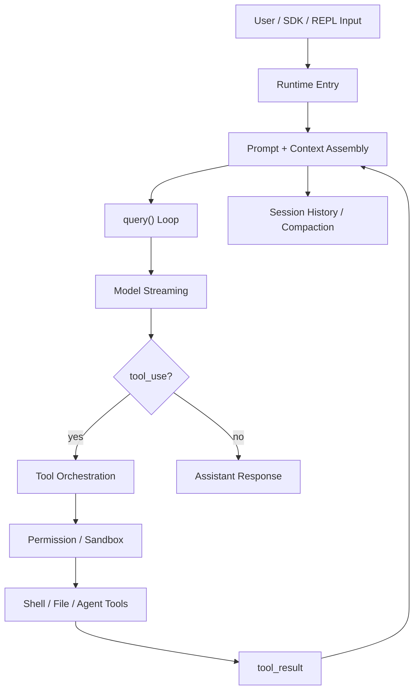
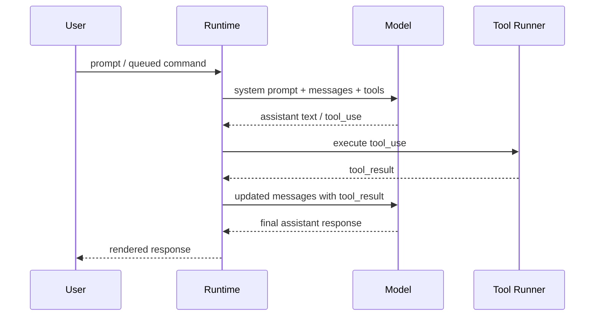
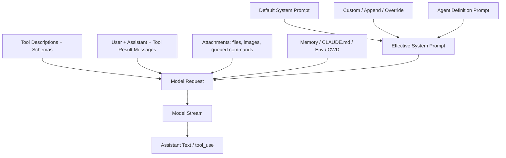

# Claude Code Source Learning Docs Implementation Plan

> **For agentic workers:** REQUIRED SUB-SKILL: Use superpowers:subagent-driven-development (recommended) or superpowers:executing-plans to implement this plan task-by-task. Steps use checkbox (`- [ ]`) syntax for tracking.

**Goal:** Rewrite `ai/claude-code-source/` into a systematic, interview-oriented deep learning guide for how Claude Code implements a coding agent.

**Architecture:** Build a linear runtime-pipeline tutorial, archive the current subagent-first notes as source material, and add interview playbook support. Core chapters explain implementation logic and principles without requiring line-by-line code narration; source anchors provide evidence and navigation.

**Tech Stack:** Markdown, Mermaid, shell verification with `rg`, `find`, `git`, and source inspection through CodeGraph in `/Users/buoy/Development/gitrepo/Claude-Code-true`.

---

## File Structure

Create or rewrite these files under `/Users/buoy/Development/gitrepo/interview/.worktrees/claude-code-source-docs/ai/claude-code-source/`:

```text
README.md
00-coding-agent-big-picture.md
01-runtime-entry.md
02-query-loop.md
03-prompt-and-context-assembly.md
04-model-streaming.md
05-tool-system-and-orchestration.md
06-permission-and-sandbox.md
07-shell-and-file-editing.md
08-session-history-compaction-resume.md
09-interrupt-abort-continue.md
10-subagent-runtime.md
11-fork-subagent-and-prompt-cache.md
12-mcp-plugin-bridge-appendix.md
13-source-code-map.md
14-interview-playbook.md
_archive/README.md
_archive/01-subagent-mental-model.md
_archive/01-subagent-background-and-communication.md
_archive/02-subagent-background-lifecycle.md
_archive/03-agent-communication-protocol.md
_archive/04-cancel-resume-and-abort.md
_archive/05-fork-subagent-prompt-cache.md
```

The source repo used for implementation evidence is:

```text
/Users/buoy/Development/gitrepo/Claude-Code-true
```

## Global Chapter Contract

Every core chapter from `01` through `11` must include these headings:

```markdown
## 面试式回答
## 这一章解决什么问题
## 心智模型
## 实现逻辑
## 源码入口
## 关键数据结构与状态
## 正常路径
## 失败、边界与中断
## Mermaid 图
## 设计取舍
## 面试追问
## 一句话总结
```

Every core chapter must answer:

- input data comes from where
- runtime modules involved
- state changes
- output destination
- permission, failure, interruption, or context-pressure behavior
- implementation principle

## Task 1: Archive Existing Notes and Create New Skeleton

**Files:**
- Move: `ai/claude-code-source/01-subagent-mental-model.md`
- Move: `ai/claude-code-source/01-subagent-background-and-communication.md`
- Move: `ai/claude-code-source/02-subagent-background-lifecycle.md`
- Move: `ai/claude-code-source/03-agent-communication-protocol.md`
- Move: `ai/claude-code-source/04-cancel-resume-and-abort.md`
- Move: `ai/claude-code-source/05-fork-subagent-prompt-cache.md`
- Modify: `ai/claude-code-source/README.md`
- Create: all new chapter files listed in File Structure
- Create: `ai/claude-code-source/_archive/README.md`

- [ ] **Step 1: Confirm worktree branch and clean status**

Run:

```bash
git branch --show-current
git status --short
```

Expected:

```text
codex/claude-code-source-docs
```

`git status --short` should be empty before edits begin.

- [ ] **Step 2: Create archive directory**

Run:

```bash
mkdir -p ai/claude-code-source/_archive
```

Expected: command exits with status 0.

- [ ] **Step 3: Move old notes into archive**

Run:

```bash
git mv ai/claude-code-source/01-subagent-mental-model.md ai/claude-code-source/_archive/01-subagent-mental-model.md
git mv ai/claude-code-source/01-subagent-background-and-communication.md ai/claude-code-source/_archive/01-subagent-background-and-communication.md
git mv ai/claude-code-source/02-subagent-background-lifecycle.md ai/claude-code-source/_archive/02-subagent-background-lifecycle.md
git mv ai/claude-code-source/03-agent-communication-protocol.md ai/claude-code-source/_archive/03-agent-communication-protocol.md
git mv ai/claude-code-source/04-cancel-resume-and-abort.md ai/claude-code-source/_archive/04-cancel-resume-and-abort.md
git mv ai/claude-code-source/05-fork-subagent-prompt-cache.md ai/claude-code-source/_archive/05-fork-subagent-prompt-cache.md
```

Expected: each file moves without creating delete/add duplicates outside git.

- [ ] **Step 4: Create archive README**

Create `ai/claude-code-source/_archive/README.md` with this exact role:

```markdown
# Archived Claude Code Source Notes

这些文件是旧版 Claude Code 源码阅读笔记，主要围绕 subagent、后台生命周期、通信、取消恢复和 fork prompt cache 展开。

新版文档改为从 coding agent runtime 主线开始组织，因此旧文档保留为素材库，而不是主阅读入口。

## 旧文档

- [01 - Subagent 心智模型](./01-subagent-mental-model.md)
- [01 - Subagent 后台执行与通信机制](./01-subagent-background-and-communication.md)
- [02 - Subagent 后台生命周期](./02-subagent-background-lifecycle.md)
- [03 - Agent 间通信协议](./03-agent-communication-protocol.md)
- [04 - 取消、继续与恢复](./04-cancel-resume-and-abort.md)
- [05 - Fork Subagent 与 Prompt Cache](./05-fork-subagent-prompt-cache.md)
```

- [ ] **Step 5: Create chapter skeletons**

Create the new chapter files with the global chapter contract headings. For `00`, `12`, `13`, and `14`, use purpose-specific headings:

`00-coding-agent-big-picture.md`:

```markdown
# 00 - Coding Agent 总览

## 面试式回答
## Coding Agent 要解决什么问题
## Claude Code 的 runtime 大图
## 核心闭环
## 和普通 Chatbot 的区别
## Mermaid 图
## 学习路线
## 一句话总结
```

`12-mcp-plugin-bridge-appendix.md`:

```markdown
# 12 - MCP / Plugin / Bridge 附录

## 面试式回答
## 为什么放在附录
## 它们如何接入 runtime
## MCP 与 Tool Pool
## Plugin 与 Agent/Tool 扩展
## Bridge 与外部环境
## 不深入的部分
## 面试追问
## 一句话总结
```

`13-source-code-map.md`:

```markdown
# 13 - 源码地图

## 如何使用这张地图
## Runtime Entry
## Query Loop
## Prompt / Context
## Model Streaming
## Tool System
## Permission / Sandbox
## Shell / File Editing
## Session / Compaction / Resume
## Interrupt / Abort / Continue
## Subagent / Fork
## Appendix Areas
```

`14-interview-playbook.md`:

```markdown
# 14 - 面试 Playbook

## 使用方式
## 1 分钟总览回答
## 系统设计类问题
## 源码深挖类问题
## 安全与权限类问题
## 长任务与上下文类问题
## Subagent 类问题
## 反问与讨论点
```

- [ ] **Step 6: Verify skeleton**

Run:

```bash
find ai/claude-code-source -maxdepth 2 -type f | sort
rg -n "TB.?D|TO.?DO|FIX.?ME|占位" ai/claude-code-source
```

Expected:

- all files listed in File Structure exist
- `rg` exits with status 1 because there are no unfinished-content markers

- [ ] **Step 7: Commit archive and skeleton**

Run:

```bash
git add ai/claude-code-source
git commit -m "docs: restructure claude code source notes"
```

Expected: commit succeeds.

## Task 2: Write README and Big Picture Chapter

**Files:**
- Modify: `ai/claude-code-source/README.md`
- Modify: `ai/claude-code-source/00-coding-agent-big-picture.md`
- Modify: `ai/claude-code-source/13-source-code-map.md`

- [ ] **Step 1: Write new README**

`README.md` must explain:

- this is an interview-oriented Claude Code source guide
- source repo is `/Users/buoy/Development/gitrepo/Claude-Code-true`
- new notes are organized by coding agent runtime pipeline
- old subagent notes are archived in `_archive/`
- recommended reading order is `00` through `14`
- core chapters explain implementation logic, not line-by-line code style

Include this runtime pipeline:

```text
input -> prompt/context -> query loop -> model stream -> tool_use -> tool execution -> tool_result -> next loop
```

- [ ] **Step 2: Write `00-coding-agent-big-picture.md`**

The chapter must cover:

- coding agent as a closed loop around model + tools + state
- why a coding agent differs from a chatbot
- Claude Code as a runtime that mediates between model intent and local machine effects
- the main concepts: messages, system prompt, tools, permission, transcript, compaction, subagent
- a Mermaid flowchart of the overall runtime pipeline

Use this Mermaid shape:



- [ ] **Step 3: Seed source map**

In `13-source-code-map.md`, add initial source anchors:

```text
Runtime Entry: src/main.tsx, src/screens/REPL.tsx
Query Loop: src/query.ts, src/query/deps.ts
Prompt / Context: src/constants/prompts.ts, src/utils/systemPrompt.ts, src/utils/queryContext.ts, src/utils/attachments.ts
Tool System: src/Tool.ts, src/tools.ts, src/services/tools/toolOrchestration.ts, src/services/tools/StreamingToolExecutor.ts
Permission / Sandbox: src/utils/permissions/permissionSetup.ts, src/tools/BashTool/
Session / Compaction: src/services/compact/autoCompact.ts, src/services/compact/compact.ts
Subagent / Fork: src/tools/AgentTool/, src/tasks/LocalAgentTask/, src/utils/forkedAgent.ts
```

- [ ] **Step 4: Verify README links**

Run:

```bash
rg -n "\\]\\(\\.\\/[^)]+" ai/claude-code-source/README.md
```

Expected: every chapter link in README points to a file created in Task 1.

- [ ] **Step 5: Commit**

Run:

```bash
git add ai/claude-code-source/README.md ai/claude-code-source/00-coding-agent-big-picture.md ai/claude-code-source/13-source-code-map.md
git commit -m "docs: add claude code runtime overview"
```

Expected: commit succeeds.

## Task 3: Write Runtime Entry, Query Loop, and Prompt/Context Chapters

**Files:**
- Modify: `ai/claude-code-source/01-runtime-entry.md`
- Modify: `ai/claude-code-source/02-query-loop.md`
- Modify: `ai/claude-code-source/03-prompt-and-context-assembly.md`
- Modify: `ai/claude-code-source/13-source-code-map.md`

- [ ] **Step 1: Gather source anchors**

Use CodeGraph against `/Users/buoy/Development/gitrepo/Claude-Code-true` for these symbols/files:

```text
main.tsx getInputPrompt run
REPL systemPrompt query
query.ts useStreamingToolExecution toolUpdates
buildEffectiveSystemPrompt
getSystemPrompt
fetchSystemPromptParts
getQueuedCommandAttachments
getAgentPendingMessageAttachments
ToolUseContext
```

Expected: collect enough source anchors to write implementation logic without guessing.

- [ ] **Step 2: Write `01-runtime-entry.md`**

Must explain:

- CLI command setup versus runtime execution
- how interactive REPL, print/non-interactive mode, SDK, and stdin eventually become prompt/messages
- where `systemPrompt`, `toolUseContext`, and model options enter the runtime
- what is intentionally not covered: UI rendering and command catalog details

The implementation logic must answer:

```text
input source -> CLI/REPL handling -> message creation -> query loop invocation
```

- [ ] **Step 3: Write `02-query-loop.md`**

Must explain:

- `query()` as the central agent loop
- the feedback cycle from messages to model to assistant content to tools to tool_result
- how tool results become user-role messages for the next model call
- when the loop stops
- how auto-compaction, queue draining, and interruptibility fit around the loop

Include a sequence diagram:



- [ ] **Step 4: Write `03-prompt-and-context-assembly.md`**

This is a highest-depth chapter. It must explain:

- system prompt is structured runtime state, not a single hand-written string
- default, custom, append, override, and agent-specific prompt precedence
- how tool descriptions and schemas enter the model request
- how user messages, tool results, attachments, queued commands, pending subagent messages, memory, CLAUDE.md, cwd/env, and compaction summary become context
- difference between model-visible context and runtime-only state
- prompt cache implications of stable prefixes

Include this Mermaid graph, expanded with chapter-specific details:



- [ ] **Step 5: Update source map**

Add the exact symbols used for these chapters under the corresponding sections in `13-source-code-map.md`.

- [ ] **Step 6: Verify coverage**

Run:

```bash
rg -n "## 面试式回答|## 实现逻辑|## 源码入口|## 关键数据结构与状态|## Mermaid 图" ai/claude-code-source/01-runtime-entry.md ai/claude-code-source/02-query-loop.md ai/claude-code-source/03-prompt-and-context-assembly.md
rg -n "buildEffectiveSystemPrompt|getSystemPrompt|ToolUseContext|tool_result|queued command|CLAUDE.md" ai/claude-code-source/03-prompt-and-context-assembly.md
```

Expected: each required heading appears in each file, and prompt/context chapter mentions the required implementation anchors.

- [ ] **Step 7: Commit**

Run:

```bash
git add ai/claude-code-source/01-runtime-entry.md ai/claude-code-source/02-query-loop.md ai/claude-code-source/03-prompt-and-context-assembly.md ai/claude-code-source/13-source-code-map.md
git commit -m "docs: explain runtime entry query loop and context assembly"
```

Expected: commit succeeds.

## Task 4: Write Model Streaming and Tool System Chapters

**Files:**
- Modify: `ai/claude-code-source/04-model-streaming.md`
- Modify: `ai/claude-code-source/05-tool-system-and-orchestration.md`
- Modify: `ai/claude-code-source/13-source-code-map.md`

- [ ] **Step 1: Gather source anchors**

Use CodeGraph for:

```text
queryModelWithStreaming
queryModelWithoutStreaming
Tool
Tools
runTools
StreamingToolExecutor
markToolUseAsComplete
useStreamingToolExecution
toolUseID
```

Expected: collect source anchors for model stream, tool abstraction, tool execution, and result mapping.

- [ ] **Step 2: Write `04-model-streaming.md`**

Must explain:

- why streaming matters for a coding agent
- how partial assistant text and tool_use blocks differ
- how stream output becomes a durable assistant message
- how streaming interacts with interruptibility and tool execution
- what changes when non-streaming fallback is used

- [ ] **Step 3: Write `05-tool-system-and-orchestration.md`**

Must explain:

- Tool as a runtime contract: name, schema, prompt, permission, call, render
- how tool definitions become model-visible schemas
- how `tool_use` IDs map to `tool_result`
- how normal tool orchestration and streaming tool execution differ
- how multiple tool calls complete, fail, or get cancelled
- how tool results are reintroduced into the next model turn

Include a Mermaid diagram showing:

```text
model tool_use -> tool lookup -> permission -> call -> result -> user tool_result message
```

- [ ] **Step 4: Update source map**

Add exact anchors for streaming and tool orchestration.

- [ ] **Step 5: Verify**

Run:

```bash
rg -n "queryModelWithStreaming|StreamingToolExecutor|runTools|tool_use|tool_result|ToolUseContext" ai/claude-code-source/04-model-streaming.md ai/claude-code-source/05-tool-system-and-orchestration.md
rg -n "## 失败、边界与中断|## 设计取舍|## 面试追问" ai/claude-code-source/04-model-streaming.md ai/claude-code-source/05-tool-system-and-orchestration.md
```

Expected: required implementation terms and headings are present.

- [ ] **Step 6: Commit**

Run:

```bash
git add ai/claude-code-source/04-model-streaming.md ai/claude-code-source/05-tool-system-and-orchestration.md ai/claude-code-source/13-source-code-map.md
git commit -m "docs: explain model streaming and tool orchestration"
```

Expected: commit succeeds.

## Task 5: Write Permission, Sandbox, Shell, and File Editing Chapters

**Files:**
- Modify: `ai/claude-code-source/06-permission-and-sandbox.md`
- Modify: `ai/claude-code-source/07-shell-and-file-editing.md`
- Modify: `ai/claude-code-source/13-source-code-map.md`

- [ ] **Step 1: Gather source anchors**

Use CodeGraph for:

```text
initializeToolPermissionContext
PermissionMode
canUseTool
shouldUseSandbox
bashPermissionRule
getSimpleCommandPrefix
BashTool
FileReadTool
FileEditTool
FileWriteTool
MultiEdit
```

Expected: collect source anchors for permission initialization, Bash permission rules, sandbox decisions, and file operation tools.

- [ ] **Step 2: Write `06-permission-and-sandbox.md`**

Must explain:

- model intent is not runtime authorization
- permission modes: default behavior, plan mode, auto mode, bypass mode
- allow/disallow lists and dangerous permission cleanup
- Bash approval and shell permission rules
- sandbox as a runtime containment mechanism, not a prompt instruction
- failure paths: denied tool, rejected permission, sandbox unavailable, unsafe command

Include a Mermaid flowchart:

```text
tool_use -> permission context -> rule match / approval -> sandbox decision -> execute or reject
```

- [ ] **Step 3: Write `07-shell-and-file-editing.md`**

Must explain:

- Bash as general execution tool and why it needs stronger controls
- command parsing, approval suggestions, background commands, output handling
- Read/Glob/Grep as context acquisition
- Edit/MultiEdit/Write as controlled mutation
- diff/review semantics and how failed edits feed back to model
- why file modification is mediated through tools instead of free-form model output

- [ ] **Step 4: Update source map**

Add permission, Bash, and file tool anchors.

- [ ] **Step 5: Verify**

Run:

```bash
rg -n "permission mode|sandbox|allow|deny|Bash|Edit|MultiEdit|Write|tool_use" ai/claude-code-source/06-permission-and-sandbox.md ai/claude-code-source/07-shell-and-file-editing.md
rg -n "## 失败、边界与中断|## 设计取舍|## 面试追问" ai/claude-code-source/06-permission-and-sandbox.md ai/claude-code-source/07-shell-and-file-editing.md
```

Expected: required safety and mutation concepts are present.

- [ ] **Step 6: Commit**

Run:

```bash
git add ai/claude-code-source/06-permission-and-sandbox.md ai/claude-code-source/07-shell-and-file-editing.md ai/claude-code-source/13-source-code-map.md
git commit -m "docs: explain permissions sandbox shell and file editing"
```

Expected: commit succeeds.

## Task 6: Write Session, Compaction, Resume, Interrupt, and Continue Chapters

**Files:**
- Modify: `ai/claude-code-source/08-session-history-compaction-resume.md`
- Modify: `ai/claude-code-source/09-interrupt-abort-continue.md`
- Modify: `ai/claude-code-source/13-source-code-map.md`

- [ ] **Step 1: Gather source anchors**

Use CodeGraph for:

```text
autoCompactIfNeeded
trySessionMemoryCompaction
CompactionResult
AutoCompactTrackingState
sessionHistory
messageQueueManager
QueuedCommand
AbortController
useCancelRequest
getQueuedCommandAttachments
```

Expected: collect source anchors for long-session state, compaction, queueing, and cancellation.

- [ ] **Step 2: Write `08-session-history-compaction-resume.md`**

Must explain:

- transcript versus current model context
- why long-running coding tasks need compaction
- token pressure and auto-compact threshold
- what a compaction result contains
- how summaries re-enter context
- how resume rebuilds working context from durable history

Include a Mermaid flowchart:

```text
messages grow -> token pressure -> compaction -> summary -> new context -> continued query loop
```

- [ ] **Step 3: Write `09-interrupt-abort-continue.md`**

Must explain:

- ESC and user interruption as runtime events
- AbortController scopes and why foreground/background behavior differs
- queued commands and interrupted input
- why continue is a new turn from history/context, not stack restoration
- edge cases: running tool, pending notification, stopped subagent

Include a Mermaid state diagram for:

```text
running -> interrupted -> queued/resumed/new turn
```

- [ ] **Step 4: Update source map**

Add session, compaction, queue, and abort anchors.

- [ ] **Step 5: Verify**

Run:

```bash
rg -n "compact|summary|resume|transcript|AbortController|ESC|queued|continue" ai/claude-code-source/08-session-history-compaction-resume.md ai/claude-code-source/09-interrupt-abort-continue.md
rg -n "## Mermaid 图|## 失败、边界与中断|## 面试追问" ai/claude-code-source/08-session-history-compaction-resume.md ai/claude-code-source/09-interrupt-abort-continue.md
```

Expected: required long-session and interruption concepts are present.

- [ ] **Step 6: Commit**

Run:

```bash
git add ai/claude-code-source/08-session-history-compaction-resume.md ai/claude-code-source/09-interrupt-abort-continue.md ai/claude-code-source/13-source-code-map.md
git commit -m "docs: explain session compaction and interruption"
```

Expected: commit succeeds.

## Task 7: Write Subagent and Fork Chapters

**Files:**
- Modify: `ai/claude-code-source/10-subagent-runtime.md`
- Modify: `ai/claude-code-source/11-fork-subagent-and-prompt-cache.md`
- Modify: `ai/claude-code-source/13-source-code-map.md`
- Read as source material: `ai/claude-code-source/_archive/*.md`

- [ ] **Step 1: Gather source anchors and old-note material**

Use CodeGraph for:

```text
AgentTool
runAgent
registerAsyncAgent
runAsyncAgentLifecycle
createSubagentContext
resolveAgentTools
SendMessageTool
TaskOutputTool
LocalAgentTask
resumeAgentBackground
buildForkedMessages
forkedAgent
```

Also read the archived old notes and extract only material that supports the new runtime order.

Expected: collect source anchors and avoid copying the old article order.

- [ ] **Step 2: Write `10-subagent-runtime.md`**

Must explain:

- Agent tool as a tool that starts another agent loop
- local subagent is not a new process or MCP server
- sync versus background agent lifecycle
- context isolation: agentId, agentType, ToolUseContext, messages, tools, abort controller
- sidechain transcript and task registry
- communication paths: tool_result, task-notification, pendingMessages, TaskOutput
- stopped/background resume semantics

Include a sequence diagram:

```text
main query -> Agent tool -> register task -> subagent query -> sidechain transcript -> task notification -> main query
```

- [ ] **Step 3: Write `11-fork-subagent-and-prompt-cache.md`**

Must explain:

- why fork agents exist
- how forked messages preserve prefix similarity
- why stable prompt prefix helps prompt cache
- what gets changed at the tail of the prompt
- what breaks cache compatibility
- how fork differs from normal subagent

- [ ] **Step 4: Update source map**

Add subagent, task, messaging, and fork anchors.

- [ ] **Step 5: Verify**

Run:

```bash
rg -n "query\\(\\)|Agent tool|background|sidechain|pendingMessages|task-notification|prompt cache|fork" ai/claude-code-source/10-subagent-runtime.md ai/claude-code-source/11-fork-subagent-and-prompt-cache.md
rg -n "## 失败、边界与中断|## 设计取舍|## 面试追问" ai/claude-code-source/10-subagent-runtime.md ai/claude-code-source/11-fork-subagent-and-prompt-cache.md
```

Expected: required subagent and fork concepts are present.

- [ ] **Step 6: Commit**

Run:

```bash
git add ai/claude-code-source/10-subagent-runtime.md ai/claude-code-source/11-fork-subagent-and-prompt-cache.md ai/claude-code-source/13-source-code-map.md
git commit -m "docs: explain subagent runtime and fork cache"
```

Expected: commit succeeds.

## Task 8: Write Appendix, Source Map, and Interview Playbook

**Files:**
- Modify: `ai/claude-code-source/12-mcp-plugin-bridge-appendix.md`
- Modify: `ai/claude-code-source/13-source-code-map.md`
- Modify: `ai/claude-code-source/14-interview-playbook.md`
- Modify: `ai/claude-code-source/README.md`

- [ ] **Step 1: Write appendix**

`12-mcp-plugin-bridge-appendix.md` must explain:

- why MCP/plugin/bridge are not the core runtime loop
- how MCP tools enter the tool pool
- how plugins can contribute agents/tools/skills
- how bridge connects external environments to runtime surfaces
- what details are intentionally skipped for interview focus

- [ ] **Step 2: Complete source map**

`13-source-code-map.md` must map each source area to chapters:

```text
src/main.tsx -> 01
src/screens/REPL.tsx -> 01
src/query.ts -> 02, 04, 05, 08, 09
src/constants/prompts.ts -> 03
src/utils/systemPrompt.ts -> 03
src/utils/queryContext.ts -> 03
src/utils/attachments.ts -> 03, 09, 10
src/Tool.ts -> 05
src/tools.ts -> 05, 12
src/services/api/claude.ts -> 04
src/services/tools/toolOrchestration.ts -> 05
src/services/tools/StreamingToolExecutor.ts -> 05
src/utils/permissions/permissionSetup.ts -> 06
src/tools/BashTool/ -> 06, 07
src/tools/FileReadTool/ -> 07
src/tools/FileEditTool/ -> 07
src/tools/FileWriteTool/ -> 07
src/services/compact/autoCompact.ts -> 08
src/services/compact/compact.ts -> 08
src/utils/messageQueueManager.ts -> 09, 10
src/tools/AgentTool/ -> 10, 11
src/tasks/LocalAgentTask/ -> 10
src/utils/forkedAgent.ts -> 11
```

- [ ] **Step 3: Write interview playbook**

`14-interview-playbook.md` must include:

- a 1-minute answer for "How would you implement a coding agent?"
- system design questions with answer outlines
- source deep-dive questions with source chapter references
- safety/permission questions
- long-context/session questions
- subagent/fork questions
- suggestions for how to steer the interview from high-level design into source evidence

- [ ] **Step 4: Update README final navigation**

Ensure README links:

- every chapter
- `_archive/`
- source map
- interview playbook

- [ ] **Step 5: Verify appendix and playbook**

Run:

```bash
rg -n "MCP|plugin|bridge|tool pool|appendix" ai/claude-code-source/12-mcp-plugin-bridge-appendix.md
rg -n "How would you implement a coding agent|permission|context|subagent|prompt cache" ai/claude-code-source/14-interview-playbook.md
rg -n "src/query.ts|src/Tool.ts|src/tools/AgentTool|src/utils/systemPrompt.ts" ai/claude-code-source/13-source-code-map.md
```

Expected: appendix, playbook, and source map contain the required anchors.

- [ ] **Step 6: Commit**

Run:

```bash
git add ai/claude-code-source/README.md ai/claude-code-source/12-mcp-plugin-bridge-appendix.md ai/claude-code-source/13-source-code-map.md ai/claude-code-source/14-interview-playbook.md
git commit -m "docs: add source map appendix and interview playbook"
```

Expected: commit succeeds.

## Task 9: Final Verification and Merge Preparation

**Files:**
- Inspect: `ai/claude-code-source/**/*.md`
- Inspect: git history on `codex/claude-code-source-docs`

- [ ] **Step 1: Verify file inventory**

Run:

```bash
find ai/claude-code-source -maxdepth 2 -type f | sort
```

Expected: output contains all files from File Structure and no old top-level `01-subagent-*` files outside `_archive/`.

- [ ] **Step 2: Verify no unfinished-content markers**

Run:

```bash
rg -n "TB.?D|TO.?DO|FIX.?ME|占位|待补|以后补" ai/claude-code-source docs/superpowers/plans docs/superpowers/specs
```

Expected: command exits with status 1.

- [ ] **Step 3: Verify core chapter headings**

Run:

```bash
for f in ai/claude-code-source/{01-runtime-entry,02-query-loop,03-prompt-and-context-assembly,04-model-streaming,05-tool-system-and-orchestration,06-permission-and-sandbox,07-shell-and-file-editing,08-session-history-compaction-resume,09-interrupt-abort-continue,10-subagent-runtime,11-fork-subagent-and-prompt-cache}.md; do
  echo "$f"
  rg -n "## 面试式回答|## 这一章解决什么问题|## 心智模型|## 实现逻辑|## 源码入口|## 关键数据结构与状态|## 正常路径|## 失败、边界与中断|## Mermaid 图|## 设计取舍|## 面试追问|## 一句话总结" "$f"
done
```

Expected: each core chapter prints all required headings.

- [ ] **Step 4: Verify README local links**

Run:

```bash
rg -o "\\]\\(\\.\\/[^)]+" ai/claude-code-source/README.md
```

Expected: every printed link target exists under `ai/claude-code-source/`.

- [ ] **Step 5: Verify Mermaid coverage**

Run:

```bash
rg -n "```mermaid" ai/claude-code-source
```

Expected: Mermaid blocks exist in the big picture and every core chapter where a diagram clarifies flow.

- [ ] **Step 6: Review diff**

Run:

```bash
git log --oneline --decorate --max-count=12
git status --short
```

Expected: branch contains focused documentation commits and `git status --short` is empty.

- [ ] **Step 7: Prepare merge instructions**

Do not merge automatically unless the user asks. Report:

```text
Worktree: /Users/buoy/Development/gitrepo/interview/.worktrees/claude-code-source-docs
Branch: codex/claude-code-source-docs
Main repo: /Users/buoy/Development/gitrepo/interview
Suggested next action: review docs, then merge branch into main
```

Expected: user can choose review, inline fixes, or merge.
