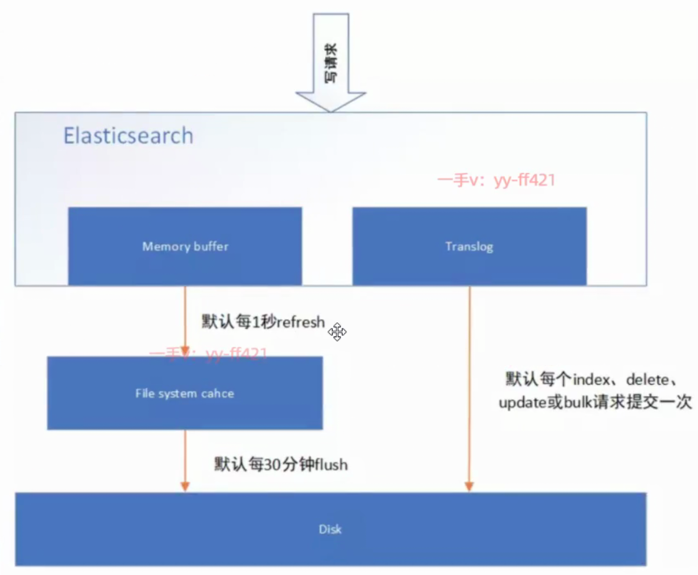

[toc]


## 概述

有master, DataNode 2种节点. clusterName 相同才能在同一个集群.


## 集群(健康)状态

**green**：每个索引的**primary** shard和**replica** shard**都是active**状态的
**yellow**：每个索引的primary shard都是active状态的，但是**部分replica shard不是active**状态，处于不可用的状态.
**red**：**不是所有索引的primary** shard**都active**状态的，部分索引有数据丢失了.


因为**replica**是**为了容错**, **需要**和 primary **分配到不同的node**, 所以, 当可用的**node不足时**, 为**黄色**.


## 节点类型

有以下配置:

主节点：node.master: true
数据节点：node.data: true

### 客户端节点

当主节点(node.master)和数据节点(node.data)配置都设置为**false**的时候，该节点**只能处理路由请求，处理搜索，分发索引操作等**，
从本质上来说该客户节点**表现为智能负载平衡器**。

### 数据节点

主要对文档进行**增删改查**操位, **聚合**操作等。
数据节点对**cpu，内存，io要求较高**，在优化的时候需要监控数据节点的状态，
当资源不够的时候，需要在集群中添加新的节点。


### 主节点

主要职责是和**集群操作相关**的内容，如**创建或删除索引**，**跟踪哪些节点是群集的一部分**，并**决定哪些分片分配**给相关的节点。

默认情况下集群中**任一个节点**都有**可能被选为主节点**，
**索引数据和搜索查询**等操作会占用**大量的cpu，内存，io资源**，为了确保一个集群的稳定，分离主节点和数据节点是一个比较好的选择。


### 生产建议

**生产集群**中, 建议集群中设置**3台以上**的节点作为**master**节点, **只负责成为主节点**.

再根据数据量设置一批**data**节点，这些节点**只负责存储数据**，后期提供**建立索引和查询索引**的服务，如果用户请求比较频繁，这些节点的压力也会比较大，

所以在集群中**建议再设置一批client**节点（node. master: false; node. data：false），这些节点**只负责处理用户请求，实现请求转发，负载均衡等功能**.


## shards/replicas

新版本ES, 默认, 索引为1个分片, 每个分片的 replicas == 1(1主1从(副本))

### 设置

创建索引(db)时, 可设置分片与副本数.

```
...
"settings"：{
“number_of_shards"：3，
“number_of_replicas"：2
}
...
```


## master

启动时，会选举出来一个Master节点。然后使用Zen Discovery机制找到集群中的其他节点，并建立连接。

### **主要负责**：

**管理索引**（创建索引、删除索引）、分配分片
维护**元数据**
管理集群**节点状态**
**不负责数据写入和查询**，比较轻量级


## DataNode


### 主要负责：

数据**写入**、数据**检索**，大部分Elasticsearch的压力都在DataNode节点上
在**生产环境**中，**内存**最好配置**大一些**


## 写入过程(原理)


client **负载均衡** 到 某一node, 该node作为 **coordinating node**来**转发到**实际的**primary shard**, 
**primary** shard **写入后同步到 replicas**, 
当**所有replica完成写**, **返回给client**.

[读写一致性](#读写一致性)

### 写磁盘过程



**先写OS缓存**: 首先写入到buffer中, 然后生成一个segment, 并刷到文件系统缓存中，数振可以被检索（注意不是直接刷到磁盘）

**写translog保障容错**: 写内存的**同时，也会写translog**，如果是修改操作, 每次都会flush.
在refresh期间出现异常，会根据translog来进行数据恢复.
等OS缓存中的segment数据都**刷到磁盘**中，**清空translog**. 

**flush磁盘**: ES默认每30分钟, 将**OS缓存**的数据**刷入磁盘**.

**segment合并**: Segment太多时，ES定期将多个segment**合并**成为大的**segment**，减少索引查询时IO开销，
这时, ES真正物理删除（之前执行过的delete的数据）


## 读取(查询)过程


搜索是一个两阶段过程，即 **Query** Then **Fetch**

**Query阶段:** 

client 负载均衡 到 某一node, 该node作为 **coordinating node** 广播请求到所有 primary shard 或 replica, 
每个**shard**在本地执行搜索并构建一个匹配文档的**大小为 from + size** 的优先队列, 
shard返回各自优先队列中 所有 **docld 和 打分值给协调节点**，
由 **coordinating node**进行数据的**合并、排序、分页**等操作，产出最终结果。

**etch阶段:**

协调节点根据 Query阶段产生的结果，去各个节点上**查询** docId **实际的 document 内容**, 
coordinate node 对 doc id 进行哈希路由(**寻找分片**)，将请求转发到对应的 node，此时会使用 round-robin 对 **primary shard 和 replica** 随机轮询算法(**读请求负载均衡**).
接收请求的 node 返回 **实际document 给 coordinate node**. **最终** coordinate node **返回 document 给客户端**。

**?)** Query Then Fetch 的搜索类型在文档相关性打分的时候参考的是本分片的数据，这样在文档数量较少的时候可能不够准确，DFS Query Then Fetch 增加了一个预查询的处理，询问 Term 和 Document frequency，这个评分更准确，但是性能会变差.


## 准实时搜索

[写入过程(原理)](#写入过程(原理))


## score(文档分值)计算 原理

**先根据query条件, 筛出包含term的doc**


### **relevance score算法**，

简单来说，计算出 **"一个索引中的文本"** 与 **"搜索文本"** 他们之间的关联**匹配程度**.

Elasticsearch使用的是 **term frequency/inverse document frequency**算法，简称为TF/IDF算法.
**Term frequency**：**搜索文本**中的**各个词条**, **在field文本**中出现了多少次，**出现次数越多，就越相关**.
**Inverse document frequency**：**搜索文本**中的**各个词条**, 在**整个索引的所有文档中**出现了多少次，出现的**次数越多**，就**越不相关**.(就是很多文档都有这个同样的关键字, 所以区分度不高.)

**例子**:

```
搜索请求：hello world
doc1: hello, tuling is very good
doc2: hi world, how are you
```

index中有1万条doc，
hello这个单词在所有的doc中出现了1000次；
world这个单词在所有的doc中出现了100次;


### Field-length norm: 

field长度，field越长，相关度越弱

**例:**

```
doc1： ｛ "title"： "hello article"， "content"： "...N个单词”｝
doc2： ｛ "title"： "my article"， "content"： "...N个单词，hi world" ｝
```

hello wor ld在整个index中出现的次数是一样多的
doc1更相关，title field更短.


## 分词工作流程


### 切分词语(normalization)

将句子拆分成一个个单个单词，同时对每个单词进行normalization（时态转换，单复数转换），分词器
recall，召回率：搜索的时候，增加能够搜索到的结果的数量

1. character filter：给一段文本**分词前**，先进行**预处理**，**比如**说最常见的就是，**过滤html标签**（<span>hello<span>--> hello）; （I&you --> I and you）
2. tokenizer：**分词**，hello you and me --> hello, you,and, me
3. token filter: 时态, lowercase, stop word, synonymom; **例**: liked --> like, Tom --> tom, 去掉 a/the/an，small --> little


**例子:**


结果: 


### 内置分词器

例子: 

```
Set the shape to semi-transparent by calling set_trans（5）
```

- **standard analyzer**(默认): set,the,shape,to,semi,transparent, by,calling, set_trans, 5
- **simple analyzer**: set,the,shape,to,semi,transparent,by,calling, set, trans
- **whitespace analyzer**: Set, the, shape, to, semi-transparent,by, calling, set_trans（5）
- **stop analyzer**: 移除停用词，比如a the it等等


### 修改分词器setting


### IK分词器

ik配置文件地址：es/plugins/ik/config目录
IKAnalyzer.cfg. xml：用来**配置自定义词库**(远程配置, 集群时)
main.dic: ik原生内置的中文词库，总共有27万多条，只要是这些单词，都会被分在二起
quantifier.dic： 放了一些单位相关的词
suffix.dic： 放了一些后缀
surname.dic： 中国的姓氏
stopword.dic： 英文停用词


## 高亮显示


## 读写一致性

### 乐观锁 _version/_seq_no


### 写操作

一致性级别支持 quorum/one/all，**默认 quorum**


### 读操作

可以设置 **replication 为 sync(默认)**，这使得操作在主分片和副本分片**都完成后才会返回**；
如果设置replication 为 **async** 时，也可以通过**设置**搜索请求参数 **_preference** 为 **primary** 来**查询主分片**，确保文档是最新版本.


## 选举


### 分布式原理

所有**节点是对等的**，节点间会选出集群的 Master，由 **Master** 会负责**维护集群状态信息**，并**同步给其他节点**。

ES只有**建立 index 和 type** 时需要经过 **Master**, 
primary分布在不同node, 写压力分散到整个集群.


###  Master选举

选主是 ZenDiscovery 模块负责, 
主要包含Ping（节点之间通过这个RPC来发现彼此）和 Unicast（单播模块包含一个主机列表以控制哪些节点需要ping通）这两部分；

### 避免脑裂

**过半**

**master** 候选节点数量**不小于3**个时（node.master: true）, 通过**设置最少投票通过数**量（discovery.zen.minimum_master_nodes）, 超过所有候选节点一半以上来**解决脑裂**问题.

