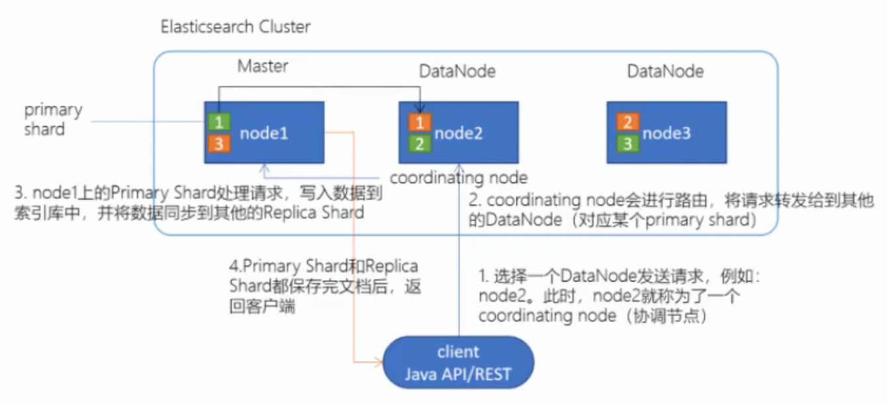
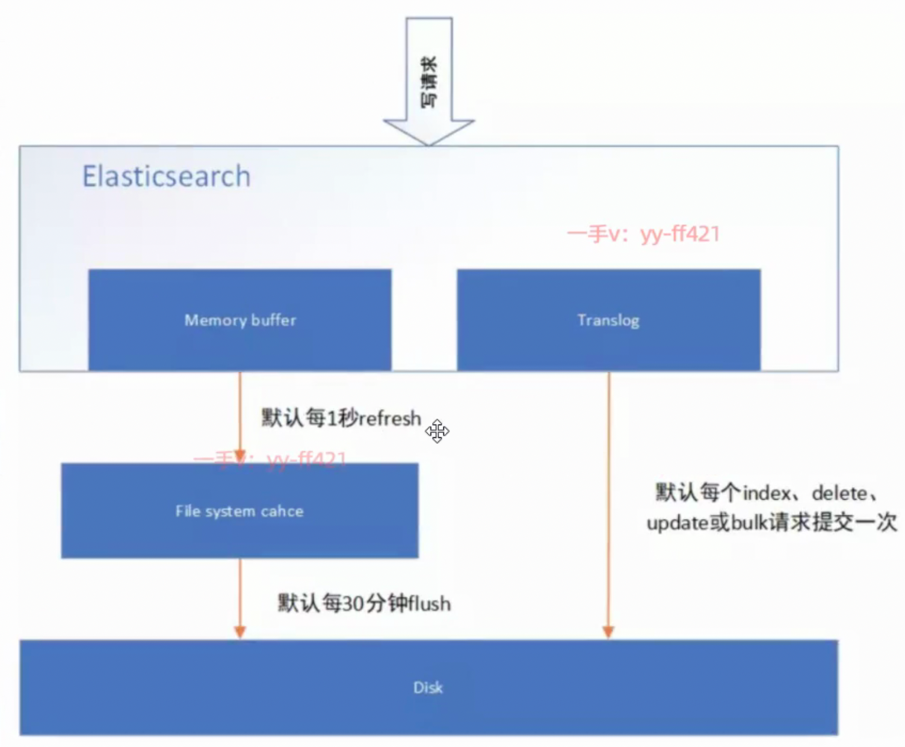
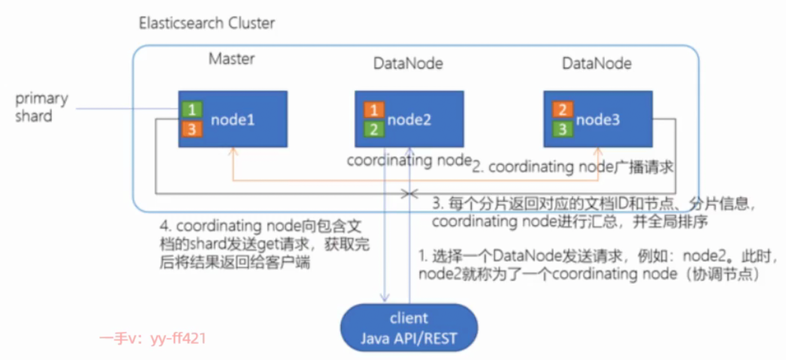

[toc]


## 概述

有master, DataNode 2种节点. clusterName 相同才能在同一个集群.
新版本ES, 默认replicas == 1(1主1从(副本))


## shards/replicas


### 设置

创建索引(db)时, 可设置分片与副本数.

```
...
"settings"：{
“number_of_shards"：3，
“number_of_replicas"：2
}
...
```


## master

启动时，会选举出来一个Master节点。然后使用Zen Discovery机制找到集群中的其他节点，并建立连接。

### **主要负责**：

**管理索引**（创建索引、删除索引）、分配分片
维护**元数据**
管理集群**节点状态**
**不负责数据写入和查询**，比较轻量级


## DataNode


### 主要负责：

数据**写入**、数据**检索**，大部分Elasticsearch的压力都在DataNode节点上
在**生产环境**中，**内存**最好配置**大一些**


## 写入过程(原理)




client **负载均衡** 到 某一node, 该node作为 **coordinating node**来**转发到**实际的**primary shard**, 
**primary** shard **写入后同步到 replicas**, 
当**所有replica完成写**, **返回给client**.


### 写磁盘过程



**先写OS缓存**: 首先写入到buffer中, 然后生成一个segment, 并刷到文件系统缓存中，数振可以被检索（注意不是直接刷到磁盘）

**写translog保障容错**: 写内存的**同时，也会写translog**，如果是修改操作, 每次都会flush.
在refresh期间出现异常，会根据translog来进行数据恢复.
等OS缓存中的segment数据都**刷到磁盘**中，**清空translog**. 

**flush磁盘**: ES默认每30分钟, 将**OS缓存**的数据**刷入磁盘**.

**segment合并**: Segment太多时，ES定期将多个segment**合并**成为大的**segment**，减少索引查询时IO开销，
这时, ES真正物理删除（之前执行过的delete的数据）


## 读取过程




client 负载均衡 到 某一node, 该node作为 **coordinating node** 广播请求, 
每个node 包含的分片 返回**源信息**用于**coordinating node**来**获取真正数据**, 


## 准实时搜索

[写入过程(原理)](#写入过程(原理))
