[toc]


## 概述

ES不能用root啓動

ES比较耗内存，建议虚拟机4G或以上内存jvm1g以上的内存分配

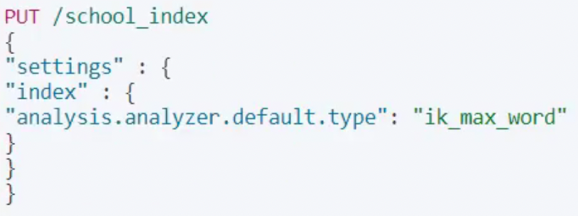

`/school_index` 相當於db/table, 7.0後不能定義爲`/es_db/user/1`, 只能是`/es_db/_doc/1`, _doc变成固定写法.
`index:analysis.analyzer.default.type` 默認分詞器, 例: 中華民國, 可以分成 "中華民國", "中華", "民國", 這樣分可以不至於搜索時輸入"中"會出現"中華民國", 更有實際意義.


## ES 和 lucene 关系

Lucene可以被认为是迄今止最先进、性能最好的、功能最全的**搜索引擎库（框架）**.
想要使用Lucene，必须使用Java来作为开发语言并将其直接集成到你的应用中，并且Lucene的**配置及使用非常复杂**，你需要深入了解检索的相关知识来理解它是如何工作的。

### Lucene缺点：

1. **只能在Java项目中使用**，并且要以jar包的方式直接集成项目中，
2. 使用非常复杂-**创建索引和搜索**索引代码**繁杂**
3. **不支持集群**环境-索引数据不同步（不支持大型项目）
4. 索引数据如果太多就不行，索引库和应用所在同一个服务器，共同占用硬盘.共用空间少.

上述Lucene框架中的**缺点，ES全部都能解诀**


## 分词器

standard: 拆成单字.

ik smart: 最粗粒度拆分

ik_max_word: 会将文本做最细粒度的拆分.


## POST/PUT/DELETE/GET

POST/PUT都可以创建/修改, 但PUT要带上id; POST可以不带id创建记录(文档), ES会自动生成唯一id.

**PUT**只会将json数据进行**整个替换**，**POST**只会更新**对应字段**的值. 所以 PUT 和 DELETE都是具有幂等性的.


## 创建

**结果json:**

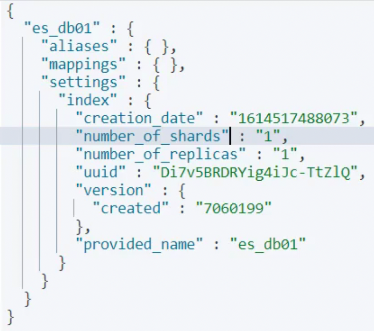

也有分片(shards)和副本数(replicas)


### delete

```
DELETE /es_db
```


## search


```
7.x 版本 GET /es_db/_search; 之前是 GET /es_db/_doc/_search

GET /es_db/_doc/_search?q=age:28 // 条件查询

GET /es_db/_doc/_search?q=age:<=28 // 范围

GET /es_db/_doc/_search?q=age [25 TO 26] // 范围

GET /es_db/_doc/_mget // get多个
{
"ids"：［"1"，"2"］
}

GET /es_db/_doc/_search?q=age[25 TO 26]&from=0&size=1 // 分页

GET /es_db/_doc/_search?_source=name,age // 输出指定字段

GET /es_db/_doc/_search?sort=age:desc // 按某字段排序
```


## 批量操作(_bulk)

- 请求方式：POST

- 请求地址：bulk

- 请求参数：通过_bulk操作文档，一般**至少有两行**参数（或偶数行参数）

  - 第一行参数**指定**操作的**类型**及操作的**对象（index, type和id）**

  - **第二行**参数才是操作的**数据**

参数类似于：

```
{"actionName": {"_index": "indexName", "_type": "typeName", "_id": "id"}}
{"field1": "value1", "field2": "value2"}
```

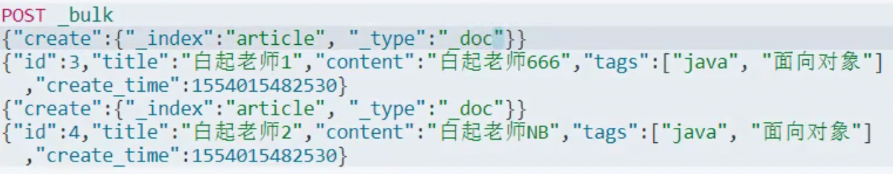


## 与 Solr 差别

当单纯的**对已有数据**进行**搜索**时，**Solr更快**。

当**实时建立索引**时，**Solr**会产生**io阻塞**，查询性能较差，**Elasticsearch**具有**明显优势**。


### 总结


## 分詞原理- 倒排索引

在创建或修改文章时, 建立一个**关键词**与**文章id**的对应关系表，我们可以称之为倒排索引/反向索引.

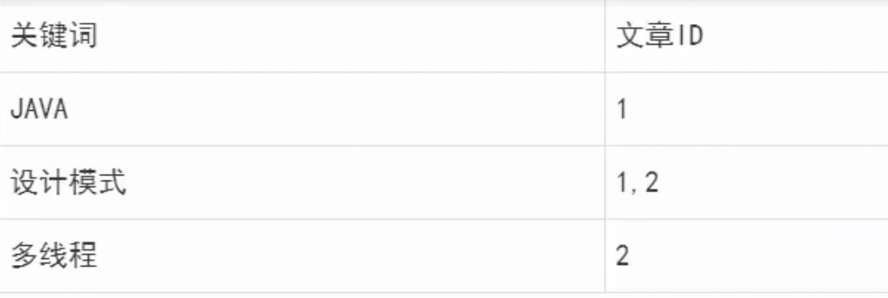


### _analyse(分词结果查询)

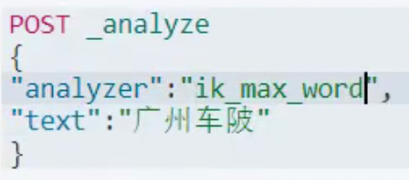

**结果**:

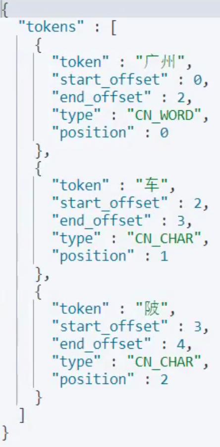

## DSL(Domain Specific Language)


### term

不会分词, 整个查询

```
```


### match/multi_match

会分词

模糊查询, 类似 mysql like %张三%

```
POST /es_db/_doc/_search
｛
“query"：｛
“multi_match"：｛
“query"：”张三”，
"fields"：［"address"，"name"］
｝
```


### match_phase(广义匹配)

对**输入分词**，**结果**中**包含所有的分词**，而且**顺序一致**。
以“hello world”为例，结果中必须包含hello和wor ld，还要是**连着的，顺序固定**(hello that world 和 world hello 都不满足).


### query_string(不指定字段查询)

```
POST /es_db/_doc/_search
"query"：｛
"query_string"：｛
“query"："广州公园 OR 长沙" // 或表示, 其中的 string 会被分词, "广州", "公园"
}
}
```

### range

```
POST /es_db/_search
{
"query"：{
"range":{
"age":｛
"gte"：25，
"lte"：28
}}}
```

### from; size(分页)

### _source(展示字段)

### sort(排序)

```
POST /es_db/_doc/_search
{
"query"：{
"range":{
"age":{
"gte"：25,
"lte"：28
}}},
"from"：0，
"size": 2,
"_source"： ［"name"， "age"， "book"］，
“sort"：｛"age"；"desc"｝
｝
```


### field(指定查询的字段名)


### operator

默认是分词后进行 or 查询, 可以通过这个字段 进行 and 查询.


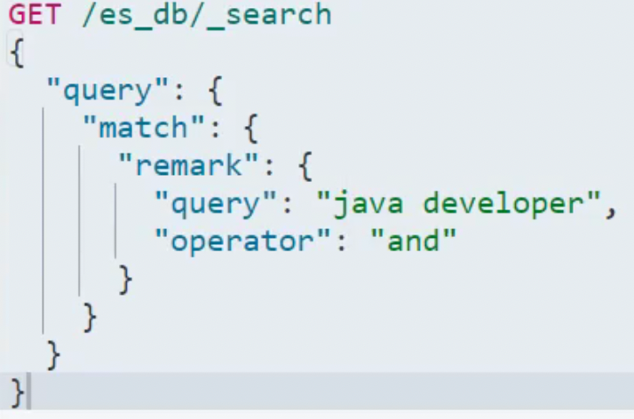

这里的 remark 是某个字段.


### minimum_should_match

进行 or 查询时, 还可以设置匹配字段数量的最小比例.

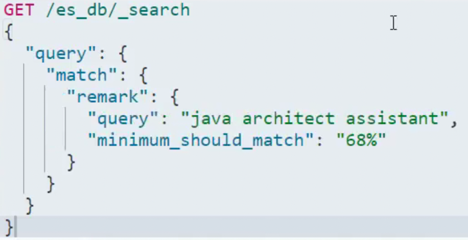


### 组合(叶子)查询

将**叶子条件**查询语句进行**组合**而形成的一个完整的查询条件

- **bool**：各条件之间有and. or或not的关系
  - must ：各条件and关系
  - should：各条件or关系
  - must_not：不满足所有条件，即各条件是 not(...and...) 关系
  - filter：不计算相关度评分，它不计算_score即相关度评分，效率更高

- **constant_score**：不计算相关度评分
    must/filter/shoud/must_not 等的子条件是通过 term/terms/range/ids/exists/match 等叶子条件为参数的
    注：以上参数，当只有一个搜索条件时，must等对应的是一个对象，当是多个条件时，对应的是一个数组


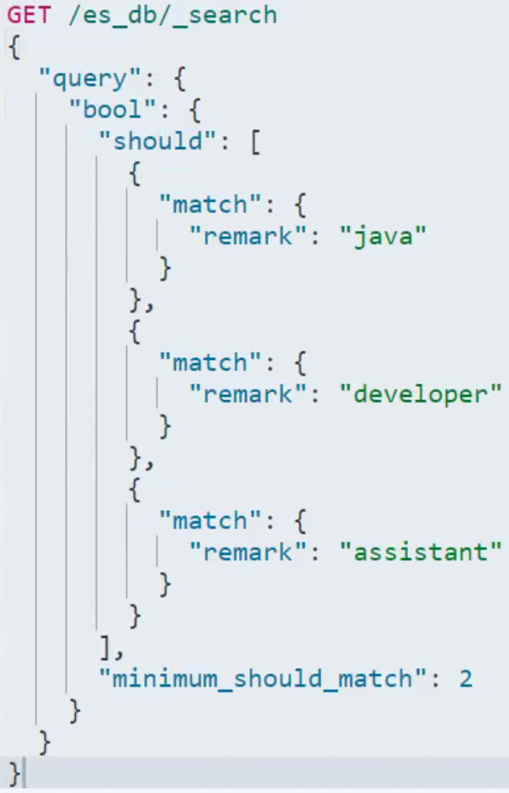


### 内部转化


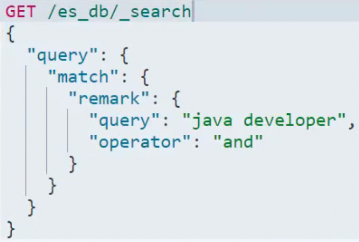

转换后是：

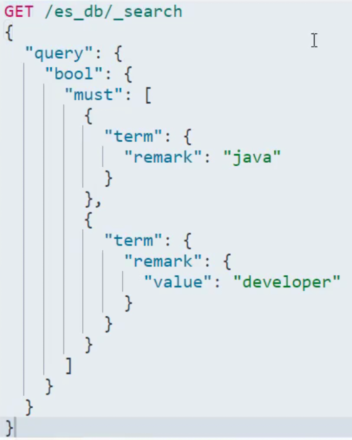


### boost(权重控制)

查询时, 如果某字段带上 boost, boost越大, 该文档查询排序越靠前.

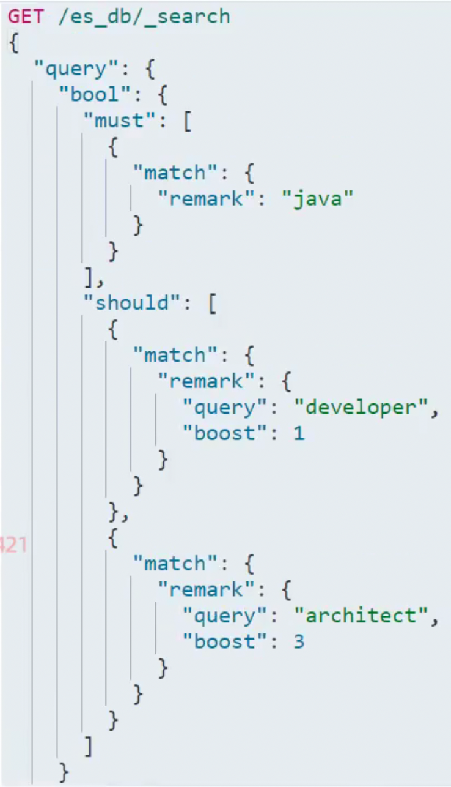


### 基于dis_max实现best fields策略进行多字段搜索

#### **best fields策略**: 

搜索**某一个field**，尽可能多的匹配搜索条件。

**优点**：精确匹配的数据可以尽可能的排列在最前端，且可以通过minimum_should_match来去除长尾数据，避免长尾数据字段对排序结果的影响。
长尾数据比如说我们搜索4个关键词，但很多文档只匹配1个，也显示出来了，这些文档其实不是我们想要的

**缺点**：相对排序不均匀。
dis_max语法：直接获取搜索的多条件中的，**单条件query相关度分数最高的条件**，以这个条件做相关度排序。


#### **most fields策略**: 

**尽可能多的字段**匹配到搜索条件.


### tie_breaker

让其他打分较低的字段也参与打分

dis_max, 将多个搜索query条件中**相关度分数最高的字段**, **用于**结果**排序**，**忽略其他query分数**，
在某些情况下，**如果需要其他query**条件中的相关度**介入**最终的结果**排序**，这个时候可以使用tie_breaker参数来优化dis_max搜索。

tie_breaker, 将其他**分数较低的query搜索条件**的相关度分数**乘以参数值**，再**参与到结果排序中**。
如果**不定义**此参数，**相当于参数值0**。所以其他**较低分数query条件**的**相关度**分数**被忽略**。

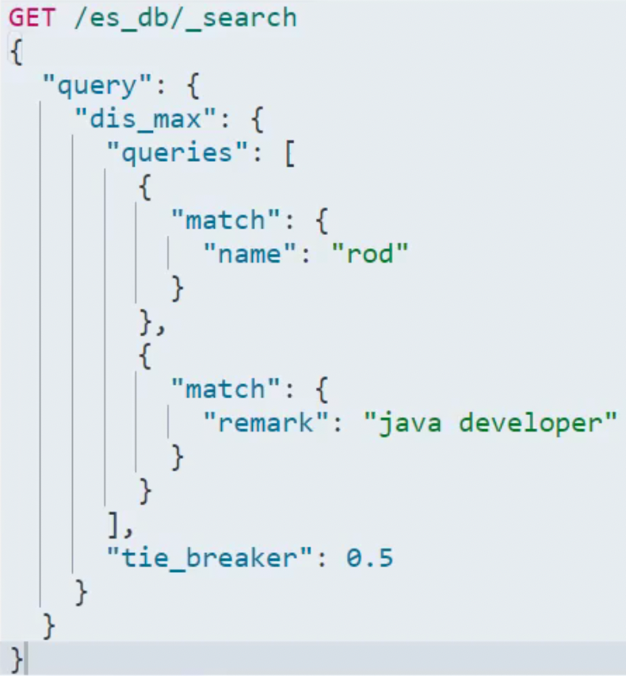


### 使用multi_match简化dis_max+tie_breaker

ES中**相同结果的搜索**可以由**不同的语法**语句来**实现**。

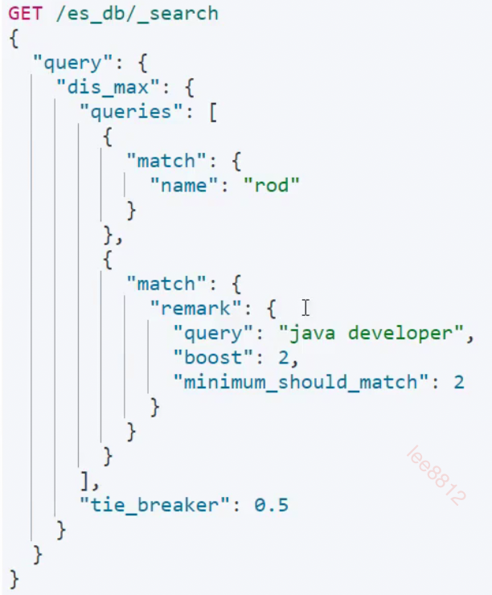


使用multi_match语法为：其中type常用的有best_fields和most_fields。
^n代表权重，相当于“boost"：n。

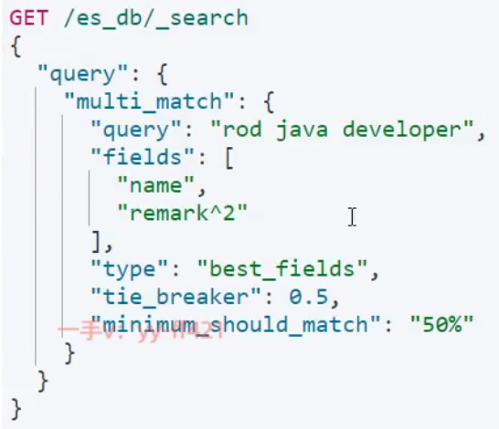


## 近似匹配

前边都是**精确匹配**。如doc中有数据java assistant，那么搜索**jave**是搜索不到数据的。因为jave单词在doc中是不存在的。


### match phase

搜索条件不可分割。

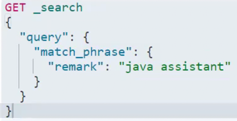

### match phase底层(term position)

还是会把搜索phase拆分, 但是会**保留每个词的位置**, 再去查, 只有符合顺序的才符合.

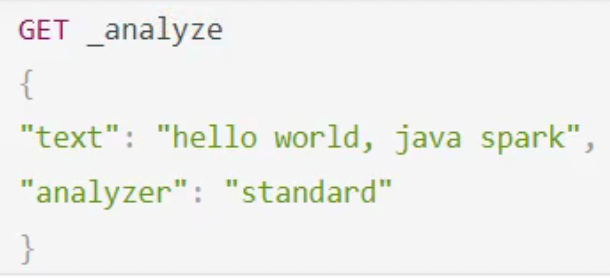

**分词结果**:

注意看**position**.

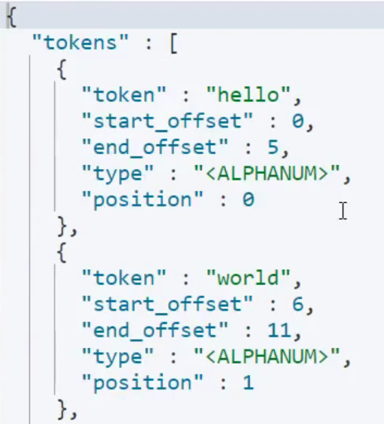


### match phrase搜索参数— slop

性能不好.

如果**搜索的是hello spark**。而ES中**存储**的数据**是hello wor ld, java spark**。使用match phrase则无法搜索到。这个时候，可以使用match来解决这个问题。
但是, 如果我们需要, hello和spark**两个单词距离越近**，document在结果集合中**排序越靠前**，这个时候再使用**match**则**未必**能**得到想要的结果**。

slop代表match phrase短语搜索的时候，**单词最多移动多少次**，可以实现数据匹配。
**多个单词距离越近**，**相关度评分越高**，排序越靠前.

这种**使用slop**参数的**match phrase**搜索，就称为**近似匹配** （proximity search）.

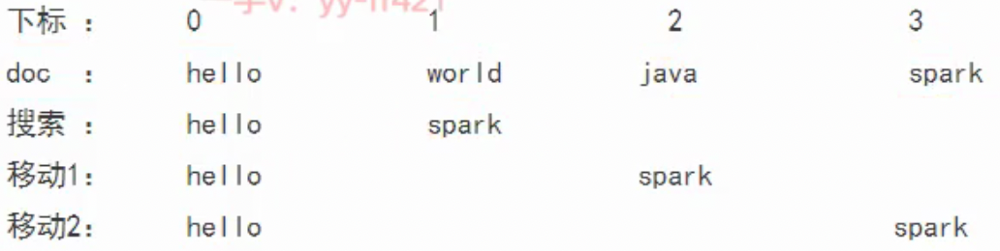


### 优化, 能完全匹配最好, 没有完全, 匹配单个词也好


使用match和proximity search**实现召回率和精准度平衡**。
**召回率**：召回率就是搜索**结果行数与总行数的比率**，如：索引A中有100个document，搜索时返回多少个document，就是召回率（recall）。
**精准度**：就是搜索**结果的准确率**，如：搜索条件为hello java，在搜索结果中**尽可能**让短语匹配和**hello java离的近的结果排序靠前**，就是精准度（precision）。
如果在搜索的时候，**只使用match phrase**语法，会导致**召回率低下**，因为搜索结果中必须包含短语（包括proximity search）。
如果在搜索的时候，**只使用match**语法，会导致**精准度低下**，因为搜索结果排序是根据相关度分数算法计算得到。
那么如果需要在结果中**兼顾召回率和精准度**的时候，就需要将match和proximity search**混合使用**，来得到搜索结果。

**例子:** 

must 必须包含 java 或 spark(match分词),
should 有完全匹配(match_phrase)就包括进来, slop再控制距离大小. 匹配match_phrase的, 分数会更高(排名).

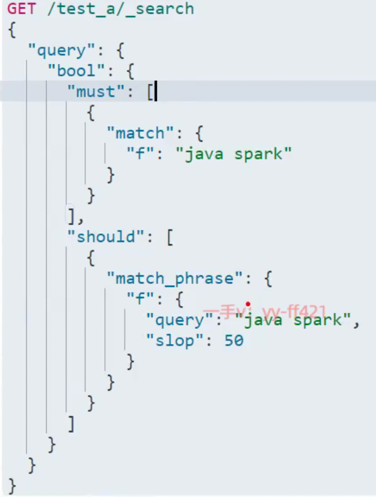


## 前缀匹配

可以做提示词功能, 例如: baidu搜索提示.

**前缀匹配**通常**只针对不分词的keyword类型字段**.

**注意**：前綴搜索，是**针对keyword类型字段**而言。而**keyword**类型字段数据**大小写敏感**。
前缀搜索**效率比较低**。前缀搜索**不会计算相关度分数**。**前缀越短，效率越低**。**建议使用长前缀**。因为前缀搜索需要**扫描完整的索引内容**，所以前缀越长，相对效率越高。


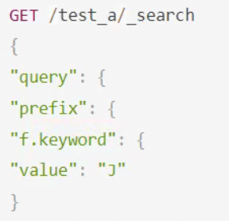

使用 **.keyword**, 就可以使用前缀搜索了, **即使是text字段**, **也会保存一份keyword类型**.


## 通配符搜索

通配符可以在**倒排索引中使用**，也可以在**keyword**类型字段中**使用**。

**?**:  一个任意字符
*****:  0~n个任意字符

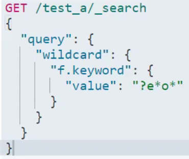


## 正则搜索

可以在倒排索引或keyword类型字段中使用。

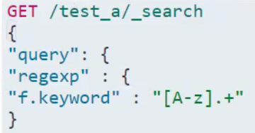


## 搜索推荐

和前缀类似, 


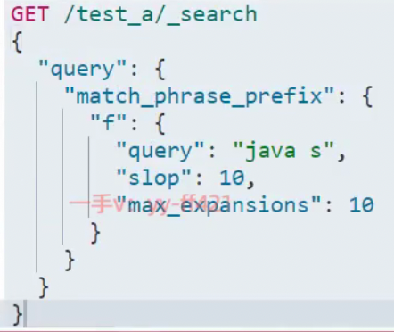

### 原理

和**match phrase类似**，是先使用**match**匹配**term数据（java）**，然后在指定的**sIop**移动次数范围内，**前缀匹配（s）**，
**max_expansions**是用于指定**prefix最多匹配多少个term**（单词），超过就不再匹配了。

这种语法的**限制是**，**只有最后一个term**会执行**前缀搜索**。
执行**性能很差**，毕竟**最后一个term**是需要**扫描所有符合slop要求**的倒排索引的term。
**如果必须使用**，**一定**要**使用**参数**max_expansions**。


## fuzzy模糊搜索技术

搜索的时候，**可能**搜索条件文本**输入错误**，如：hello **world** -> hello **word**.


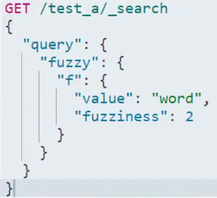

**fuzziness**代表搜索 **f字段**, 为 "word"的结果, **可以修改多少个字母来进行拼写错误的纠正**（修改字母的数量包含字母变更，增加或减少字母。）.


## filter

它的查询不会计算相关性分值，也不会对结果进行排序，因此效率会高一点，查询的结果可以被缓存。

```
POST /es_db/_doc/_search
{
"query":{
"bool":{
"filter":{
"term"：｛
"age"：25
}}}}}

```


## 文档映射(like mysql schema)


### 动态映射

不需要事先设置, 根据写入文档自动识别数据类型. 


### 静态映射

事先设置, 包含字段类型, 分词器等.


### 查看映射

```
GET /es_db/_mapping
```


**结果:**

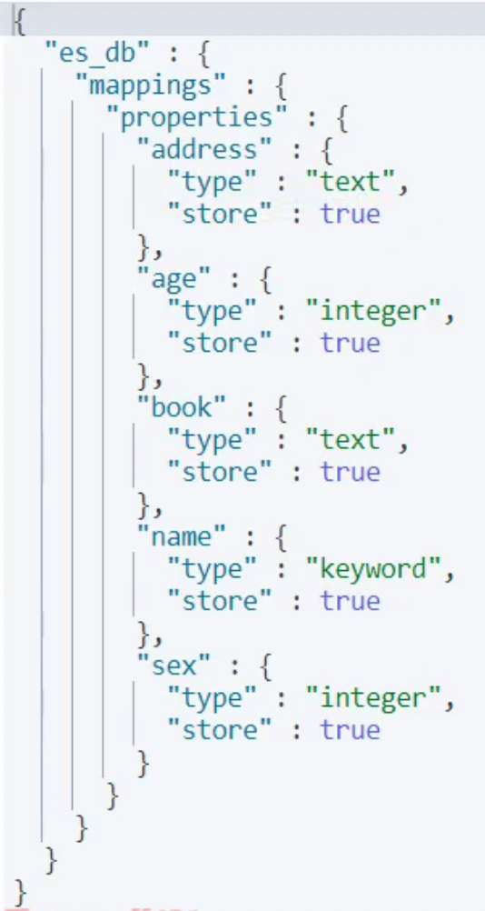


### 设置映射


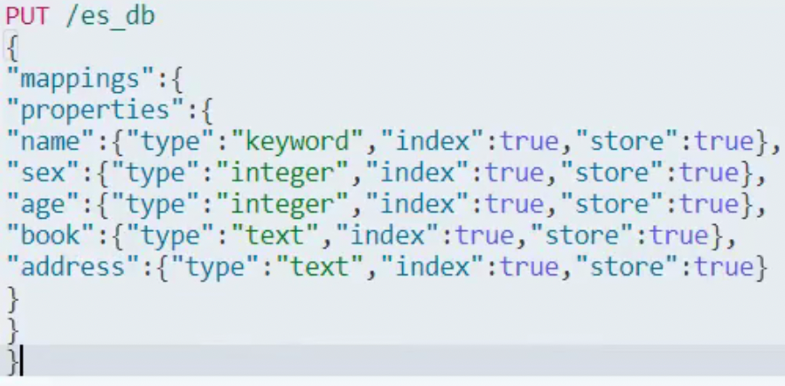

index: 字段是否建立倒排索引(?不是分词)

store: 数据表是否保存这个字段的具体内容, 有些场景不需要查处具体内容, 只需要**根据这个字段的索引**找到**其他字段**即可. (**例如**: 商品内容 和 商品标题, **根据内容建索引, 但是只需要显示标题即可**).


### 重建映射

只能新建, 不能修改

新建好后通过 _reindex 来导入原db文档, 然后删除原db, 在改名新db.

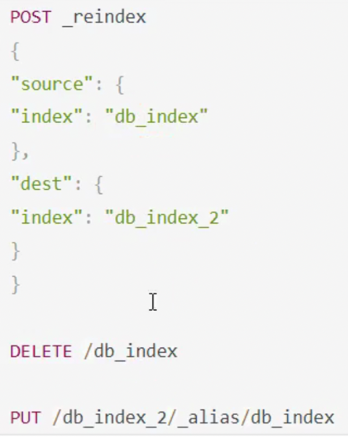


### _reindex


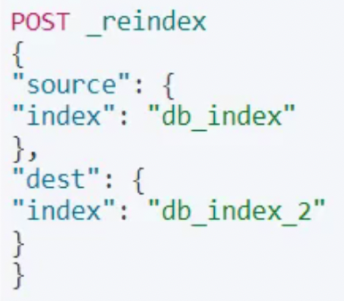


## 核心类型 （Core datatype）

- 字符串：string，string类型包含 text 和 keyword。
  - text：该类型被用来索引**长文本**，在**创建索引前**会将这些文本**进行分词**，转化为词的组合，建立索引；**text**类型**不能**用来**排序和聚合**。
  - keyword：该类型**不能分词(但会建索引)**，可以被**用来检索过滤、排序和聚合**，keyword类型**不可**用text进行**分词模糊检索**。
- 数值型：long、integer、short、byte、double、float
- 日期型：date
- 布尔型：boolean


### keyword

查询该字段时, 如果是 match


## 通过term 和 match查询数据时细节点以及数据类型keyword与text区别


**term-keyword**: term 和 keyword字段 **都不分词**。需要**完全匹配**。

**term-text**: term不分词, text字段会分词，所以, **term查询**的条件**必须是text字段分词后的某一个**。

**match-keyword**: match会被分词，而keyword不会被分词，match的需要跟keyword的**完全匹配**。

**match-text**: match 和 text 都分词，只要**match分词结果**和**text分词结果**, **有相同就匹配**。


## 并发控制


### 悲观


### 乐观

7.x前用 _version, 后用 _seq_no


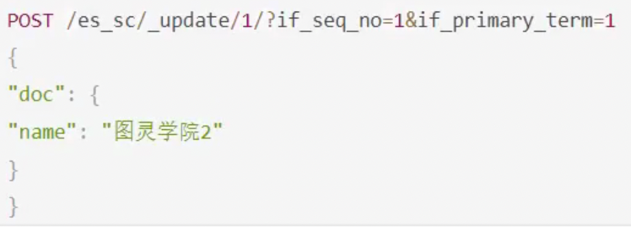

**_primary_term(类似zookeeper的世代)**：_primary_term也和_seq_no一样都是整数，每当Primary Shard发生重新分配时，比如重启，Primary选举等，_primary_term会递增1。


## 集群


### 查看

```
GET _cat/nodes?v
GET _cat/health?v
```


## 分析(_explain), 如何打分


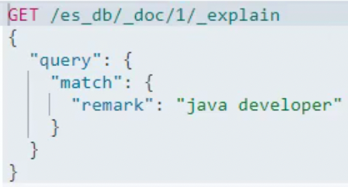

remark是字段.


## highlight(高亮显示)


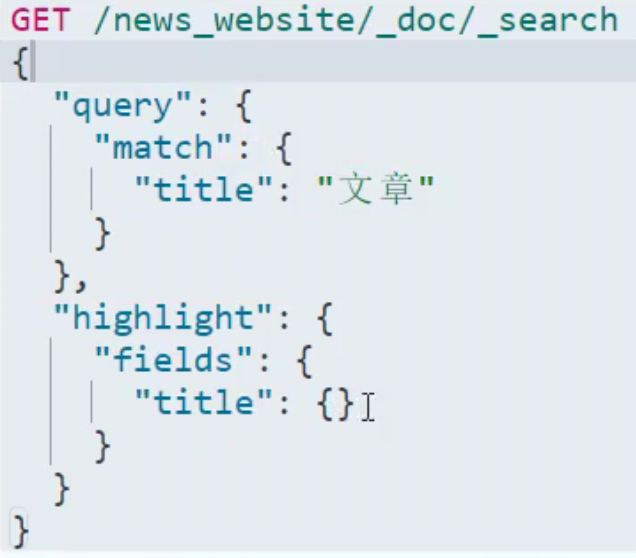

结果: 

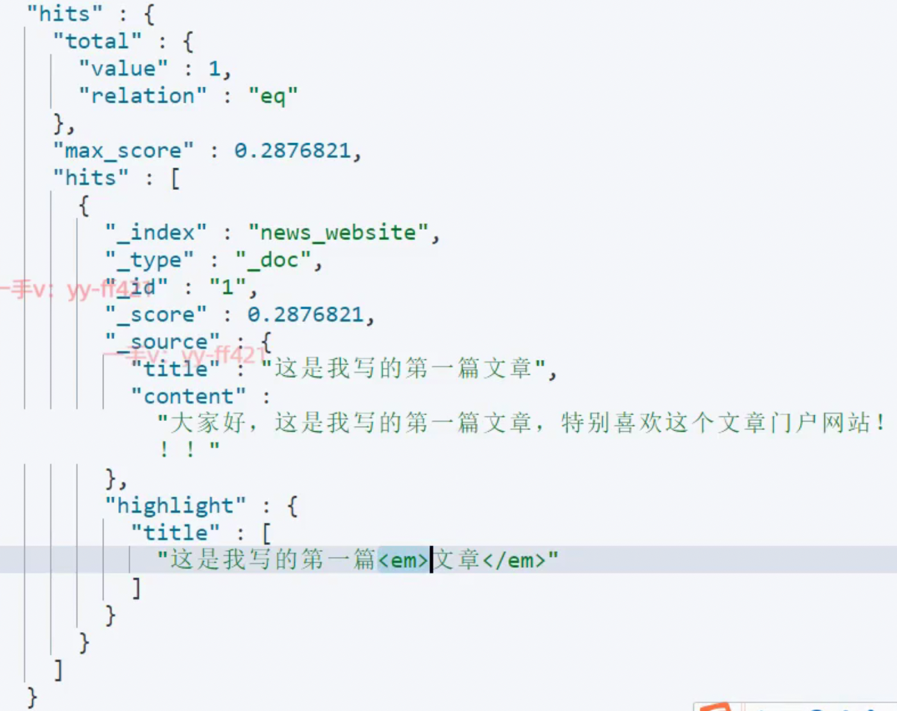

### highlight类型

在**创建db时**, 对字段的指定属性.

**检索时**, 也可以再次指定字段对应的highlight类型.


**fragment_size**：假如一个Field的值，有长度是1万，不可能在页面上完全显示, 设置**要显示出来的 fragment文本长度**，默认是100.
**number_of_fragments**：指定显示 **高亮的fragment文本片段** 的数量.


#### **plain highlight**, 

lucene highlight，默认


#### **posting highlight**, 

index_options=offsets

1. 性能比plain highlight要高，因为**不需要重新对高亮文本进行分词**
2. 对**磁盘的消耗更少**


#### fast vector highlight
index-time term vector设置在mapping中，就会用fast verctor highlight

1. 对大field而言（大于1mb），性能更高


## 聚合搜索技术深入

size: 可以指定返回的行数. == 0, 就只返回统计后的数据.


### bucket和metric概念简介

bucket相当于 mysql 的 group by, 
metric有多种统计，如：求和，最大值，最小值，平均值等。


**例子:**


group_by_color: 自定义字段;
terms: 相当于 mysql count();
_count: ES内部定义的;


### 嵌套(下钻分析)

**例子:**

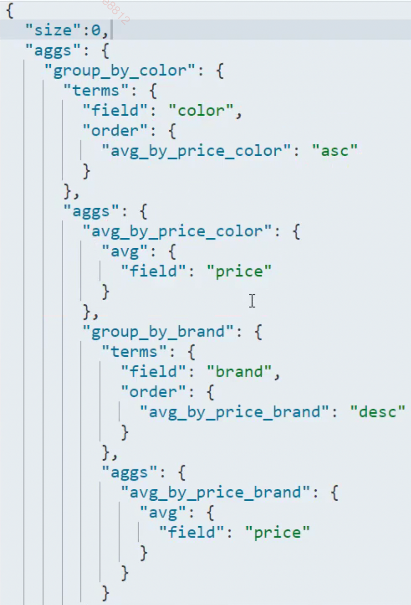

结果:

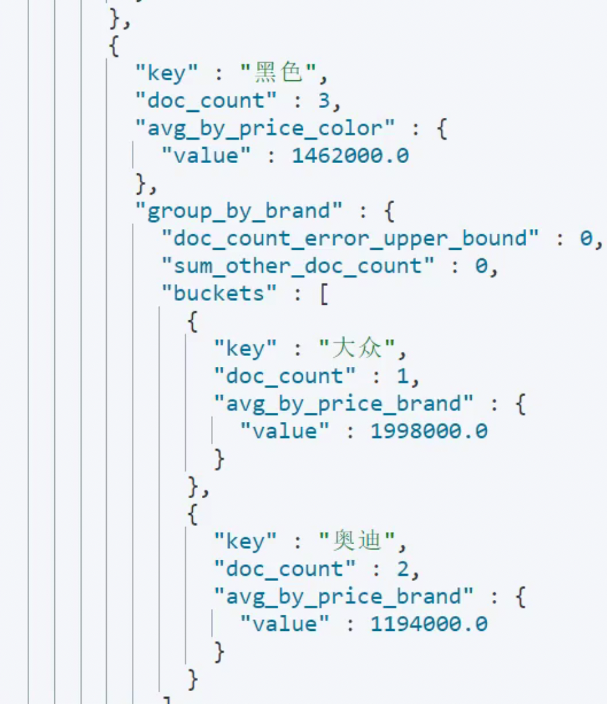


## histogram区间统计


## cross fields搜索

一个唯一的标识，分部在多个fields中，使用这种唯一标识搜索数据就称为cross fields搜索。
实现这种搜索，一般都是使用most fields搜索策略。因为这就不是一个field的问题。
默认情况下，和most fields搜索的逻辑是一致的，
计算相关度分数是和best fields策略一致的。
一般来说，如果使用cross fields搜索策略，都会**携带一个额外的参数operator**。用来标记搜索条件如何在多个字段中匹配。

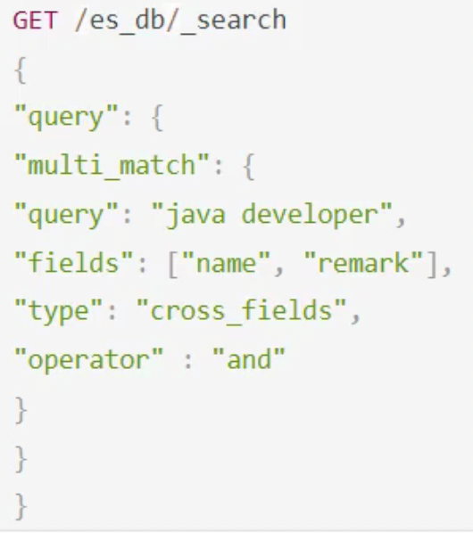

