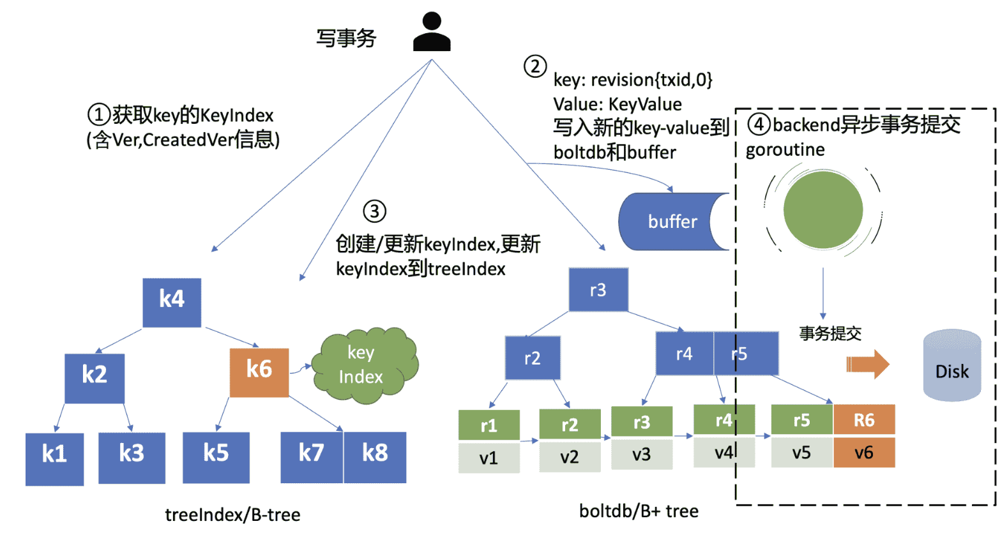

## 概述

建议最多8G内存

## mvcc(boltdb)

底层用 B+树(一个key一个树), 可以分页查询节点历史信息.

treeIndex 模块 用于持久化 kv历史信息

最后一个表示, delete	

### 过程

## RAFT

## lease

用最小堆来管理 lease, 定期清理从最小kv到小于当前时间的kv即可.

通过 kv 和 lease 绑定, 在 lease 时间内, 如果没有续约就会被删除. 和 心跳作用一样.

## watch

## 压缩后 db 大小不减少

我们通过 boltdb 删除大量的 key，在事务提交后 B+ tree 经过分裂、平衡，会**释放出若干 branch/leaf page 页面**，然而 boltdb 并**不会将其释放给磁盘**，调整 db 大小操作是昂贵的，会对性能有较大的损害。
**通过 freelist page 记录这些空闲页**的分布位置，当收到新的写请求时，优先**从空闲页数组中申请若干连续页使用**，实现高性能的读写（而不是直接扩大 db 大小）

## 线性读

节点**从 Leader** 获取到**最新已提交的日志**条目索引 (rs.Index) 后，它需要**等待本节点**当前**已应用的 Raft 日志索引**，**大于等于 Leader 的已提交索引**，确保能在**本节点**状态机中**读取到最新数据**。

ReadIndex -> AppliedIndex

**应用已提交日志**条目到状态机的过程中又**涉及到随机写磁盘**. 

etcd 是一个**对磁盘 IO 性能非常敏感的存储系统**，磁盘 IO 性能不仅会**影响 Leader 稳定性、写性能表现，还会影响读性能**。线性读性能会**随着写性能的增加而快速下降**。如果业务对性能、稳定性有较大要求，我建议你尽量使用 SSD 盘。

## 优化读

client 对节点的**负载均衡**

如果异地的服务**对数据一致性要求不高**，那么你甚至可以通过**串行读访问 Learner 节点**

## 优化/扩展

**db quota** 大小调整

**限速**: Raft 模块**已提交**的日志索引（committed index）比**已应用**到状态机的日志索引（applied index）**超过了 5000**，那么它就返回一个"etcdserver: too many requests"错误给 client。

**心跳**及**选举**参数: 建议你可以根据实际部署环境、业务场景，将**心跳间隔时间调整到 100ms(默认) 到 400ms 左右**，选举超时时间要求至少是心跳间隔的 **10 倍**。

**快照**参数: --snapshot-count 的参数来控制快照行为。它是指收到多少个写请求后就触发生成一次快照，并对 Raft 日志条目进行压缩.

### 扩展

**读/Watch/Lease扩展**

gRPC proxy: **无状态节点**，为你**提供高性能的读缓存的能力**。你可以根据业务场景需要水平扩容若干节点，同时通过**连接复用，降低服务端连接数、负载**。它也提供了**故障探测和自动切换**能力，当后端 etcd 某节点失效后，会自动切换到其他正常节点，业务 client 可对此无感知。

