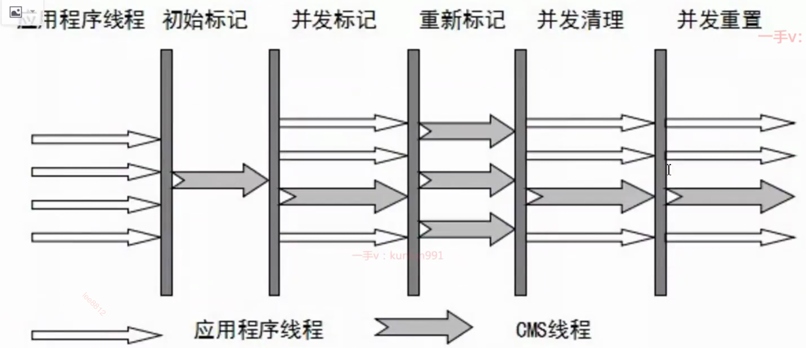
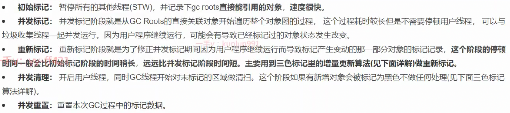
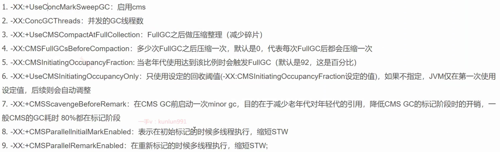
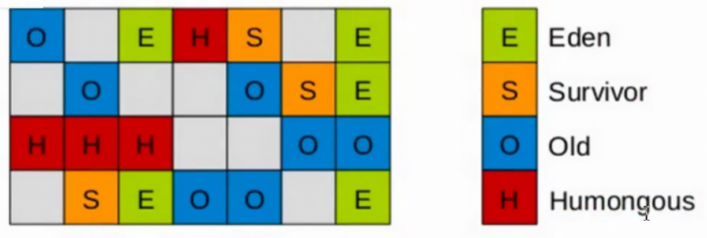
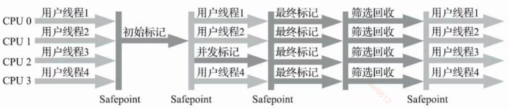
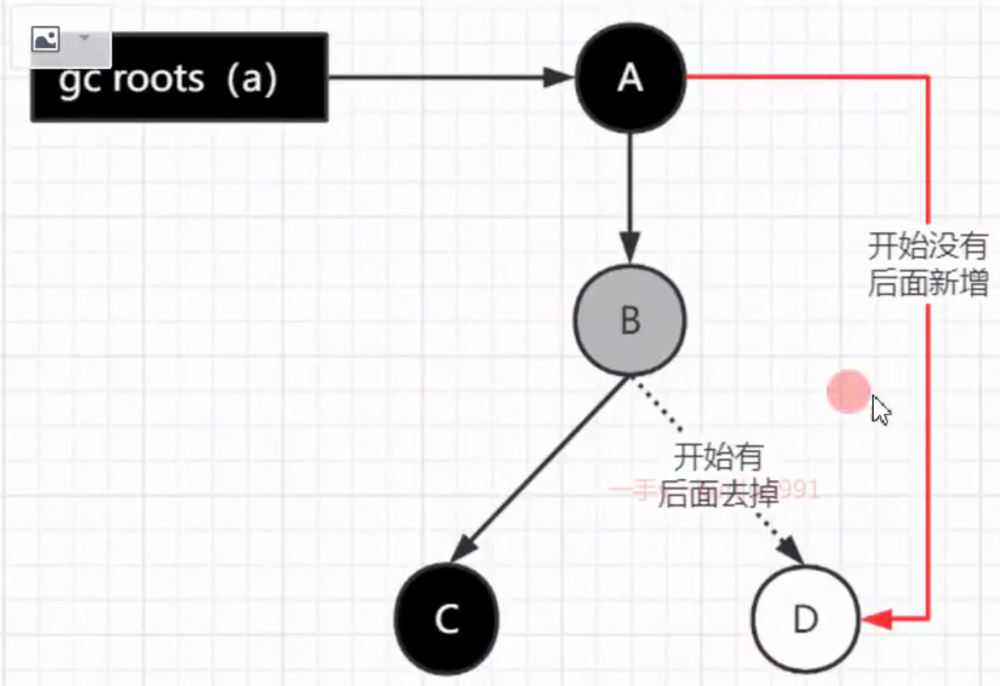

## eden/survivor

minor GC 是**同时清理 eden + 一边的survivor**, 存活的对象**移动到另一边的survivor**.

## 回收算法

### 标记-清除

只单纯清理垃圾

### 标记-整理

标记完, 
把有效数据移动到头部原来垃圾的位置,
移动完有效的数据, 如果还有未清理的垃圾再删掉

### 标记-复制

标记完, 把有效的数据复制到另一侧(下一代),
然后把原来一侧完全清除.

## Parallel Scavenge

总的GC时间短, 吞吐量大.

## CMS

浮动垃圾: 在并发标记阶段, 例如某个被标记为黑色的局部变量, 因为方法的结束又被标记为白色(灰?), 导致本轮不会被GC, 下轮在GC.

使用标记-清除, 造成空间碎片, 可以使用 -XX: +UseCMSCompactAtFullCollection 做整理. 

因为是并发清理, 所以会出现 GC 时, 出现仍然空间不足的情况, 这时会STW, 然后用 Serial Old 收集.

### CMS的相关核心参数

X越多, 越可能被废弃.

**注意: 5 就是可以尽量避免并发清理时, 发生oom, 导致 STW继而改为使用 Serial Old** (如果大对象比较多(老年代容易塞满), 注意要调小)

## G1

年轻代的 eden survivor 比例一样, 但是被切分成一个个的独立区域(region).
使用的是标记-复制, 但是也会有标记-整理的效果.

优先回收**回收时间短(存活对象的多少)的区域**, (效益比),

除了年轻代, 老年代, 多了一个大对象区域(Humongous), 大于一个region50% 就是大对象.

-XX:**MaxTenuringThreshold**：最大年龄阈值（默认15）
-XX:**G1MixedGCLiveThresholdPercent**: （默认85%）region中的**存活对象低于这个值**时才会**回收该region**，如果超过这个值，存活对象过多，回收的的意义不大。
-XX:**G1MixedGCCountTarget**: 在一次回收过程中**指定做几次筛选回收（默认8次）**，在最后一个筛选回收阶段可以**回收一会，然后暂停回收，恢复系统运行**，一会再开始回收，这样可以让系统**不至于单次停顿时间过长**。

初始标记, 最终标记, 筛选回收 都会STW.
但是可以设置**STW的时间(-XX:MaxGCPauseMillis)**, 原理是在**筛选回收阶段**只**回收部分region的垃圾, 在设定时间内完成**.
会先计算回收的GC是否 > 默认的STW时间, 如果没有超过, 会增加youngGC的区域, 更合理地利用GC时间, 否则 GC.

G1 在**最终标记阶段**, 使用 原始快照（Snapshot At The Beginning, SATB）来实现写屏障(并发GC避免误删).

### mixed GC(不是 fullGC)

老年代的堆占有率达到参数（-XX:**InitiatingHeapOccupancyPercent**）设定的值则触发，回收所有的Young和部分Old（根据期望的GC停顿时间确定old区垃圾收集的优先顺序）以及大对象区，正常情况G1的垃圾收集是**先做MixedGC**，主要使用**复制算法**，需要把各个region中存活的对象拷贝到别的region里去，拷贝过程中如果发现**没有足够的空region**能够承载拷贝对象就会**触发一次Full GC**

### G1使用场景

1. 50%以上的堆被存活对象占用
2. 对象分配和晋升的速度变化非常大
3. 垃圾回收时间特别长，超过1秒
4. 8GB以上的堆内存（建议值）
5. 停顿时间是500ms以内

部署**kafka**需要用**大内存**机器（比如**64G**），**年轻代分配个三四十G**的内存用来文撑高并发处理，kafka这个并发量放满三四十G的eden区可能也就一两分钟吧，整个系统每运行一两分钟就**会因为young gc卡顿几秒**钟没法处理新消息, 
可以使用**G1收集器**设置-XX:**MaxGCPauseMills** 为**50ms**，完全能够接受，用户**几乎无感知**，那么整个系统可以在卡顿几乎无感知的情况下**一边处理业务一边GC**。

## parnew/CMS区别

parnew即使是并发标记的stw还是比较长(1s), 

CMS**总stw**较**短**, 但是**总的GC**时间**长**, 也会消耗CPU, 使得**吞吐量**会**比Parallel** Scavenge**低**点, 
好处是会**拆分成多个(2个?)阶段来stw**, **使用户感知更不明显**. 80%时间是并发GC.

## GC收集器

## GC ROOT

**包括以下对象：**

	1. 虚拟机栈中引用的对象（方法的**局部变量、参数、操作数栈**）。	
	1. 方法区中的**静态变量**。
	1. 方法区中的**常量**（final static 常量）。
	1. **本地方法栈**中 JNI 的引用对象。
	1. **活跃线程**对象。
	1. **类加载器**及其引用的对象。
	1. 被**同步锁**（synchronized）持有的对象。
	1. 特定 GC 内部的保留引用（例如 G1 GC 的 Region 元数据）。

## 标记算法

### 3色标记法

黑色: 本身存活, 且他的所有直接子节点都扫描过

灰色: 本身已经存活(绝不会变回白色), 但他的直接子节点, 还没扫描完, 或是垃圾.

白色: 还没扫描,或是垃圾.

### 漏标

就是可能老的GC算法会有bug, 
就是, 并发标记时, 垃圾对象又被重新引用, **如果漏标, 就会误删有效对象.**

#### 并发GC垃圾对象被重新引用, 解决办法

**增量更新 （Incremental Update）和原始快照（Snapshot At The Beginning, SATB）**, 都是**写屏障**实现.

并发GC**增量更新**时, 
会记录下, 每一个更新的引用关系到一个list,
然后**在重新标记阶段**(看上边CMS), STW, 把更新所有的引用的**起点对象变为灰色**, **重新执行3色标记**.

**原始快照**, 
要删除的引用记录到list，
并发结束后, 把灰色的重新扫描, 如果**扫(不是深度扫)到白色对象**，将白色对象直接**标记为黑色**（目的就是让这种对象在本轮gc清理中能存活下来，待**下一轮gc的时候重新扫**描，这个对象也有可能是浮动垃圾）

#### 写屏障:

是jvm的代码屏障用于保留操作前后的记录.

增量更新, 是收集更新后的引用关系, 所以是写后记录的写屏障,

原始快照, 是要删除的, 所以是写前记录的写屏障

## savePoint

由**底层C++ savePointSync at savePoint实现**

GC不是随时都能做, 只有在savePoint,
GC会有有正在GC的标志位, 每当线程到达 savePoint 时, 就会**检查 是否要准备GC, 使得话会线程会挂起,**
当**所有线程**都走到savePoint**挂起时**, **开始GC**的某个阶段.

**savePoint 包括:**

1. 方法返回之前
2. 调用某个方法之后
3. 抛出异常的位置
4. 循环的末尾

## 安全区域

有些**线程处于wait或sleep状态**, **没法到达savePoint,** 在这一段**代码片段**中, **GC不会改变引用关系**, 所以是安全的区域.

## 记忆集(Remember Set)

用於記錄 older區對象 對 年轻代的引用, 用 记忆集 来记录.

## 卡表(Cardtable)

是记忆集的一种实现(hotspot),
卡表在老年代, 
卡表是使用一个字节数组实现：CARD_TABLE［］，每个元素对应着其标识的内存区域(一块特定大小的内存块)，称为“卡页"。

## 为什么G1用SATB？CMS用增量更新？

SATB只会把要**删除的引用记录到list**, 不会**重新深度扫描**, **下轮GC再重新执行**.

## ZGC

和 G1 不同, ZGC的3色标记不再对象头, 在指针.

**并发重分配（Concurrent Relocate)**, 存活对象复制到新的Region上, 为重分配集中的每个Region维护一个转发表（Forward Table）,
并发访问了位于重分配集中的对象，被预置的内存屏障（读屏障）所截获，根据Region上的转发表记录将访问转发到新复制的对象上，
ZGC将这种行为称为指针的“自愈”（Self-Healing）能力。
