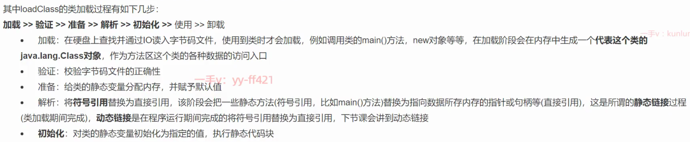
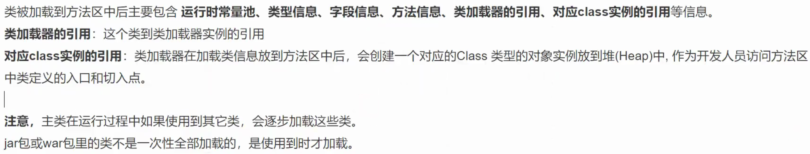
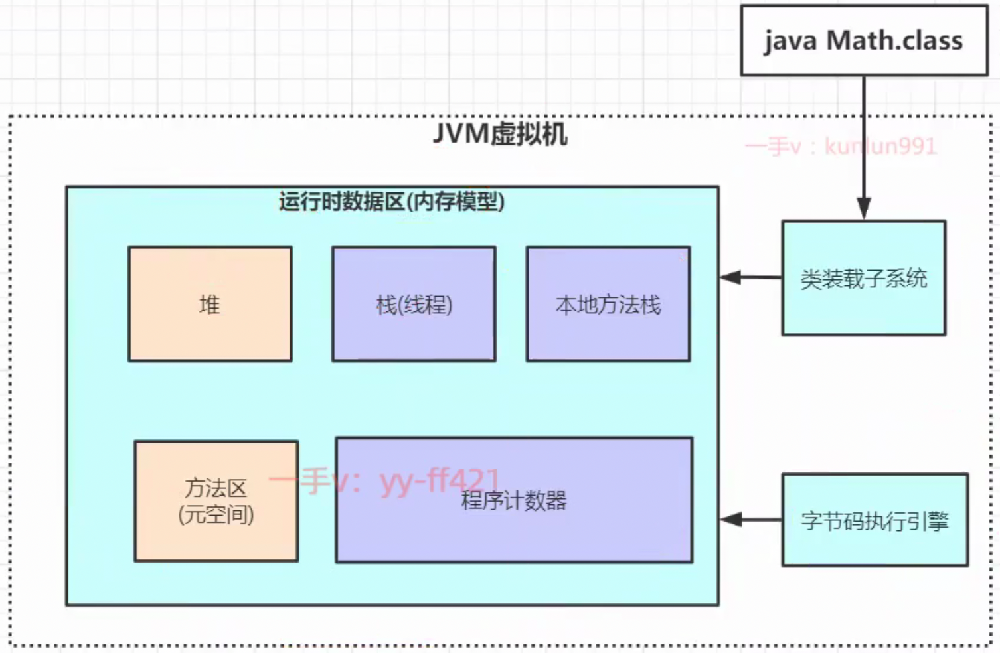

[toc]

## main加载过程

## 静/动态链接

### 静态

**静态方法直接指向方法的内存地址.**

### 动态

例如, 实例方法, 一开始不会解析成对应的内存地址, 直到调用时.

## 双亲委派机制

**双亲委派机制说简单点就是，先找父亲加载，不行再由儿子自己加载**

- 引导类加载器：负责加载支撑JVM运行的位于JRE的lib目录下的核心类库，比如 rt.jar、charsets.jar等
- 扩展类加载器：负责加载支撑JVM运行的位于JRE的lib目录下的ext扩展目录中的JAR类包
- 应用程序类加载器：负责加载ClassPath(编译好的target目录)路径下的类包，主要就是加载你自己写的那些类
- 自定义加载器：负责加载用户自定义路径下的类包

### 为什么要用这种有下至上再至下的方式呢

因为, 后续主要还是使用app loader, 除了第一次需要这么加载, 后续直接在app loader里获得缓存即可. 可能只是为了区分loader的使用场景.

## 为什么要设计双亲委派机制？

• 沙箱安全机制：自己写的java.lang.String.class类不会被加载，这样便可以防止核心API库被随意篡改
• 避免类的重复加载：当父亲已经加载了该类时，就没有必要子ClassLoader再加载一次，保证被加载类的唯一性

## 全盘负责委托机制

是指当一个ClassLoder装载一个类时，除非显示的使用另外一个ClassLoder，该类所依赖及引用的类也由这个
ClassLoder载入。

## 打破 双亲委派机制(**Parent Delegation Model**)

extends ClassLoader, 重写  loadClass(string, boolean), 只需要跳过自定义的class走parent loader 逻辑, 即可.

### 应用 

tomcat war包部署的lib隔离.

## JVM

