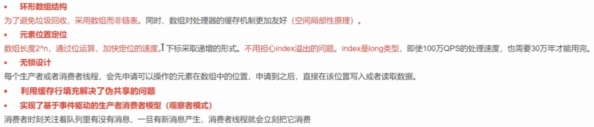
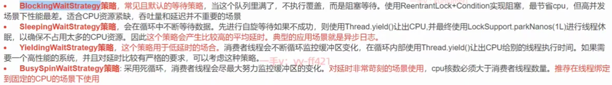
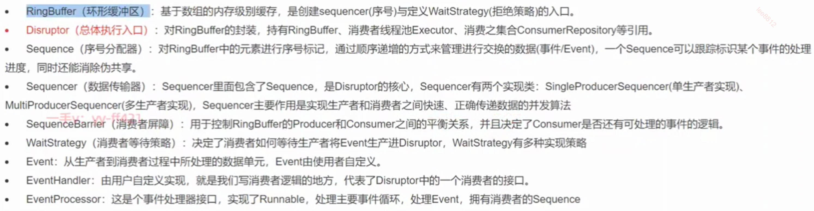
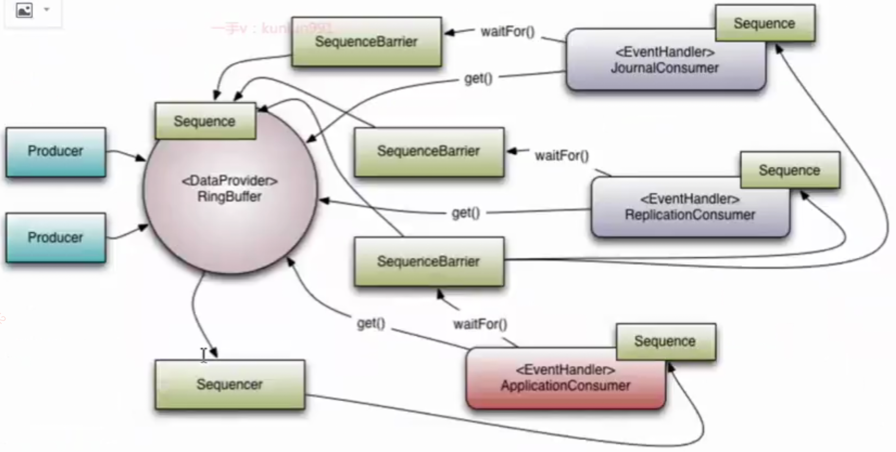

## 简述

**高性能内存有界队列**, 基于此开发的系统单线程能支撑每秒600万订单, 
使用了**ringbuff**, **环形array**, 长度建议为2^n, **2^n就可以想到寻址用&(位运算)来hash**, 快速**定位index**
**关键:** 使用填充Long, 来解决伪共享, 因为相同的64位里的变量改变,  会造成伪共享, **伪共享会导致在64位内的所有变量失效(为了可见性刷入主存).**

## Disruptor解决队列速度慢的问题

## ringBuff

### buff满时策略

### 多个生产者写数据的流程

每个线程通过cas, 获取不同的一段数组空间进行操作。

但是会**遇到新问题**：**如何防止读取时, 读到还未写的元素。** **和kafka思想一样**, available Buffer, 当某个位置写入成功的时候，便把**availble Buffer相应的位置置位，标记为写入成功**。
**读取时，遍历available Buffer**，来**判断元素是否已经就绪**。**只能读到"最早未写入"的前一个可读元素为止.**

## Disruptor核心概念

### Disruptor构造器

有单/单, ..., 多/多(生产/消费)模式