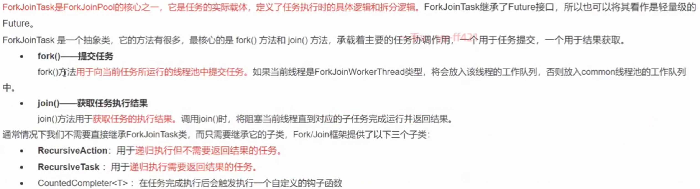

## 简述

传统ThreadPoolExecutor有两个明显的缺点: 
一是**无法对大任务进行拆分**，对于某个任务只能由单线程执行;
二是工作线程**从队列中获取任务**时存在**竞争**情况。

Fork/Join框架的**核心是ForkJoinPool类**, 它是对AbstractExecutorService类的扩展。ForkJoinPool允许其他线程向它提交任务, 并根据设定将这些任务拆分为粒度更细的子任务，这些子任务将由ForkJoinPoal内部的工作线程来并行执行，并且**工作线程之间可以窃取彼此之间的任务**。

ForkJoinPool**最适合计算密集型任务**，而且**最好是非阻塞任务**。

## 提交API

## 为什么工作线程总是从头部获取任务，窃取线程从尾部获取任务

为了提高性能，**工作线程**通过始终**选择最近提交的任务**，可以**增加资源仍分配在CPU缓存中的机会**，这样CPU处理起来要快一些。
**窃取者**从尾部获取任务，则是为了**降低线程之间的竞争**可能，毕竟大家都从一个部分拿任务，竞争的可能要大很多。
此外，由于任务是可分割的，那队列中**较旧的任务最有可能粒度较大**，因为它们可能**还没有被分割**，而**空闲的线程**则相对更有“精力”来完成这些粒度较大的任务。

## ForkJoinTask

### ForkJoinTask使用限制

ForkJoinTask最适合用于**纯粹的计算任务**，也就是纯函数计算，计算过程中的对象都是独立的，对外部没有依赖。提交到ForkJoinPool中的**任务应避免执行阻塞IO**。

## 线程数

<<JAVA并发编程实战>>推荐, 线程数= CPU 核心数*（1+平均等待时间/平均工作时间）

CPU密集, 推荐 1~2倍.
IO密集, 很多倍, 压测.

## 坑

自己实现的递归分支算法, 可能因为分配的总线程数不足, 导致拆分任务时, 无法分配线程导致死锁.

## ForkJoinPool 原理

多个线程，每个线程维护一个工作队列workqueue, workqueue是array Deque, 存放着ForkJoinTask
多个workqueue存在workQueues[],
**提交任务, hash到一个工作队列**, push,
工作线程在**处理自己的工作队列时，使用的是 LIFO** 方式,
**窃取任务使用的是FIFO**方式,
在遇到 join()时，如果需要 **join 的任务尚未完成**，则会**等待其他任务处理完成**。

## 工作队列WorkQueue

- WorkQueue 是Deque, 如果 WorkQueue 用于自己的执行线程，线程默认从尾端选取任务用来执行 LIFO。
- 每个 ForkJoinWorkThread 都有属于自己的 WorkQueue，但**不是每个 WorkQueue 都有对应的 ForkJoinWorkThread**.
- **没有 ForkJoinWorkThread** 的WorkQueue 保存的是 **submission**，来自外部提交，在WorkQueuel的下标是 偶数位.

## ForkJoinWorkThread

ForkJoinWorkThread 是用于执行任务的线程，**区别使用非 ForkJoinWorkThread 线程**提交task、启动一个该 Thread, 会自动注册一个 WorkQueue 到 Pool, **拥有 Thread的 WorkQueue 只能出现在 WorkQueue[] 的奇数位**。

