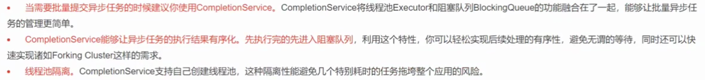

## Future 的主要功能

## Future 注意事项

- 当 for 循环批量获取 Future 的结果时容易 block，get 方法调用时**应使用 timeout 限制**
- Future 的生命周期不能后退。一旦完成了任务，它就永久停在了“已完成”的状态，不能从头再来

## Future的局限性

## CompletionService

CompletionService主要功能是**一边生成任务，一边获取任务的返回值**。让两件事分开执行，任务之间不会互相阻塞，可以实现**先执行完的先取结果，不依赖任务顺序**。

### 用法

### 

### 原理

内部通过阻塞队列(BlockingQueue<Future<V>>)+FutureTask，实现了**任务先完成可优先获取到**，通过调用它的take方法或poll方法可以获取到一个已经执行完成的Future，进而通过调用Future接口实现类的get方法获取最终的结果.

### 应用场景总结

## 使用Callable 和Future 产生新的线程了吗？

没有, 

## CompletableFuture

CompletableFuture是**Future接口的扩展和增强**。
业务逻辑处理存在**串行[依赖]、并行、聚合**的关系。自己实现很麻烦. CompletableFuture实现了**对任务的编排能力**。

Completionstage接口: 执行某一个阶段, 可向下执行后续阶段. 异步执行, **默认线程池是ForkJoinPool.commonPool(), 注意线程隔离问题.**

### 应用场景

### 结果处理

### anyOf

