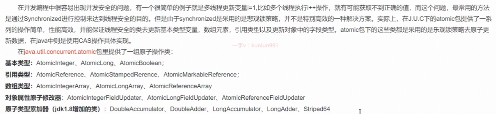

[toc]

## 1.1. 与进程区别

**线程, 是cpu执行的最小单元**,
线程**共享进程的资源,**

进程, 操作系统以**进程是资源分配的最小单位。**
进程就是**分配系统资源**（CPU时间片、内存等资源）, 用来加载指令、管理内存、管理IO的。

## 使用方式

1. 实现runnable->复写run()->new Theads(runnable)->执行start()
   因为runnable 有 @FunctionalInterface, 也就可以用 lambda.
2. new Theads()->复写run()->start()
3. callable 类runnable, Executors.newFixedThreadPool(10).submit(new Callable()); 也可以new Thread(new FutureTask(new Callable()); **比 runnable, 可以对外抛异常, 有返回值**. 

但**实际上只有一种**, 只是语法糖/封装.
Theads执行的target, 就是 runnable;
callable在ThreadPool中, 其实也是new thread();

## CAS

不会涉及用户到内核模式的切换, 只调用了一个汇编**原子性**(读,写不中断)指令.

V（内存中的实际值，有可能被其他线程修改）
E（旧值，当前线程之前从内存中获取的值，也就是参与和V进行比较的值）
U（当前线程需要更新的值，也就是需要参与和V进行交换的值）

api有3种unsafe方法: object, int, long

### cas 底层


1. 通过 obj 和 offset 得到addr, 
2. 然后比较e, 
3. 如果e一致, 则替换为x, 并返回e.

下图意义: Atomic::cmpxchg(x,addr,e), 就会去调汇编指令`cmpxchg()`, 之前还判断了是否是多处理器, LOCK_IF_MP(...), 如果是则锁定.


### CAS缺陷
CAS 虽然**高效解决了原子操作**，但存在缺陷的：

- 自旋 CAS长时间不成功，则会给CPU 带来非常大的开销
- 只能保证一个共享变量原子操作
- ABA 问题

### ABA问题

变量x 的值由, A->B->A, 但是线程却不知道, 中间发生的变化.

java 带版本cas AtomicStampedReference

## 进程间通信

socket通信
mq
共享内存
信号(signal)
信号量(semaphore)
管道(pipe)及有名管道(named pipe)

## 线程 同步/互斥

同步, 一个线程**等待另一个线程的完成/消息**, 直到**达到才被唤醒**
互斥, 对**共享资源**, 各个**线程的排他性**, 可以视为特殊的线程同步.

## 上下文

**上下文**是**CPU寄存器**和**程序计数器**在任何时间点的**内容**。

**CPU寄存器**是**CPU内部**的一小部分非常快的**内存**（相对于CPU外部较慢的RAM主内存）
**程序计数器**是一种专门的寄存器，它指示CPU在其指令序列中的位置，并**保存着正在执行的指令的地址**或**下一条要执行的指令的地址**


### 切换

**CPU**从一个进程/线程, **切换到另一个进程/线程**。
上下文切换只能在**内核模式下发生**.
**切换时间**大致在 **10ms~100ms**之间.
实际上，它可能是**操作系统上成本最高的操作**。尽可能地**避免不必要**的上下文**切换**。Linux优势是上下文/模式切换成本极低。

#### 大致过程

1. **暂停一个进程的处理**，将该进程的CPU状态（即上下文）**存储在内存中**的某个地方
2. **从内存中获取下一个进程上下文**，并**在CPU的寄存器中恢复**它.
3. 返回到程序计数器指示的位置（即返回到进程被中断的代码行）以恢复进程。


### 线程生命周期

#### 操作系统层面

(?不止)五种：初始状态、就绪(可运行)状态、运行状态、休眠状态和终止状态。

#### JVM层面
就绪(可运行)状态 和 运行状态 **合并为运行状态**; 但是可以通过**yield()**来, 转为**操作系统的就绪态**.

休眠状态在java种分3种, 
**blocked**: 
synchronized锁定, 分2种, 
直接block, 
objects.wait()醒后block; 

**waiting:**
Object#wait()
Thread.join()
Locksupport#park()

**TIMED_WAITING:**
Thread.sleep
Object#wait(long)
join(long)
LockSupport#park
LockSupport#park

## 内核/用户态

### 原因

因为**有些操作风险较高**, 有操作系统来执行**比较安全**, 操作系统**对用户态提供API**来调用内核操作, 

### 层级

内核和用户态**之间**, 是**硬件驱动**

### 切换的时机

系统调用
异常事件, 不可预知事件
设备中断

linux命令查看切换

```
// 对应的 cs(**context switches**) 字段
vmstat 1
```

```
// 字段 cswch/s（Context Switches per second）和 nvcswch/s（Non-Voluntary Context Switches per second）
pidstat -w -p 5598 1 
```

```
// voluntary_ctxt_switches: 40469351
// nonvoluntary_ctxt_switches: 2268
cat /proc/5598/status
```

## Thread.start() 原理

### 创建

java Thread class 初始化时, 会去调 registerNative, 绑定navtive 和真正方法的绑定.

Thread.start() -> native的 Thread.start()-> JNINativeMethod中建立了jni的映射关系 的 JVM_StartThread-> thread.ccp#JavaThread->os_linux.cpp#os::create_thread->实际linux 的 pthread_create 函数创建线程(os属内核操作).
最终就是 **java 的 thread 和 native 的 thread 建立绑定关系**, 和 **native 的 thread 和 os thread  建立绑定关系**, 也就间接绑定了.

### 启动

创建好 thread后, os thread会被sync->wait(), 最后native 方法调 os 的 start_thread启动线程, 正真执行复写的 run().

## java线程调度机制

###  协同式线程调度

线程执行时间**由线程本身来控制**，线程执行完自己工作之后，要**主动通知系统切换**到另外其他线程上。
最大**好处**是**实现简单**，**切换操作对线程自己可知**，没啥线程同步问题。
**坏处**是线程**执行时间不可控制**(自己写的程序导致)，如果一个线程有问题，可能一直阻塞。

### 抢占式线程调度

每个线程将**由系统来分配执行时间**，线程的**切换不由线程本身来决定** (Java中，Thread.yield()和以让出执行时间，但无法获取执行时间).
线程**执行时间系统可控**，也**不会一个线程导致整个进程阻塞**。

### java是抢占式

在两线程同时处于ready状态时，**优先级越高的线程越容易被系统选择执行**。
但优先级并不是很靠谱，因为**Java线程是通过映射到系统的原生线程**上来实现的，所以线程调度最终还是**取决于操作系统**。


## 2.1. 携程(coroutine)-goroutine


**基于线程之上**，比线程**更加轻量级**的存在，协程**不被操作系统内核所管理**(具有**对内核来说不可见**的特性)，完全**由程序所控制(也就是在用户态执行)**. 带来的好处是**很大的性能提升**，**不会那样消耗资源**像线程切换。

所以, **golang适合做网络通信, 大量并发的场景, 针对网络IO**.

### 优势

- 协程由用户自己进行调度，因此**减少了线程的重量级上下文切换**，提高了效率。
- 线程的默认stack大小是**1M**, 协程更轻量, 接近**1k**, 因此在**相同内存下, 开启更多协程**.
- **不需要多线程的锁机制**：因为只有一个线程，也不存在同时写变量冲突，在协程中控制**共享资源不加锁，需要判断状态**，所以执行效率比多线程高很多。

劣势

- 协程适用于被阻塞的，且需要大量并发的场景(网络IO), **不适合大量计算的场景**.


## thread 常用方法

### sleep

不释放锁

### yield

不释放锁

### join

等待**调用join方法的线程**结束之后，程序再继续执行.

### stop

**会释放锁, 直接中断不是一个安全的优雅的做法**. 但不一定马上停止该线程, 都是由系统来调度.


## 中断机制

### API的使用

- Thread#interrupt()：将线程的中断标志位设置为true，不会停止线程
- Thread#islnterrupted()：判断当前线程的中断标志位是否为true，**不会清除中断标志位**.
- Thread.interrupted()：判断当前线程的中断标志位是否为true，并**清除中断标志位**，重置为fasle. **注意, 如果使用这个来检查, 要记得补上中断标志位**, 也就是**第一次出现中断时, 如果忽略了**, **以后将不会再触发中断**.(看下边)

一般通过设置 Thread#interrupt(), 然后 在while中, 通过判断**(Thread#islnterrupted()/Thread.interrupted(), 注意2者使用特点)**是否interrupted来执行退出循环逻辑.

**sleep()/wait()时, 是可以感知到 interrupted的**, 然后抛出 InterruptedException, 我们可以**再对InterruptedException来处理**.
如果使用的是**Thread.interrupted()**, 需要在异常处理中添加回标志位.


## 等待唤醒机制

wait()
notify()
notifyAll()
LockSupport.upark(thread), 比notify()好用, 因为可以指定线程, uppark可以比park先执行, 轮到park()的时候直接通过.


## 管道IO流

pipeWrite, pipeRead

## 线程安全

unlock应该放在finally


## java ATOMIC API



### 累加器

adder 比 atomic 对于累加性能更高
原理是, 每次add进来**都先尝试在base(result都累加到这里)上cas累加**, 如果cas失败, 说明**有线程竞争, 这时放到cell[]中**, 不同的thread hash到对应的index, **各自累加完, 最后统计在base上**, 从而减少了公共资源的竞争.
如果cell中还竞争, 也一样cas加锁去初始化cell或累加.


