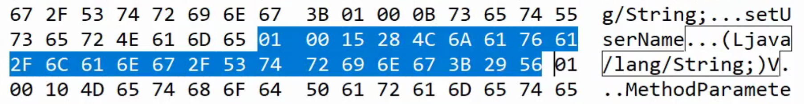
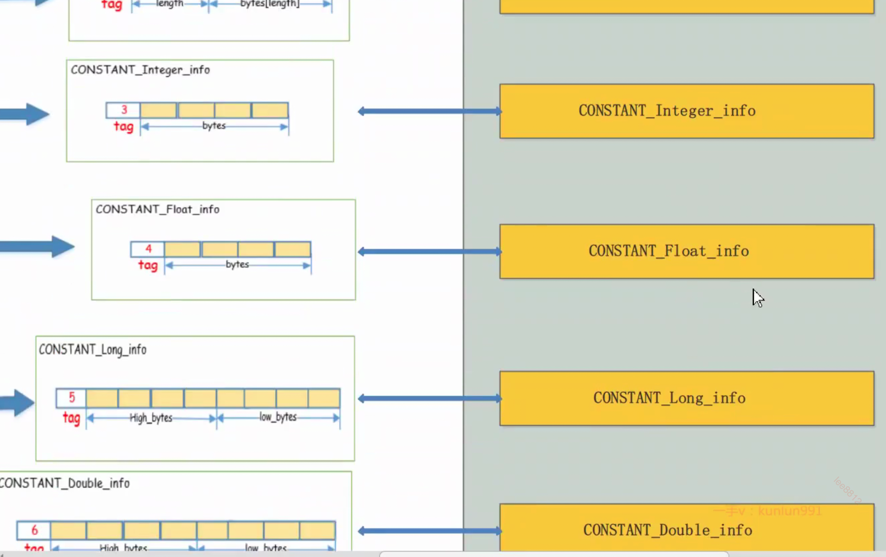
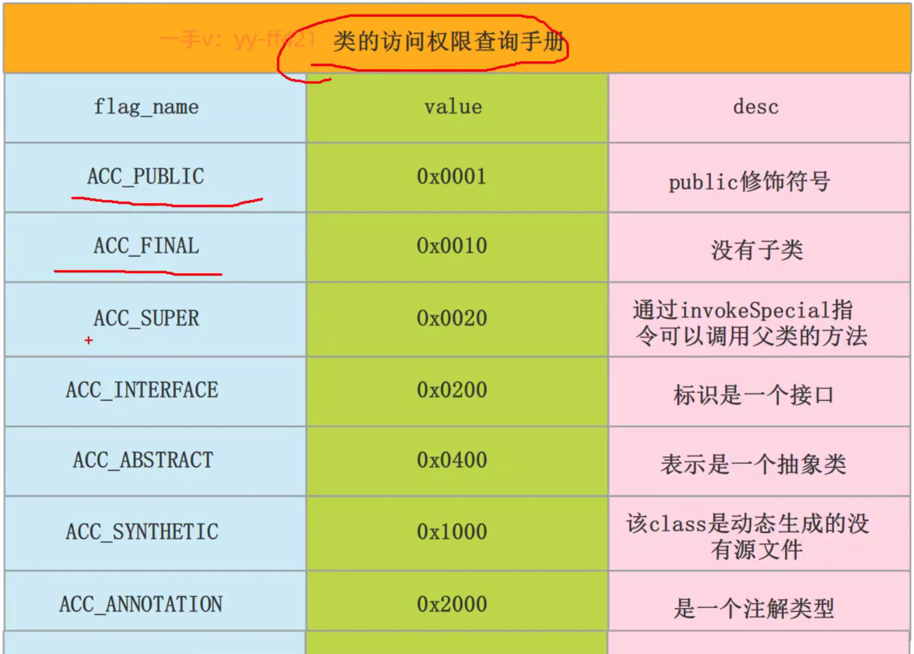

## 编译过程

java->class(字节码)->JVM(指令序列)->汇编->机器码

## 局部变量表

在编译时已经生成,
this, 也在字节码中, 以第一个参数传入函数中.

## 静态常量池(运行后会加入到运行时常量池)

就是class中的资源仓库.

## 字节码

常量池, 就是, 可以表示, class的类型 

字节码16进制表示时, 
第一个byte 表示 常量的类型, 
第2个byte表示这个常量, 从第3个字节开始的实际长度, 
第3个字节开始就是实际的内容,
例如 XX YY ZZZ....

### 字面量
**字面量就是指由字母、数字等构成的字符串或者数值常量**
字面量只可以右值出现，所谓右值是指等号右边的值，如：int a=1这里的a为左值，1为右值。在这个例子中1就是字面量。

### 符号引用
符号引用是编译原理中的概念，是相对于直接引用来说的。主要包括了以下三类常量：

- 类和接口的全限定名
- 字段的名称和描述符
- 方法的名称和描述符

**符号引用**在程序**加载或运行时**会被转变为被加载到内存区域的代码的**直接引用**，也就是我们说的**动态链接**了。例如，**compute（）这个符号引用**在运行时就会被转变为compute（）方法具体**代码在内存中的地址**，主要**通过对象头**里的**类型指针去转换直接引用**。

### 常量池内常量的类型

## access_flag（访问标记符号）

## 字符串常量池位置
Jdk**1.6**及之前：有**永久代**，**运行时常量池在永久代**，**运行时常量池包含字符串常量池**
Jdk**1.7**：有永久代，但已经逐步“去永久代”，**字符串常量池**从永久代里的运行时常量池**分离到堆里**
Jdk**1.8**及之后：**无永久代**，**运行时常量池在元空间**，**字符串常量池**里依然**在堆里**
