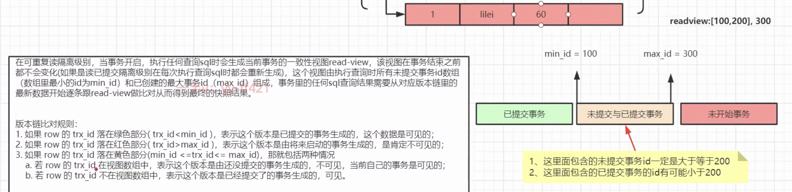
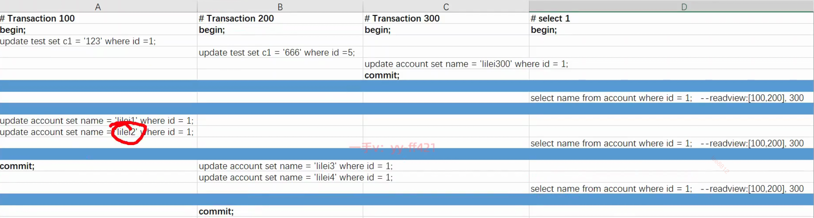

## 概述

**MVCC（Multi-Version Concurrency Control）多版本并发控制机制**, 在读已提交和可重复读隔离级别, **实现读写隔离性**, 

## undo日志版本链与read view机制详解

每张表都有 **两个隐藏字段trx_id和roll_pointer**, 把这些undo日志串联起来形成一个历史记录版本链, 新记录头插.

**总结,**
"undo_log历史版本链" == "每次修改的字段" + ""每次修改的trx_id, 头插, 来组成一个历史版本链, 不管没有commit.

**readview(一致性试图)是一个trx_id的区间, ［100,200］是不能确定有没有commit的区间**

设readview(一致性试图)：<100,［100,200］, >200;
**300是RR隔离级别下, 其实就是记录下  是最新版本的trx_id,**
所以如果要rollback不能到这里停止, 继续往linklist尾找, 直到找到已提交的历史(就是**当前务当初记录的最新版对应的trx_id(300)**)

****

