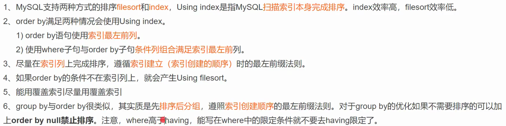

[toc]

## 概述

索引是**高效获取数据**的**排好序**的**数据结构**.

mysql的**二级索引** 就是 **非聚集索引**

**索引受很多规则影响, 如果数据很小, 可能走全表扫描, **
**根本原因在于, 当优化器觉得全扫的性能可能和走索引的像能差不多的时候, 就有可能导致全扫**, 覆盖索引可能可以优化.

## 索引数据结构

- 二叉树
- 红黑树
- Hash表, 不支持范围查询
- B-Tree
- B+tree, 父节点等于子节点最小的那个id, 除了第一个子节点.

## B+tree

只有3层, root节点常驻内存, 高版本更多非叶子节点常驻内存

范围查询时, 如果跨多页, 也会影响性能.

## 为什么选 B+tree

树的高度, 
b-tree 退化成linklist, 红黑树高度也不可控(很高),
在存相同大小数据时, B+tree的高度更低
叶子节点之间有对方的指针


## B+树的非叶子节点一行 就是一页

最耗费时间的就是定位某一页, 一页16KB


## 唯一索引/非唯一索引(普通/一般索引)区别


[mysql普通索引和唯一索引——mysql change buffer深入解析！](https://blog.51cto.com/u_15257216/2861584)

唯一索引, 直接从读到内存的页中修改即可.
非唯一, 则先写到changeBuff


## 索引自增

如果不自增, 导致节点分裂, 重平衡, 效率变低

## 优化

- 查询语句无论是使用哪种判断条件 等于、小于、大于， WHERE 左侧的条件查询字段不要使用函数或者表达式
- 使用 EXPLAIN 命令优化你的 SELECT 查询，对于复杂、效率低的 sql 语句，我们通常是使用 explain sql 来分析这条 sql 语句，这样方便我们分析，进行优化。
- 当你的 SELECT 查询语句只需要使用一条记录时，要使用 LIMIT 1
- 不要直接使用 SELECT *，而应该使用具体需要查询的表字段，因为使用 EXPLAIN 进行分析时，SELECT * 使用的是全表扫描，也就是 type = all。
- 为每一张表设置一个 ID 属性
- 避免在 WHERE 字句中对字段进行 NULL 判断
- 避免在 WHERE 中使用 != 或 < > 操作符
- 使用 BETWEEN AND 替代 IN
- 为搜索字段创建索引
- 选择正确的存储引擎，InnoDB 、MyISAM 、MEMORY 等
- 使用 LIKE %abc% 不会走索引，而使用 LIKE abc% 会走索引
- 对于枚举类型的字段(即有固定罗列值的字段)，建议使用 ENUM而不是 VARCHAR，如性别、星期、类型、类别等
- 拆分大的 DELETE 或 INSERT 语句
- 选择合适的字段类型，选择标准是 尽可能小、尽可能定长、尽可能使用整数。
- 字段设计尽可能使用 NOT NULL


### explain

#### 字段解释

早期不显示字段 Partitions, filtered. 需要用 `explain patition/extended ...` 

**filtered 列**，是一个半分比的值，rows * fltered/100 可以估算出将要和 explain中前一个表进行连接的行数（前一个表指explain 中的id值比当前表id值小的表）。

### 尽量不使用函数

用了函数后, 可能无法对应上所建的索引, 导致失效

## 日期内

~~用范围搜索, `where hire time >=12018-09-30 00:00:00' and hire time ＜=12018-09-30 23:59:591`~~


### like

- 用 a%, 后续的索引也会用到.
- 用%a的话, 需要覆盖索引

### 字符串忘加 ' '

### 少用 or, in

in在数量大的情况下走索引

## in 优化

在有小基数的字段, 在某个索引的中间, 可以用 in来包含, 从而使用索引

### 小基数(区别度低的)字段不要建


### 长字符串我们可以考虑采用前缀索引

类似于 `KEY index(name(20)age, position)`, 可能可以解决90%的问题

### where与order by冲突时优先Where

### 基于慢sql优化


## 索引下推(Index Condition Pushdown)

参考: [五分钟搞懂MySQL索引下推 ](https://www.cnblogs.com/three-fighter/p/15246577.html)

是指将**部分上层（服务层）负责的事情**，**交给了下层（引擎层）去处理**。
目的是**为了减少回表次数，也就是要减少IO操作**.

**没有使用ICP**，读二级索引, **只能利用最左前缀**(like %... 停止), 回表读取具体行, 全部返回给server层, 再处理后续 where 条件.

**使用ICP**, 读二级索引, **更可能完整利用索引判断where**(**过滤更多无效行, 减少回表查具体行数据次数**),  最后返回给server层.


**例如:** 
like %... and ... = ... and ... = ... 会使用到所有索引, 就是因为**索引下推**


### 使用条件

- 只能用于`range`、 `ref`、 `eq_ref`、`ref_or_null`访问方法；
- 只能用于`InnoDB`和 `MyISAM`存储引擎及其分区表；
- 对`InnoDB`存储引擎来说，索引下推只适用于二级索引（也叫辅助索引）;
- 引用了子查询的条件不能下推；
- 引用了存储函数的条件不能下推，因为存储引擎无法调用存储函数。


## 影响cost的因素

很多以为会用的索引, 预想到的情况, 和现实不同, 就是因为cost, cost才是最后决定如何执行的关键.

rows, 回表, 数据量(小的时候, 反而全表扫描快), 索引下推, 


## order 也会使用索引

using filesort 是没有用索引的意思, 只是文件本身的排序.

## in(多个) order ..., ... 不会走索引


## 什么是fileSort(单/双路排序)

可以通过max_length_for_sort_data调整, 一般不调整.

### 单路: 

将聚集索引全load到内存, 按字段排序, 占内存大, 排完序结果可直接返回.

### 双路: 

只load出 id 和 排序字段, 排完序, 回表查处数据返回.


## 优化总结



## 7天内登录用户查询, 优化

新增字段用于记录7天是否登过


## 逼不得已, 不好优化, 再建相关索引


## 分页优化

### 如果id连续且自增的

``` 
select * From employees limit 90000, 5; //底层是取出前90005条, 再舍弃掉前90000条
select * from employees where id > 90000 1imit 5;
```

### inner join

```
select * from employees ORDER BY name 1imit 90000,5；
Select * from emplovees e inner join （select id from employees order by name limit 90000,5） ed on e.id = ed.id; // 覆盖索引, 即使用了 limit, 还是很快; 在inner join 原表 id = id
```


## 关联查询

### 嵌套循环连接 Nested-Loop Join（NLJ）算法

一次一行循环地从第一张表（称为驱动表）中读取行，在这行数据中取到关联字段，根据关联字段在另一张表（被驱动表）里取出满足条件的行，然后取出两张表的结果合集。

```
EXPLAIN select * from t1 inner join t2 on t1.a= t2.a；// 取t2, 再取t1, 设 t1 10000行, t2 100行
```

实际扫了 100 + 100 行

### 基于块的嵌套循环连接 Block Nested-Loop Join（BNL）算法

关联的字段没有走索引, 就会在一个叫join buff中对比数据, **t2 load进 join buff 的数据是无序的**, 造成查找t1时, 扫了10000 + 100 行, 内存判断次数是 10000 * 100 次

join_buffer 的大小是由参数 join_buffer_size 设定的，默认值是 256k。如果放不下表t2的所有数据话，就分段放。

**如果没有索引使用（NLJ）算法**, 会造成 扫描了  10000 * 100 行, 没有索引的话

join的时候需要用小表驱动大表, 
如果你不想mysql帮你优化, 用 straight_join
