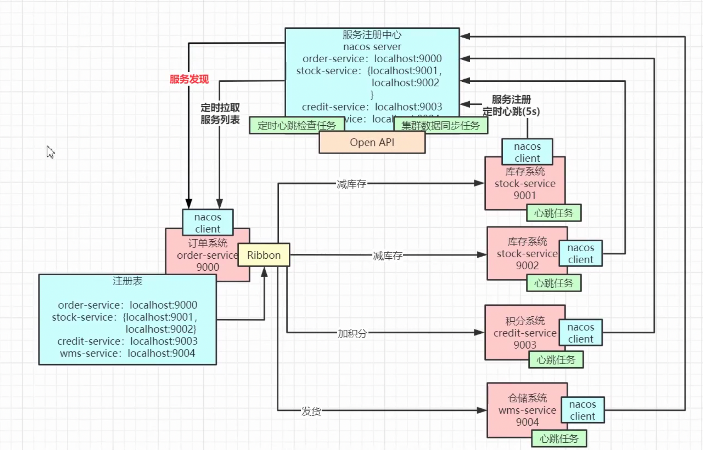

[toc]

### 服务隔离 内存注册表:

namespace(可以用于不同的开发/测试/生产环境)
	group(可以理解为大的服务trade, 有 支付/下单/退货 服务等.)::service
		cluster(不同地区集群, loadbalance 优先同集群, 高可扩展的体现)

分 持久 和 临时 instance

通过

## 流程

通过 http post 注册 instance

和 k8s api 很像, 都是httpi调用. 

分 ephemeralConsistencyService 和 persistentConsistencyService, 前者为AP, 后为 CP

PUT service后, 把异步task 放入 notify queue中, 通过一个线程异步地从queue中, 注册服务. **集群模式还会sync其他节点**.

异步会导致消费端同步到的消息延迟到达, 作为异步的取舍.(高并发, 大量请求, 会异步的缓慢处理)

update 注册表时(分ephemeral/persistent), 为了高并发, 也是利用了 **copyOnWrite**(写的时候复制一份, 然后修改(写)副本, 在未完成写时, 读的是原数据, 这也是一种读写分离, 对读的一致性的妥协), 因为写是单线程处理queue, 并不会导致并发覆盖问题.
copyOnWrite 使用时尽量降低粒度, 可以减少内存消耗.
副本其实也是一种缓存, 不是每次都会去更新注册表, 而是先更新缓存(副本).

#### 客户端

nacos client 更新 服务器信息, 定时任务, 只要发起调用, 才会开始心跳定时任务

只有 ephemeral 才会发起心跳

##### service 更新延迟

由于存在service延迟更新, 肯定会造成服务请求失败, 但是有retry机制兜底, 此外, **服务端也会有推送instance更新信息**

#### 服务端

定时检查上一次心跳时间, 

如果在限定时间(15s)内, 没有收到心跳, 则把对应 instance healthy 设为false,
如果在限定时间(30s)内, 没有收到心跳, 则delete对应 instance, 调用自己的 /instance/delete

每当service内存注册表更新, 会发布push事件, 通过udp发送最新的instance信息, 通知client.

## 集群

### 搭建

需要先搭建mysql用于存储. 
在每台nacos中, 保存 conf/cluster.conf, 记录集群中所有nacos节点的ip:port

### client-server 心跳

client心跳, 通过hash%nacosServerSize, 选出某一台nacos, 来保持.
server-server 心跳检测不一致时, 确实有可能导致 client-server 心跳 出现在不同服务器上, 但只是短时间.(直接忽略)

### server-server 心跳

集群间的, 每个server 都会给其他server 逐一发心跳检测 `/operator/server/status`, 

### 集群数据同步(sync)

异步数据同步, 也是封装成task, 放入tasks(先上锁lock), 在通过其他线程(DistroTaskEngineHolder)处理task, 再放入到另一个queue, 再由InnerWorker 取出再syncData(). 实际上调用了其他server的 `/distro/datum`接口.
如果是同步的是一个新增instance, 实际上也是需要同步的server上调用了对应的 restfulAPI 的 PUT 方法.
为什么需要多次的异步?

