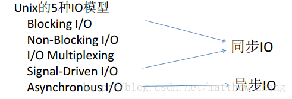
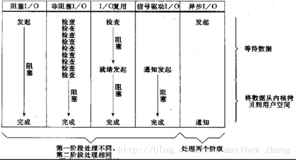

[toc]

# 首先，在Unix的IO模型里：

- 异步I/O 是指用户程序发起IO请求后，不等待数据，同时操作系统内核负责I/O操作把数据从内核拷贝到用户程序的缓冲区后通知应用程序。数据拷贝是由操作系统内核完成，用户程序从一开始就没有等待数据，发起请求后不参与任何IO操作，等内核通知完成。

- 同步I/O 就是非异步IO的情况，也就是用户程序要参与把数据拷贝到程序缓冲区（例如java的InputStream读字节流过程）。

- 同步IO里的非阻塞 是指用户程序发起IO操作请求后不等待数据，而是调用会立即返回一个标志信息告知条件不满足，数据未准备好，从而用户请求程序继续执行其它任务。执行完其它任务，用户程序会主动轮询查看IO操作条件是否满足，如果满足，则用户程序亲自参与拷贝数据动作。
  





简单说，Unix IO模型的语境下，同步和异步的区别在于数据拷贝阶段是否需要完全由操作系统处理。

阻塞和非阻塞操作是针对发起IO请求操作后是否有立刻返回一个标志信息而不让请求线程等待。

基于这个语境，Netty目前的版本是没有把IO操作交过操作系统处理的，所以是属于同步的。

对于网上大部分文章，如果别人说Netty是异步非阻塞，如果要深究，那真要看看Netty新的版本是否把IO操作交过操作系统处理，或者看看有否使用JDK1.7中的AIO API，**否则他们说的异步其实是指客户端程序调用Netty的IO操作API“不停顿等待”**。

其次，在Java的IO模型里：
JDK的各个历史版本引入如下概念。
**BIO**：Blocking IO
**NIO**：Non Blocking IO 或者 New IO
**AIO**：Asynchronous IO 或者 NIO2

这里的AIO应该就对应着Unix模型里的异步IO，也就是IO操作交给操作系统处理，充分调用OS参与并发操作，确实是操作系统的异步IO机制。

而BIO和NIO简单对比就是，NIO解决了BIO的痛点，把BIO中请求IO过程中的两步（请求连接+连接有真实IO请求时候的处理过程）分离开来，不让一个线程负责这两步。NIO就是一个线程负责所有请求连接但不处理IO操作，该线程只负责把连接注册到多路复用器上，多用复用器轮询到连接有IO请求时候再启动其它线程处理IO请求操作。

注意一点，Netty线程模型提及很多IO线程池，每条IO线程在进行IO操作（IO条件满足进行真正读写数据）时候虽然也是要消耗操作时间，但这种情况是否应该叫阻塞，取决于该IO线程有没有阻塞业务请求线程，当且仅当所有的IO线程在重度负载情形下（IO线程池所有IO线程在工作）导致业务请求线程提交不了新请求的情形下才叫IO线程的IO操作阻塞了业务线程的IO请求。由此可知，NIO也会产生BIO的情况。

Ref. https://blog.csdn.net/matthew_zhang/article/details/71328697

# 具体为什么 Netty 4.1.X 版本不支持 Java AIO 的原因

AIO Not faster than NIO **(epoll)** on unix systems (which is true) 

Ref. https://juejin.cn/post/6844903565928955918

# NIO Buffer

- ByteBuffer
- CharBuffer
- DoubleBuffer
- FloatBuffer
- IntBuffer
- LongBuffer
- ShortBuffer


Buffer 中有 **4** 个非常重要的属性：`capacity`、`limit`、`position`、`mark`

`capacity` 属性，容量，Buffer 能容纳的数据元素的**最大值**。

`position` 属性，位置，初始值为 0 

- **写**模式下，每往 Buffer 中写入一个值，`position` 就自动加 1 ，代表下一次的写入位置。
- **读**模式下，每从 Buffer 中读取一个值，`position` 就自动加 1 ，代表下一次的读取位置。( *和写模式类似* )

`limit` 属性，上限。

- **写**模式下，代表最大能写入的数据上限位置，这个时候 `limit` 等于 `capacity` 。
- **读**模式下，等于 Buffer 中实际的数据大小。

`mark` 属性，标记，通过 `#mark()` 方法，记录当前 `position` ；通过 `reset()` 方法，恢复 `position` 为标记。

- **写**模式下，标记上一次写位置。
- **读**模式下，标记上一次读位置。

```
mark <= position <= limit <= capacity
```

## 创建buffer

`#allocate(int capacity)` 静态方法，返回的是它的**基于堆内( Non-Direct )内存**的实现类 HeapByteBuffer 的对象。

每个 Buffer 实现类，都提供了 `#wrap(array)` 静态方法，帮助我们将其对应的数组**包装**成一个 Buffer 对象。

每个 Buffer 实现类，都提供了 `#allocateDirect(int capacity)` 静态方法，返回的是它的**基于堆外( Direct )内存**的实现类 DirectByteBuffer 的对象。

## func

```
public final Buffer flip() {
    limit = position; // 设置读取上限
    position = 0; // 重置 position
    mark = -1; // 清空 mark
    return this;
}
```

```
public final Buffer rewind() {
    position = 0; // 重置 position
    mark = -1; // 清空 mark
    return this;
}
```

clear 注意 只是 重置了 position, 和 **limit = capacity, 可能 导致 读异常**, 因为 没有 清理 data.

```
public final Buffer clear() {
    position = 0; // 重置 position
    limit = capacity; // 恢复 limit 为 capacity
    mark = -1; // 清空 mark
    return this;
}
```

```
public final Buffer mark() {
    mark = position;
    return this;
}
```

**reset 是重置 positon, rewind 是 使position 回到 mark位置.**

```
public final Buffer reset() {
    int m = mark;
    if (m < 0)
        throw new InvalidMarkException();
    position = m;
    return this;
}
```

#  Direct Buffer 和 Non-Direct Buffer 的区别

**Direct Buffer:**

- 所分配的内存不在 JVM 堆上, 不受 GC 直接管理.(但是 Direct Buffer 的 Java 对象是由 GC 管理的, 当发生 GC, 对象被回收时, Direct Buffer 也会被释放)

- 因为 不在 JVM 堆上分配, 因此 Direct Buffer 对 应用程序 的内存占用的影响 就不那么明显 (实际上还是占用了这么多内存, 但是 JVM 不好统计到非 JVM 管理的内存.)

- 申请和释放 Direct Buffer 的开销比较大. 正确的使用 Direct Buffer 的方式是在初始化时申请一个 Buffer, 不断复用此 buffer, 在程序结束后才释放此 buffer.
- 当进行一些底层的系统 IO 操作时, 效率会比较高, 因为此时 JVM 不需要拷贝 buffer 中的内存到中间临时缓冲区中.

**Non-Direct Buffer:**

- 直接在**JVM 堆**上进行内存的分配, 本质上是 byte[] 数组的封装.
- 因为 Non-Direct Buffer 在 JVM 堆中, 当进行操作系统底层 IO 操作中时, 会将此 buffer 的内存复制到中间临时缓冲区中. 因此 Non-Direct Buffer 的效率就较低.
