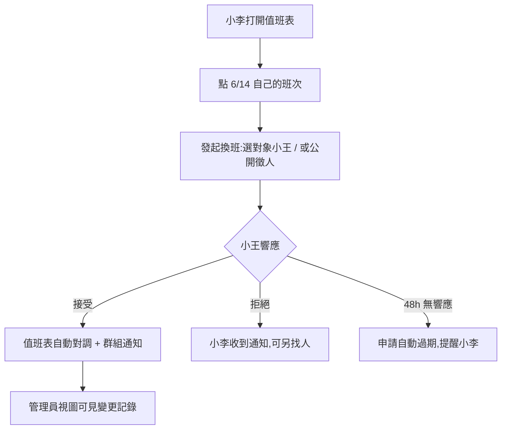

# FigJam 腦暴板(模擬)

> 真實公司裡:kickoff 後 PM 和設計師開 45 分鐘 workshop,在 FigJam 上貼便利貼、畫 user journey、發散再收斂。
> 這份文件按 FigJam 畫板的典型分區還原:**左邊 journey、中間發散、右邊收斂成 flow**。

## 分區 1:User Journey(現狀走一遍,找痛點)

以「小李 6/14 要陪產檢」為例,現狀旅程:

| 步驟 | 小李做什麼 | 痛點便利貼 🟨 |
|---|---|---|
| 1 | 群組發「6/14 誰能跟我換」 | 🟨 刷屏,沒人回也不知道誰看過 |
| 2 | 小王私聊答應 | 🟨 口頭協議,無記錄 |
| 3 | 小李(應該)去改試算表 | 🟨 **最容易斷的一環**,忘改率 40% |
| 4 | 管理員月底核對 | 🟨 滯後,事故已發生才發現 |
| 5 | 6/14 告警來了 | 🟨 兩人都以為對方值班 |

**收斂結論:核心要修的是步驟 3——「達成協議」和「表被更新」必須是同一個動作,不能靠人記得。**

## 分區 2:方案發散(Crazy 8s 精簡版,每個方案一張便利貼)

| # | 方案 | 快速評註 |
|---|---|---|
| A | 群組 bot 指令換班(`/swap 6/14 @小王`) | 零 UI 成本;但狀態查詢、歷史、拒絕流程在聊天裡很彆扭 |
| B | 網頁小工具:值班表 + 換班申請流 | 狀態一目了然;要寫前端 |
| C | 試算表 + Apps Script 強校驗 | 改動最小;治標,喊話環節照舊 |
| D | 買現成 on-call 平台(PagerDuty 類) | 功能溢出+訂閱費,10 人團隊殺雞牛刀 |

**收斂:B 為主體,A 的 bot 降級為「通知渠道」(webhook 推消息進群組,點連結回網頁操作)。C/D 淘汰,理由寫進 PRD 的 non-goals。**

## 分區 3:目標方案 User Flow(收斂產物,帶回 PRD)

## 分區 4:停車場(Parking Lot,腦暴中冒出但先不做的)

- 自動排班算法(公平性輪轉)→ 太大,MVP 之後
- 換班鏈(A換B、B再換C)→ 工程師直覺:狀態複雜度爆炸,kickoff 時工程 lead 已預警
- 請假(不是換班,是缺人)→ 不同問題,另立項

---
*狀態:腦暴收斂完成 → 下一步:寫 PRD v1(見 03)*
*真實工具對應:這一頁在 FigJam 裡是一塊畫板,便利貼是真便利貼,flow 用連線工具畫;結論由 PM 拍照收進 PRD。*
