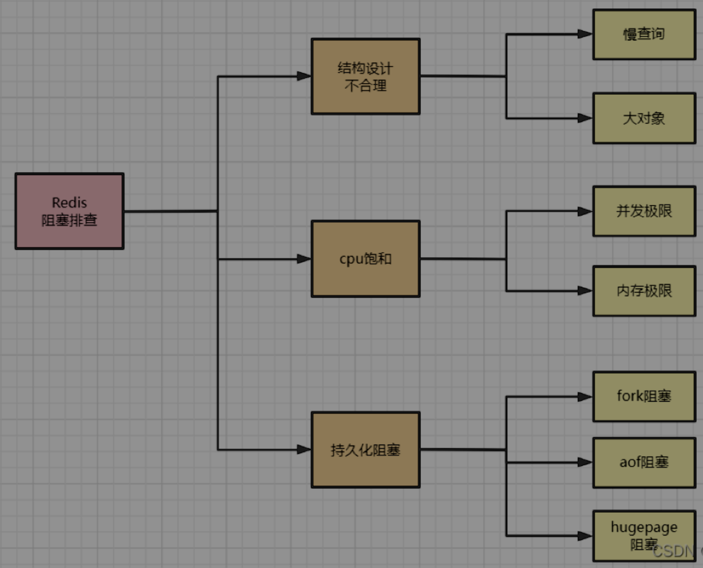
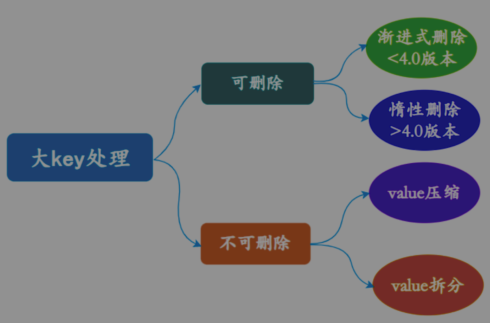
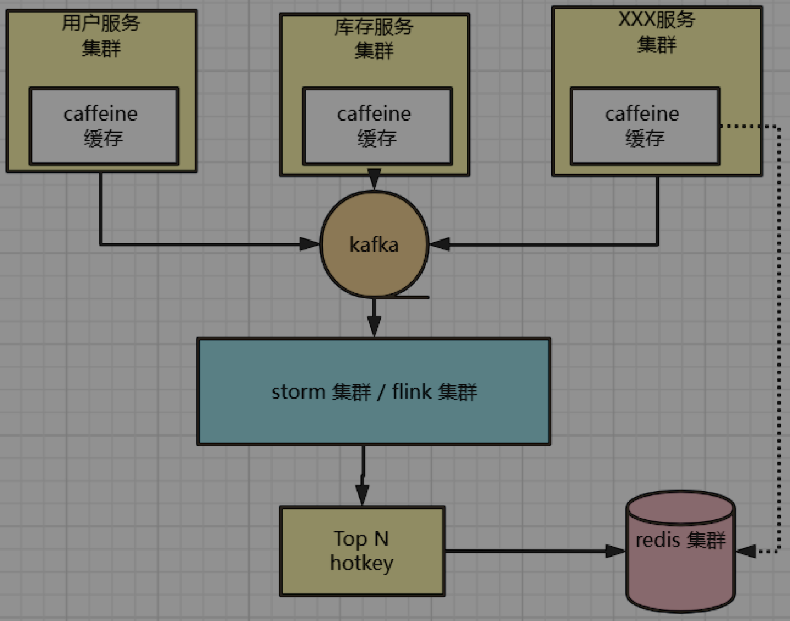
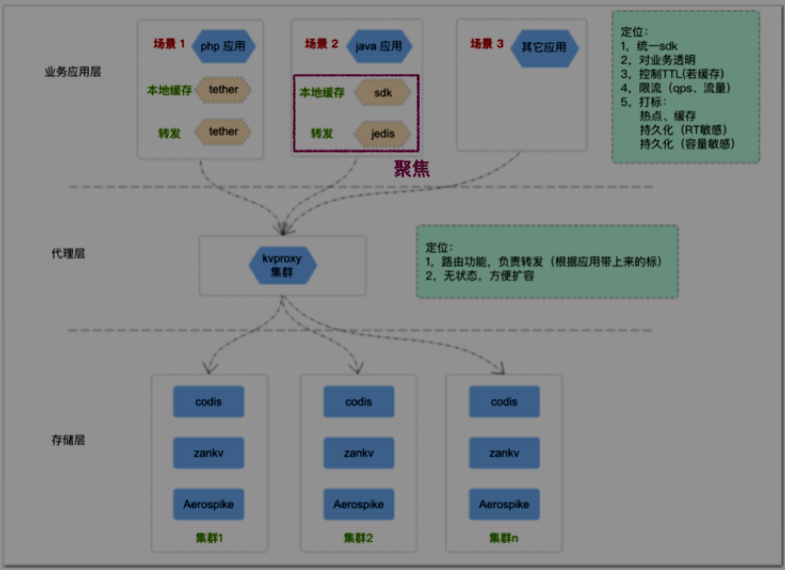
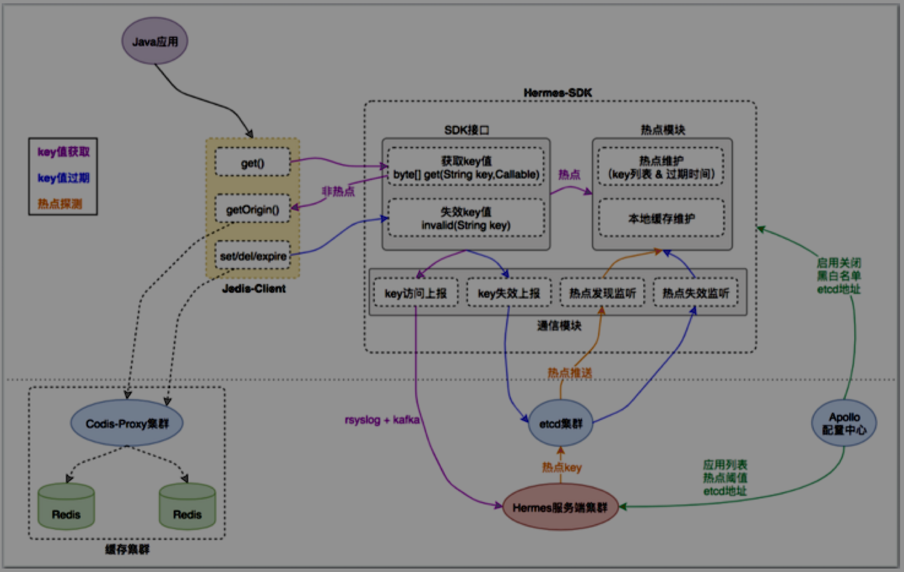

[toc]

## 无底洞

数据和访问量持续增长, 造成添加大量节点做水平扩容, 导致键值**分布到更多的节点**上.
**分布式批量操作**相对于**单机批量操作**会涉及**多次网络时间**.

问题:
随着节点的增多,耗时会不断增大.
网络连接数变多, 性能也有一定影响.

解决:
优化操作语句.
减少网络通信次数. Pipline.
使用长连/连接池、NIO等, 降低接入成本.

### 内存不足处理

redis.conf 的 maxmemory 参数.
命令set maxmemory动态设置内存上限.
调整内存淘汰策略.
Redis 集群模式, 横向扩容.

## 回收策略

### 惰性删除

当查询key时, 才检测key, 如果已经达到过期时间, 则删除.
缺点: 一直不被访问, 一直留在内存.

### 定期删除

**定期随机**取**一些key**去做**检查和删除**.

## Redis阻塞

## 慢查询

### 发现慢查询

### 优化慢查询

hgetall改hmget.
禁用keys、sort等命令.
调整拆分大对象.

## CPU饱和

单线程的Redis**处理命令**时**只**能使用**一个CPU**, 饱和指的是Redis单核CPU使用率跑到**接近100%**。

### 发现饱和

统计命令**redis-cli-h{ip}-p{port}--stat**获取当前Redis使用情况.
如果Redis的**请求几万+**,大概就是Redis的OPS已经极限,应该做**集群化水平扩展**来分摊压力. 

## 持久化相关阻塞

fork操作, 发生在RDB和AOF重写时, 内存页表的复制导致阻塞.
fsync操作, AOF文件刷盘时, 硬盘压力过大, 需要同步等待,直到写入完成.
开启了Transparent HugePages, 出现修改数据时, COW导致复制**内存页**单位由**4K变为2MB**, 拖慢写操作的执行时间.

## 大key

**单个**key, **超过10KB**.
**hash, set, zset, list** 存储**过多元素(以万为单位)**.

问题:
客户端耗时增加.
IO操作, 严重占用带宽和CPU.
集群的数据倾斜.
主动/被动删等,可能会导致阻塞.

### 发现大key

bigkeys 命令, 用于遍历. 整体统计信息与每个数据类型中Top1的大Key.
redis-rdb-tools 分析 rdb快照文件.

### 处理大key

#### 可删

Redis版本大于4.0, UNLINK命令, 非阻塞, 逐步清理.
版本小于4.0时, 通过SCAN命令, 迭代扫描key, 然后判断删除.

#### 不可删

string类型, 不好拆分, 使用序列化、压缩算法. 但会带来**更多时间消耗**. 如果仍是大key, 拆分, 然后使用multiget.
list/set等集合类型, 按数据规模来分片.

## 常见性能问题和解决方案

如果性能优先, Master 最好不做任何持久化工作, 
如果数据比较重要, ,某个 Slave 开启 AOF, 每秒同步一次.
为了主从复制的速度和连接稳定性,主从最好在同一个局域网.
尽量避免在压力较大的主库增加从库.
为了 主 的稳定性, 用单向链表结构, Master<–Slave1<–Slave2.

## 管道(pipline)

有三种命令打包方式: Pipelining(管道) 、 Transactions(事务) 和 Lua Scripts(Lua 脚本).

**管道**: **一次性**将要执行的多条命令**发送给服务端**, 执行结果会缓存, **直到全部执行完**在**全部发回**client. 
作用是**降低 RTT(Round Trip Time) ** 和 **减少了上下文切换**(从**网络读写数据**会产生**系统调用**).

## 假如Redis有1亿个key, 其中有10w个key以某个固定的前缀开头, 如何将它们找出来?

用 scan 无阻塞遍历, 可能有重复key, 去重, keys会阻塞.

## Redis底层数据结构

动态字符串(sds)、链表(list)、字典(ht)、跳跃表(skiplist)、整数集合(intset)、压缩列表(ziplist) 等**底层数据结构(不是直接使用这些数据结构来实现键值对数据库)**.

## Redis实现分布式锁

setnx.

锁超时解决死锁. set 整合了setnx 和 expire, 或 Lua 腳本
 `SET mykey "value" NX EX 60` 
**NX**:（**Only set if key does not exist**）：只有當 key **不存在** 時，才會設置值，類似於 SETNX。
**EX**: 60（**Expire after 60 seconds**）：設置過期時間 60 秒。
**XX**: key存在时设置value,成功返回OK,失败返回(nil)

redisson

## 用过分布式锁吗?遇到过什么 问题?如何解决的?

并发修改, 为了保证一致性.

## redis 集群的脑裂

如果**哨兵无法感知到 master** 的存在,会将 **slave 提升为 master**, 导致**双master, 脑裂**, 而**旧master**可能**还在提供服务**.

**解决**: 
**手动**: 判断master时候还在工作, 不在, 再切换.
**自动**: 配置 **min-replicas-to-write**, min-replicas-max-lag, **过半slave**就**不会产生双master**问题.

## redis挂了怎么办

先回答持久化类型, 
冷启动如何加载备份文件, 

## BigKey、HotKey 问题严重,该如何 预防和解决

### BigKey

当一个key包含的**内容接近限制**,或者**高于平均值**,大key就产生了.

单个 **string** value 值**超过 1M**B,就可以认为是 Bigkey.
**哈希、列表、集合、有序集合**等, 它们的元素**个数超过 2000** 个,就可以认为是 Bigkey.

例子:
redis数据结构使用不恰当.

### HotKey

一个key**对应在一个分片**上,**短时间内大量**请求打到该分片上, key被**频繁访问**, 
接收到的**访问次数显著高于其它Key**, 该key就是热key.
整个redis**集群呈现**出了**资源使用不均衡**的现象.

例子: 
Redis每秒总访问量为10000, 其中一个Key每秒访问量达到了7000.
拥有**上千个成员**且**总大小为1M**B的**HASH Key**每秒发送大量的**HGETALL**
**数万个成员的ZSET Key**每秒发送**大量的ZRANGE**

### Big/HotKey 引发的问题

**bigkey的问题**:
**大量超时**, 因为单线程, 后续请求频繁超时.
**侵占带宽**, key所占空间过大.
**内存溢出**或**处理阻塞**, 数据量过大导致.

**hotkey的问题**:
单点访问频率过高,
**分片服务瘫痪**, **引发缓存击穿**, **进而引发系统雪崩**, 频繁请求.
**分布式集群的优势弱化**, 因资源不平均.
**可能造成资损**, 极端场景下, 数据处理不及时导致.
也可以影响同机器上的其他进程.

#### 问题场景:

购物车无限制添加商品.
活动资格userList无限制. 查询频繁.

### Big/HotKey 发现

Redis4.0 及以上版本提供 -**-Bigkeys, --hotkeys** 命令. 分析出**每种数据结构 top 1 Bigkey**, 同时给出每种数据类型**键值个数及平均大小**.
`redis-cli -a passwd --bigkeys/--hotkeys`

[AnotherRedisDesktopManager](https://github.com/qishibo/AnotherRedisDesktopManager) 工具, [redis-rdb-tools](https://github.com/sripathikrishnan/redis-rdb-tools), DaaS, RDB 文件分析法 等. **一般使用slave来分析**.

#### 生产bigkey发现

**--Bigkeys**:
在 slave, scan 也可能会对节点造成阻塞.
本机执行,
没有从节点, 使用--i 参数(--i 0.1 代表 100 毫秒执行一次).
只能计算每种数据结构 top1, 如有多个可能要继续处理.

**RDB 文件分析**:
[redis-rdb-tools](https://github.com/sripathikrishnan/redis-rdb-tools),
slave生成RDB,
**优点**: 获取key信息详细、可选参数多、支持定制化需求结果信息, 可选择json或csv格式.
**缺点**: **离线**操作,获取结果**时间较长**.

**Bigkey 巡检**:
思路: 开发一个高效 RDB 解析工具, 通过大规模解析 RDB 文件来分析 Bigkey, 提高分析速度,实现 Bigkey 的巡检.

**debug object key命令**:
分析并返回大量数据, 
serializedlength的值为该Key 的序列化长度, 并不等同于它在内存空间中的真实长度.
命令是阻塞式,
每次只能查找单个key的信息, 官方不推荐使用.

**监控Redis的内存、网络带宽、超时等指标**:
Redis内存使用率超过70%, Redis内存1小时内增长率超过20%等

**定期清理失效数据**:
某个Key有业务**不断以增量方式**写入大量数据, 又**忽略**了其**时效性**,导致大量的**失效数据堆积**.
可以通过**定时任务**的方式,对失效数据进行**清理**.

**压缩value**:
使用序列化、压缩算法将key的大小控制在合理范围内, 需要注意会带来一定的消耗.
还是很大, 拆分.

### Big/HotKey 解决

#### bigkey

拆分

#### hotkey

本地缓存,
缺点: 可能导致本地缓存过大, 一致性问题.

#### vivo bigkey案例

**场景**:

- **统计类** key, 记录访问用户IP, 随时间越来越大.
- **缓存**, 原db数据就是那么大, 全放一个key.
- **队列**, 消费不及时.

**危害**:

**内存空间不均匀**不同实例之间. 用上边方法发现bigkey.
**超时阻塞**, 单线程, 操作Bigkey(key自动过期删除、del删除命令), 造成客户端阻塞. 例: hkeys 返回hash所有字段. `redis.instance.latency.max` (监控指标: 命令最大延迟), 也是拆分处理.
**网络阻塞**, value 比较大, 网络流也就较大.
**迁移困难**, migrate 命令, migrate 是通过 dump + restore + del 三个命令**组成原子命令**完成. 执行时, 会**阻塞进行迁移的两个实例**, 直到 **迁移成功,迁移失败,等待超时**. Bigkey会**加剧阻塞时长**.

**迁移失败案例**:

在工单, 用失败实例的 **slave 节点分析Bigkey**. 然后还是拆分(再hash/按日期).

#### 生产上 Bigkey 处理优化

Bigkey **拆分**: 
list -> list1、list2、...listN
二次的 hash
日期拆分: key20220310、key20220311、key202203212

**分析工具优化**:
全集群全部 slave 分析, 
**相同**服务器 slave **串行**分析, **不同服务器**的 slave **并行分析**.
分析符合 Bigkey 规定标准的所有 key 信息, (例: 大于 1MB 的 string 类型的所有 key, hash、list、set、zset 等类型元素个数大于 2000 的所有 key), 
**不存在**就**列出每种类型最大的 50** 个 key.
增加暂停、重新开始、结束功能,暂停分析后可以重新开始.

#### 水平扩容迁移优化

延长 `cluster-node-timeout`, 防止由于**迁移 Bigkey 阻塞**导致 **master-slave 故障切换**.
减少阻塞时间`migrate timeout`, 都是10s,  重试间隔 30 秒.
重试次数, 3次后, 停止, 记录Bigkey.
优化日志记录, 记录迁移节点、solt、key 信息. 方便定位.

#### 总结

从**源头**治理, 
**防**止 Bigkey 、Hotkey**形成**,
提升及时**发现的能力**, 实现 Bigkey 、Hotkey **及时探测**能力.

## 1000W用户1Wqps高并发签到系统的架构和实操

redis Bitmap, userX: 31bit; 
表示: 每个user的不同月份, 用31bit表示1个月签到情况.

## 三级缓存方案

1级: java本地缓存, caffeine
2级, redis
3级: nginx

### 本地缓存

**优点**:

读取访问速度快, 无须网络传输,
尽量缓存**热点key**, 而提升缓存的命中率.

**缺点**:

无法大量存储.
需要解决数据一致性问题(本地缓存、分布式缓存、DB), 可用 rocketmq 发布订阅机制来同步更新缓存.
未持久化, 重启会丢失.
非热key命中率低.

**提升命中率**:
caffeine使用 w-tinylfu 策略,
优先存热key.

### HotKey对服务层和数据层的风险

短短的几秒的HotKey, 会瞬间造成其**所在redis分片**集群**瘫痪**,
HotKey的请求压力数量超出Redis的承受能力造成**缓存击穿**,
此时大量强求将**直接指向后端db**存储, 将后端存储打挂并影响到其它业务, **造成雪崩**.

**HotKey问题的根本**, **不知道哪个是HotKey**. **如何进行 HotKey的探测**.

### HotKey探测关键指标

**实时性**: 往往是突发性瞬间变hotkey. 实现1秒内让它进到整个服务集群的内存. 刷子用户, 1s禁掉.
**准确性**: 不误探, 例: 累加数量.
**集群一致性:** 例: 删key时整个集群内的该key都会删掉.
**高性能:** 目的就是为了降低**数据层负载**. 带来**低成本**, 不至于马上整体扩充redis集群规模.

### HotKey探测实现

#### 流计算集群

storm/ flink 集群,进行 topkey.
java 应用将**访问记录发到消息队列**, top N key,就是热点 key.

#### 开源探测组件/解决方案

结合京东开源hotkey,做热点探测;
有赞透明多级缓存解决方案;

#### 有赞透明多级缓存解决方案 Transparent Multilevel Cache(TMC)

在**通用分布式缓存**解决方案(如 CodisProxy + Redis)**基础上, 增加功能**: 
应用层热点**探测**;
应用层**本地缓存**;
应用层缓存**命中统计**;

**目的:** 
**自动发现热点** 并 将热点**缓存访问**请求**前置在**应用层**本地缓存** 的解决方案.

**多级缓存解决方案痛点**:
**热点探测**: 快速准确
**数据一致性**: 应用层的本地缓存与分布式缓存系统一致性
**效果验证**: 应用层**查看本地缓存命中率**、**热点 key** 等数据
**透明接入**: **减少**对应用**系统入侵**, 做到快速**平滑接入**.

**TMC 整体架构**:

**应用层**: 提供**统一客户端**给应用服务使用, 对**业务透明**(**内置**“热点探测”、“**本地缓存**”等功能).
**代理层**: 为应用层提供**统一缓存使用入口**及通信协议, 承担分布式数据水平切分后的**路由转发工作**.
**存储层**: 提供**基础kv数据存储能力**, **针对不同的业务场景**选用不同的存储服务( codis / zankv / aerospike );

**基本流程**:

**insert**:
通过 hotkey sdk, 调用hotkey模块, 先判断**本地是否有该hotkey**, 是, 则直接返回, 无, 则请求redis.
每次访问缓存都会**异步(通过MQ)上报hotkey服务**, 经过hotkey探测(统计等), 决定是否是hotkey, **是, 则写入etcd, etcd再推送至java应用**.

**update**:
任何对hotkey的update操作(set del expire), 都会失效本地缓存, 并同样异步上报hotkey服务, 后续与写入hotkey一致.

**发现hotkey**:
hotkey服务收集上报数据后, 3s一次分析探测hotkey.
在一个**时间窗口内, 按规则计算热度, 取 top N**, 作为hotkey.

**启动**:
sdk读配置中心, 启动关闭配置、黑白名单配置、etcd地址等配置.
hotkey服务读, 业务应用列表、热点阈值配置、 etcd 地址等.

**异步上报日志**:
利用rsyslog, 

**一致性**:
hotkey update, **本地失效**, 并上报, 然后**etcd同步**事件, 使得**最终一致**.

