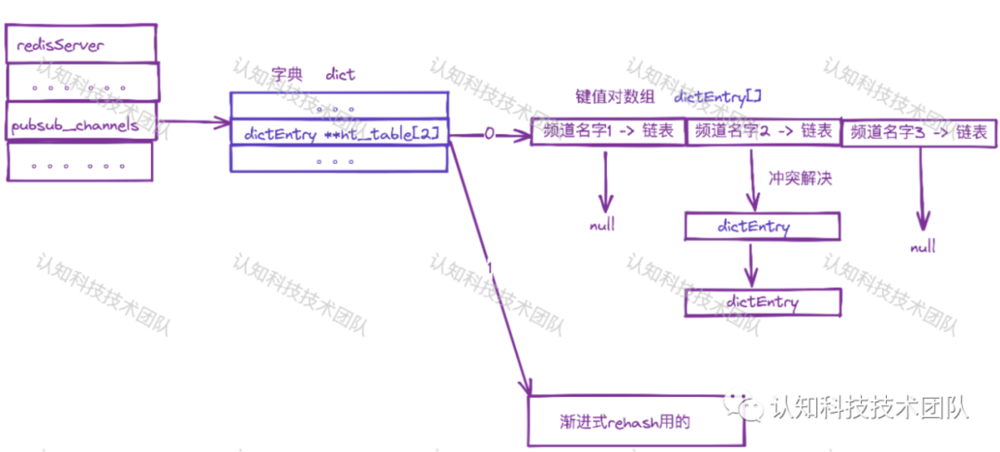

[toc]

## 订阅关系数据结构

Redis**使用字典(map)来存储订阅关系**
字典底层使用**哈希数组来实现，键为频道名字，值为链表，链表中的元素为连接的client对象。**
**哈希冲突, 使用链地址法解决**（所有哈希地址冲突的键值对保存链表中）。

为了统计客户端所订阅的频道信息，封装客户端信息的结构体client中，空间换时间，冗余保存了此client订阅的所有的频道名字（字典行为表现为集合数据结构）。

## 发布消息的流程

### sentinel

判断是否为哨兵（sentinel）模式, 调用pubsubPublishMessageAndPropagateToCluster

从server.pubsub_channels（**订阅关系**）中，将channel发布的消息写入**所有订阅者**client的对应的响应缓存中。

**ps**: client对应的缓存如果超过限制，会强制关闭订阅者.

### 集群模式（server.cluster_enabled）

调用 **clusterPropagatePublish**.

## 注意事项

- 由于redis实现的发布订阅关系，只保存在内存中，发布的消息不会持久化，客户端一旦下线/重新上线，则**不在线的时间内，发布的消息不会被订阅到的**。
- redis客户端client对象里的响应缓存是有限制的，超过限制会强制关闭client，**需要客户端处理重新订阅关系**。
- redis的发布订阅的这种实现，不能用来当做mq如rocktmq。 **ps**: 可以看下 **redis steam**
