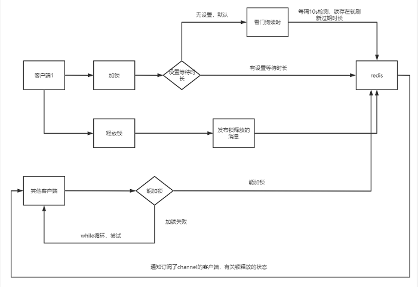

[toc]

## 概述

使用了 channel 来实现 **解锁通知**.

### lock/tryLock

tryAcquire 获取锁
如果超过 waitTime, 直接false
**订阅分布式锁, 解锁时收到通知**, 订阅也可能超时, 超时就取消订阅.
死循环 tryAcquire(leaseTime, unit, threadId) 获取锁, 直到超过 waitTime

tryAcquire 实际调用了 tryAcquireAsync, tryAcquireAsync 调了 tryLockInnerAsync,

tryLockInnerAsync 执行了 lua 上锁脚本

```
return commandExecutor.evalWriteAsync(getName(), LongCodec.INSTANCE, command, 
              "if (redis.call('exists', KEYS[1]) == 0) then " + 
                  "redis.call('hset', KEYS[1], ARGV[2], 1); " + 
                  "redis.call('pexpire', KEYS[1], ARGV[1]); " + 
                  "return nil; " + 
              "end; " + 
              "if (redis.call('hexists', KEYS[1], ARGV[2]) == 1) then " + 
                  "redis.call('hincrby', KEYS[1], ARGV[2], 1); " + 
                  "redis.call('pexpire', KEYS[1], ARGV[1]); " + 
                  "return nil; " + 
              "end; " + 
              "return redis.call('pttl', KEYS[1]);", 
             Collections.<Object>singletonList(getName()), internalLockLeaseTime, getLockName(threadId)); 

```

**解析:**

- 先用exists key命令判断是否锁是否被占据了，没有的话就用hset命令写入，key为锁的名称，field为“客户端唯一ID:线程ID”，value为1;
- 锁被占据了，判断是否是当前线程占据的，是的话value值加1;
- 锁不是被当前线程占据，返回锁剩下的过期时长;

tryAcquireAsync 方法内, 如果没有设置 leaseTime, 会注册 listener, 如果拿到了锁, 就会不断 scheduleExpirationRenewal,
scheduleExpirationRenewal 每隔 internalLockLeaseTime / 3, 就会 Renew 过期时长.

### unlock

1、判断锁是否存在，不存在, publish释放锁的消息，订阅者收到后就能做下一步的拿锁处理;
2、锁存在但不是当前线程持有，返回空置nil;
3、当前线程持有锁，用hincrby命令将锁的可重入次数-1，然后判断重入次数是否大于0，是的话就重新刷新锁的过期时长，返回0(表示未解锁)，否则就删除锁，publish释放锁的消息，返回1;

当线程完全释放锁后，就会调用cancelExpirationRenewal()方法取消"看门狗"的续时线程

### redlock 分布式部分

这个工具类就是RedissonRedLock。
创建多个Redisson Node, 由这些无关联的Node就可以组成一个完整的分布式锁.

?) cluster 计算出不同slot后, 同样执行.

```
RLock lock1 = Redisson.create(config1).getLock(lockKey); 
RLock lock2 = Redisson.create(config2).getLock(lockKey); 
RLock lock3 = Redisson.create(config3).getLock(lockKey); 
 
RedissonRedLock redLock = new RedissonRedLock(lock1, lock2, lock3); 
try { 
   redLock.lock(); 
} finally { 
   redLock.unlock(); 
} 
```


## 上/解锁流程图




## 参考

[又长又细，万字长文带你解读Redisson分布式锁的源码](https://www.51cto.com/article/646123.html)

