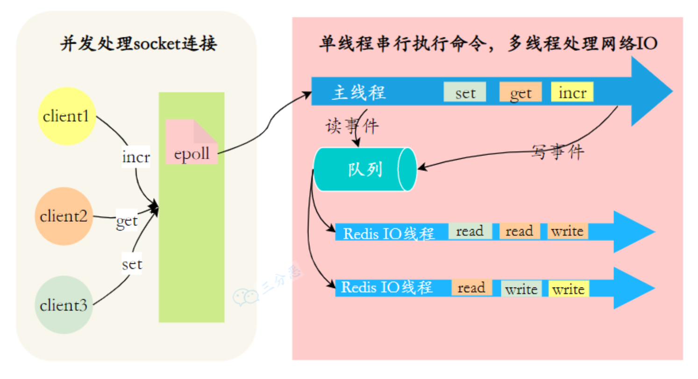

Redis6.0 只有在网络请求的接收和解析，以及请求后的数据通过网络返回给时，使用了多线程, 但是Redis执行命令还是单线程的。

因为Redis的性能瓶颈在于⽹络IO⽽⾮CPU，
因为有大量的CPU时间片耗费在**网络IO的(同步?)处理上**, 多线程可以减少由于网络 I/O 等待造成的影响，充分利用 CPU 的多核优势。
所以, 使⽤多线程能提升IO读写的效率，从⽽整体提⾼Redis的性能。