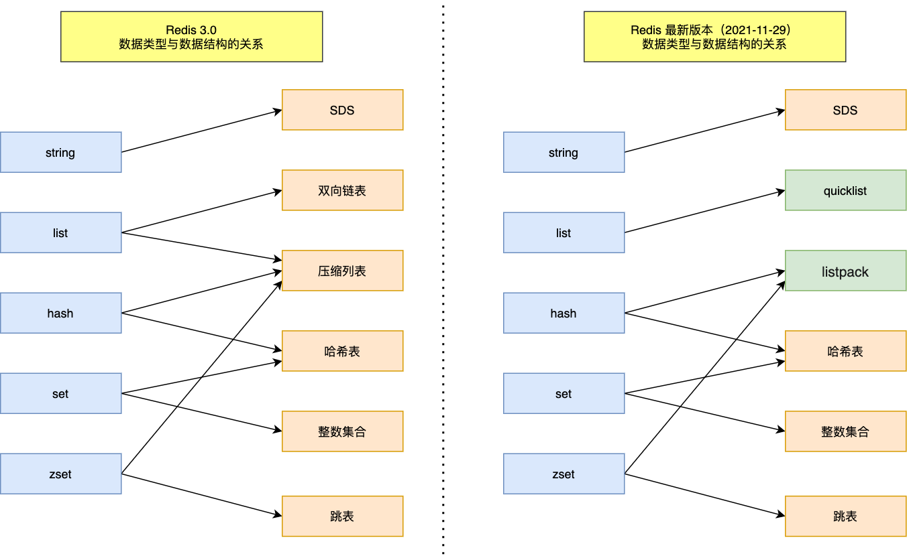
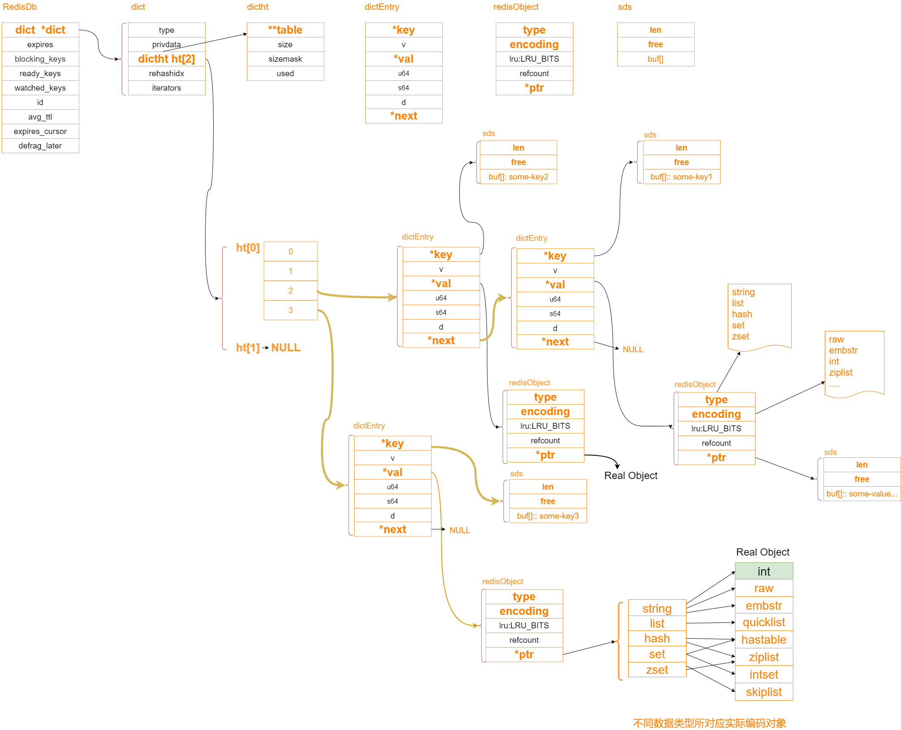
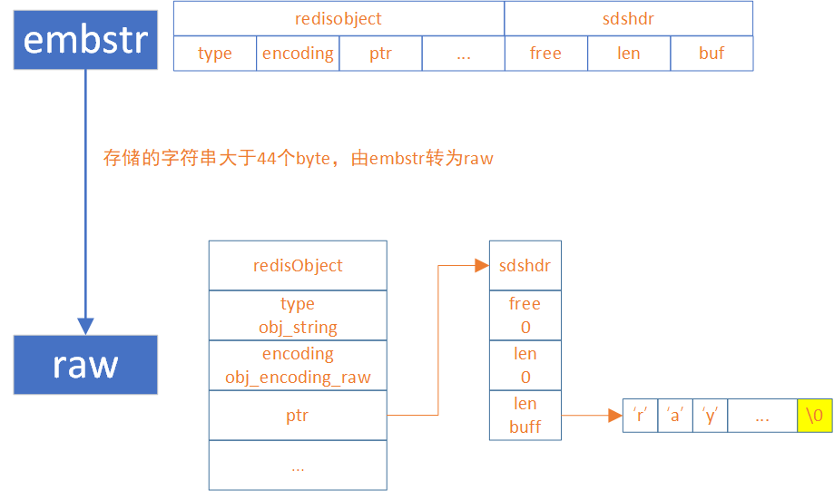
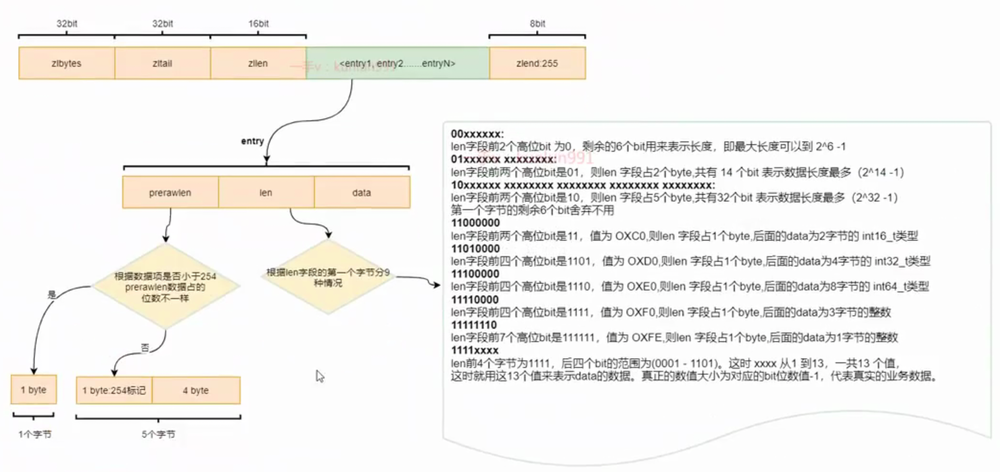
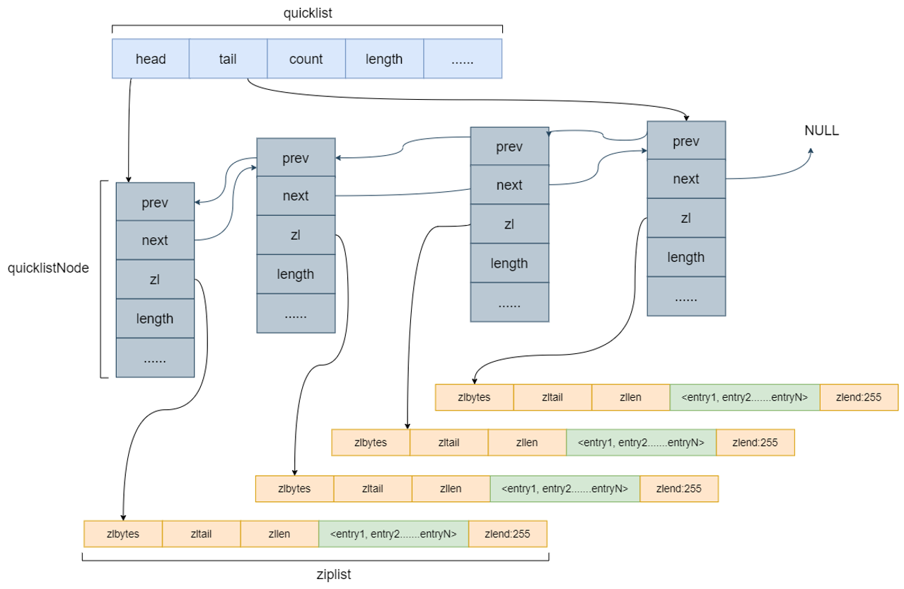
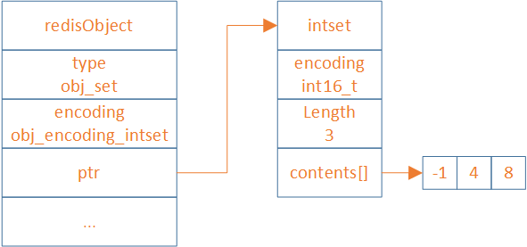
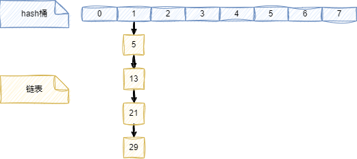
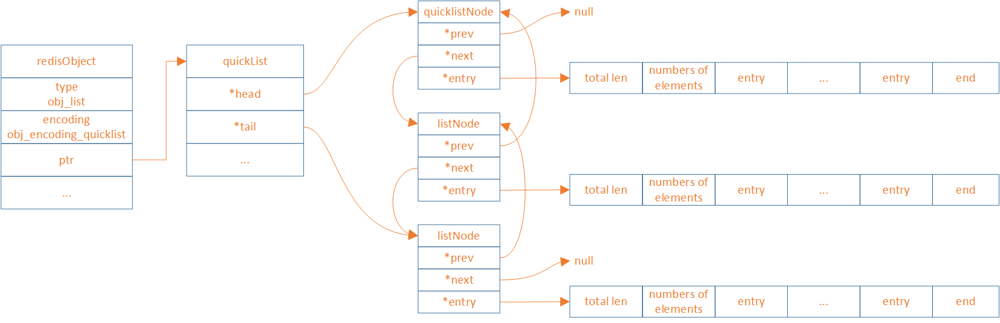
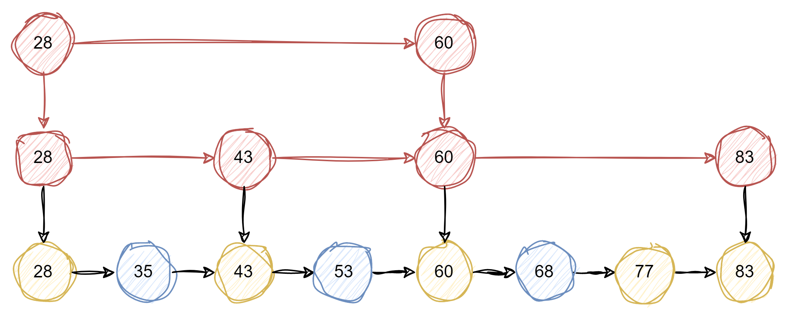

[TOC]


[toc]


## 概述

redis默认有0~15, 16个db.


## 类型

Redis 的10种数据类型，分别是

- string（字符串）
- hash（哈希）
- list（列表）
- set（集合）
- zset（有序集合）
- stream（流）
- geospatial（地理）
- bitmap（位图）
- bitfield（位域）
- hyperloglog（基数统计）

## 类型与底层数据结构关系



### 底层数据结构的对象关系




## string

 SDS（simple dynamic string），它是一个动态字符串结构，由长度、空闲空间和字节数组三部分组成

SDS有3种编码类型:
embstr 结构存储小于等于44个字节的字符串，embstr 每次开辟64个byte的空间
raw：存储大于44Bytes的数据
int：存储整数类型




### 使用场景:

- **缓存数据**，提高访问速度和降低数据库压力。
- **计数器**，利用 incr 和 decr 命令实现原子性的加减操作。
- **分布式锁**，利用 setnx 命令实现互斥访问。
- **限流**，利用 expire 命令实现时间窗口内的访问控制。


### hash冲突

头插


## hash

Hash类型的底层实现有三种：

- `ziplist`(7.0前)：压缩列表，当**hash**达到一定的阈值时，会自动转换为`hashtable`结构
- `listpack`：紧凑列表，Redis7.0之后，正式取代`ziplist`。同样, 达到一定的阈值时，会自动转换为`hashtable`结构
- `hashtable`：哈希表，类似map


### 扩容

len 和 size 相同就扩容

2倍, 渐进式, 每当操作到某个桶, 就去rehash这个桶到新的hash表
又或者在空闲时操作

### 使用场景:

**主要是存储对象**，比如：

- **用户信息**，利用 hset 和 hget 命令实现对象属性的增删改查。
- **购物车**，利用 hincrby 命令实现商品数量的增减。
- **配置信息**，利用 hmset 和 hmget 命令实现批量设置和获取配置项。

## ziplist 的缺陷






https://www.kancloud.cn/zatko/redis/2274315

## listpack 解决 ziplist 问题

**(重點):** **ziplist**的**每个entry**都**包含previous_entry_length来记录上一个节点的大小**，长度是1个或5个byte：

- 如果前一节点的长度小于254个byte，则采用1个byte来保存这个长度值
- 如果前一节点的长度大于等于254个byte，则采用5个byte来保存这个长度值，第一个byte为0xfe，后四个byte才是真实长度数据

所以, 当第一节长度大于等于254个bytes，导致第二节**previous_entry_length**变为5个bytes，第二节的长度由250变为254。而第二节长度的增加必然会影响第三节的**previous_entry_length**。ziplist这种特殊套娃的情况下产生的连续多次空间扩展操作成为连锁更新。新增、删除都可能**导致连锁更新的产生**。


简化数据结构, 每个entry保存 本entry的encoding/data/len

[listpack 结构设计](https://xiaolincoding.com/redis/data_struct/data_struct.html#listpack-结构设计)


## list

有序的字符串列表, 一个 list 类型的键最多可以存储 2^32 - 1 个元素。

### list場景

主要是实现**队列和栈**，比如：

- **消息队列**，利用 lpush 和 rpop 命令实现生产者消费者模式。
- **最新消息**，利用 lpush 和 ltrim 命令实现固定长度的时间线。
- **历史记录**，利用 lpush 和 lrange 命令实现浏览记录或者搜索记录。


### list底层原理

在`Redis7.0`之后，使用`quickList`([底層quickList](#底層quickList)) (linkedlist([底層linkedlist](#底層linkedlist)) 和 listpack([底層listpack](#底層listpack))的结合版) 


## set

无序的**字符串集合**，不允许重复元素。一个 `set `类型的键最多可以存储 2^32 - 1 个元素。

### 底層結構實現

- `intset`[底層intset](#底層intset)，整数集合.
- `hashtable`[底層hashtable](#底層hashtable)（哈希表）。和 hash 类型的hashtable相同，将元素**存储在一个数组**中，通过哈希函数计算元素在数组中的索引.

```
typedef struct intset {
    uint32_t encoding;
    uint32_t length;
    int8_t contents[];
} intset;
```


### intset 、listpack和hashtable的转换

根据要**添加的数据**、**当前`set`的编码**和**阈值**决定的,

**添加的数据是整型**，且当前`set`的编码为`intset`, 且超過閾值, **intset轉hashtable**.
閾值: `intset`最大元素个数, `set-max-intset-entries` ，默认512.


**添加的数据是字符串**，分为三种情况:

- 当前`set`的编码为`intset`：如果没有超过阈值，转换为`listpack`；否则，直接转换为`hashtable`
- 当前`set`的编码为`listpack`：如果超过阈值，就转换为`hashtable`
- 当前`set`的编码为`hashtable`：直接插入，编码不会进行转换

**阈值条件**为：
`set-max-listpack-entries`：最大元素个数，默认128
`set_max_listpack_value`：最大元素大小，默认64
以上两个条件需要同时满足才能进行编码转换.


### set场景

主要是利用集合的特性，比如：

- **去重**，利用 sadd 和 scard 命令实现元素的添加和计数。
- **交集**，并集，差集，利用 sinter，sunion 和 sdiff 命令实现集合间的运算。
- **随机抽取**，利用 srandmember 命令实现随机抽奖或者抽样。


## zset

### 底層數據結構

```
typedef struct zset {
    dict *dict;
    zskiplist *zsl; //嵌套
} zset;

typedef struct zskiplist {
    struct zskiplistNode *header, *tail; //嵌套
    unsigned long length;
    int level;
} zskiplist;

typedef struct zskiplistNode {
    sds ele;
    double score; //排序
    struct zskiplistNode *backward;
    struct zskiplistLevel {
        struct zskiplistNode *forward;
        unsigned long span;
    } level[];
} zskiplistNode;
```


### zset使用場景

利用分数和排序的特性, 

- **排行榜**，利用 zadd 和 zrange 命令实现分数的更新和排名的查询
- **延时队列**，利用 zadd 和 zpopmin 命令实现任务的添加和执行，并且可以定期地获取已经到期的任务
- **按訪問量的访问统计**，可以使用 zset 来存储网站或者文章的访问次数，并且可以按照访问量进行排序和筛选。


使用 **listpack**(`redis7.0`之前使用ziplist), 在**同時滿足**一下條件:

- 元素个数小于 `zset_max_listpack_entries `，默认值为 128
- 元素值的长度小于`zset_max_listpack_value`，默认值为 64

否則, 使用 `skiplist` [skiplist](#skipList)


## stream

类似于日志的数据结构, 记录一系列的键值对, 每个键值对都有一个唯一的 ID. **一个 stream** 类型的键**最多存储 2^64 - 1 个键值对**。
底层实现是 rax（基数树），它是一种**压缩的前缀树结构**，它将所有的键值对按照 ID 的字典序存储在一个树形结构中。rax 可以快速地定位、插入、删除任意位置的键值对.

### 应用场景

stream 类型的应用场景主要是实现事件驱动的架构，比如：

- 消息队列，利用 xadd 和 xread 命令实现生产者消费者模式。
- 操作日志，利用 xadd 和 xrange 命令实现操作记录和回放。
- 数据同步，利用 xadd 和 xreadgroup 命令实现多个消费者组之间的数据同步。


## Hyperloglog

是一种特殊的 string 类型, 底层实现是 SDS（simple dynamic string）.
使用极小的空间来统计一个集合中不同元素的数量，也就是基数.
一个 hyperloglog 类型的键最多可以存储 12 KB 的数据.

使用一种概率算法来计算基数。hyperloglog 的**误差率为 0.81%**，也就是说如果真实基数为 1000，那么 hyperloglog **计算出来的基数可能在 981 到 1019 之间**.


### Hyperloglog場景

主要是利用空间换时间和精度,

- 统计网站的**独立访客**数（UV）
- 统计在线游戏的活跃用户数（DAU）
- 统计电商平台的商品浏览量
- 统计社交网络的用户关注数
- 统计日志分析中的**不同事件**数

```
> PFADD goodA "1"
1
> PFADD goodA "2"
1
> PFADD goodA "3"
1
> PFCOUNT goodA
3
```


## GEO(geospatial)

存储和查询地理空间位置的数据类型, 基于 sorted set 数据结构实现, geohash 算法将经纬度编码为二进制字符串, 作为 sorted set 的 score 值. 

功能: 两个地理空间位置之间的距离; 指定圆心和半径内的地理空间位置; 指定[圆心/成員]和半径内的地理空间位置;

### GEO場景

- 统计某个区域内的商家或用户数量
- 查询某个位置附近的餐馆或酒店
- 计算两个位置之间的距离或行驶时间
- 显示某个位置周围的景点或活动


## bitmap

是一种特殊的 string 类型，它将一个 **string 类型**的值**看作是一个由二进制位组成的数组**。一个 bitmap 类型的键**最多存储 2^32 - 1 个二进制位**。底层实现是 SDS（simple dynamic string）.


### bitmap場景

- 统计用户活跃度，利用 setbit 和 bitcount 命令实现每天或每月用户登录次数的统计。
- 实现布隆过滤器，利用 setbit 和 getbit 命令实现快速判断一个元素是否存在于一个集合中。
- 实现位图索引，利用 bitop 和 bitpos 命令实现对多个条件进行位运算和定位

```
SETBIT 1000:2024:100 1 1 //将userid为100的用户，记录他在2024年第100天中第1秒，是否登录
SETBIT 1000:2024:100 10240 1 //将userid为100的用户，记录他在2024年第100天中第10240 秒，是否登录
```


## bitfield

`bitfield`和`bitmap`都是基于`string`类型的位操作, 
但**主要**是用**不同位长度的整数**来**表示状态或属性**的场合.


### bitmap区别

- `bitmap`只能**操作1位的无符号**整数，而`bitfield`可以操作**任意位长度的有符号或无符号整数**
- `bitmap`只能设置或获取指定偏移量上的位，而`bitfield`可以对指定偏移量上的位进行增加或减少操作
- `bitmap`可以对**多个字符串**进行位运算，而`bitfield`只能对**单个字符串**进行位操作
- `bitmap`的偏移量是**从0开始**的，而`bitfield`的偏移量是从**最高有效位开始**的


### bitfield場景

使用`bitfield`存储用户的个人信息，

- 用一个8位的无符号整数来表示用户的性别，0表示男，1表示女
- 用一个8位的无符号整数来表示用户的年龄，范围是0-255
- 用一个16位的无符号整数来表示用户的身高，单位是厘米，范围是0-65535
- 用一个16位的无符号整数来表示用户的体重，单位是克，范围是0-65535

```
BITFIELD user:1:info SET u8 #0 1 SET u8 #1 25 SET u16 #2 165 SET u16 #3 50000
```


## 底層intset 

[set](#set)





## 底層hashtable

[set](#set)

就是普通的 array + linklist 的 hashtable




## 底層linkedlist

[list](#list)


## 底層quickList

[list](#list)

`redis7.0`後, `quicklist`存储了一个**双向列表**，每个列表的**节点是一个`ziplist`**，所以实际上`quicklist`是`linkedlist`和`listpack`的结合，然后被命名为快速列表。
和Hash结构一样，因为`ziplist`有连锁更新问题，将`ziplist`替换为`listpack`.





## 底層listpack

[list](#list)


## 底層skipList





跳跃表相比于其他平衡树结构，有以下几个优点和缺点：

**优点：**

- 实现简单，易于理解和调试
- 插入和删除操作只需要修改局部节点的指针，不需要像平衡树那样进行全局调整
- 可以利用空间换时间，通过增加索引层来提高查找效率
- 支持快速的范围查询，可以方便地返回指定区间内的所有元素

**缺点：**

- 空间复杂度较高，需要额外存储多级索引
- 随机性太强，性能不稳定，最坏情况下可能退化成链表
- 不支持快速的倒序遍历，需要额外的指针来实现

### redis對skipList調整

随机函数的期望值是 `1/(1-p)` ，`p `是概率常数，默认为 **`0.25`**。这样**保证跳表平均高度**为 `log (1/p) n` ，其中 `n `是节点数。
Redis 还**限制了跳跃表的最大层数为 32** ，这样可以避免过高的索引层造成空间浪费


## 参考

[Reids 连环炮面试（转） ](https://www.cnblogs.com/myseries/p/12071608.html)

[聊一聊redis十种数据类型及底层原理 ](https://www.cnblogs.com/reim/p/17377883.html)

[HyperLogLog 算法的原理讲解以及 Redis 是如何应用它的](https://juejin.cn/post/6844903785744056333)

[2 万字 + 20张图｜ 细说 Redis 九种数据类型和应用场景](https://www.cnblogs.com/xiaolincoding/p/16370783.html) (未看)


