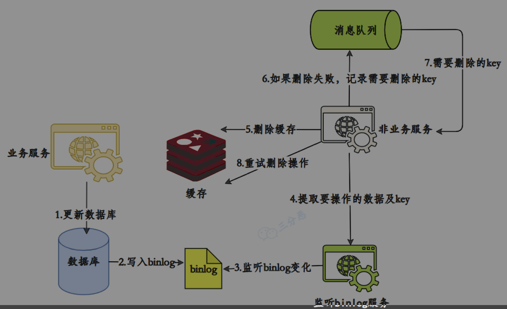

[toc]


## 缓存:

### 雪崩:

大量缓存同时失效,

**对策:** 

- 设置随机过期时间 (强依赖, 强一致的, 这个方式不合适.)
- 热点数据, 均匀分布在不同实例 或 设置不过期
- 读写锁, 抢不到就快速失败或同步等待. 让前边的线程更新key值.

### 穿透

大量访问不存在(/合法)的数据

**对策:** 

- 鉴权和校验
- 布隆过滤器（Bloom Filter）

### 击穿(缓存失效)

并发集中对一个热点Key进行访问，当这个Key在失效的瞬间，持续的大并发直接落到了数据库上，就在这个Key的点上击穿了缓存。

**对策:**

- 热点设置不过期
- 加锁, 使 缓存失效时, 只有抢到锁的线程才能到db取数据


### 热点

分布式锁来更新缓存, 避免同时访问mysql


### 缓存不一致

分布式读写锁, 来更新


#### 延迟双删

```
RedisUtils.del（key）；// 第一次删除缓存
updateDB（user）；// 更新db中的数据
Thread.sleep（N）；//延迟一段时间，在删除该缓存key
RedisUtils.del（key）；// 再次删除缓存
```

**参考**: [村头老大爷都能听的懂的延迟双删策略](https://www.51cto.com/article/744725.html)


#### canal + MQ




#### 还是有问题

想请教下各位, 我没有实际做过电商的项目, 心里总有一些关于redis缓存一致的问题感到困惑, 关于


## 热key

关键是对热点key的**热key监控**:
redis客户端
代理端 像Twemproxy、Codis
Redis服务端 使用monitor命令

**热key处理**:
把热key打散到不同的服务器,降低压力.
加入**本地二级缓存**,**提前加载**热key数据到内存中.

配置中心 推送 本地缓存.


### 定位热key


### 热key预热

写个缓存刷新接口, 按需操作.
如果数据量不大, 可以启动时自动加载.
定时任务刷新缓存.


### 热key重建(更新)

问题: 重建需要时间. 对于复杂系统.

解决: 
减少重建次数.
互斥锁(mutex key) , 只允许一个线程重建.
"不过期": 按照时间段来缓存. 


## 缓存同步方式

### 设置缓存有效期

### 同步双写

### 异步通知

落地方案未知

### MQ

### canal


## 参考

[Redis击穿、穿透、雪崩产生原因以及解决思路](https://objcoding.com/2021/11/28/redis/) 雪崩大致解决思路

[多级缓存——亿级流量缓存方案](https://zhuanlan.zhihu.com/p/648039630) 有三级缓存解释


