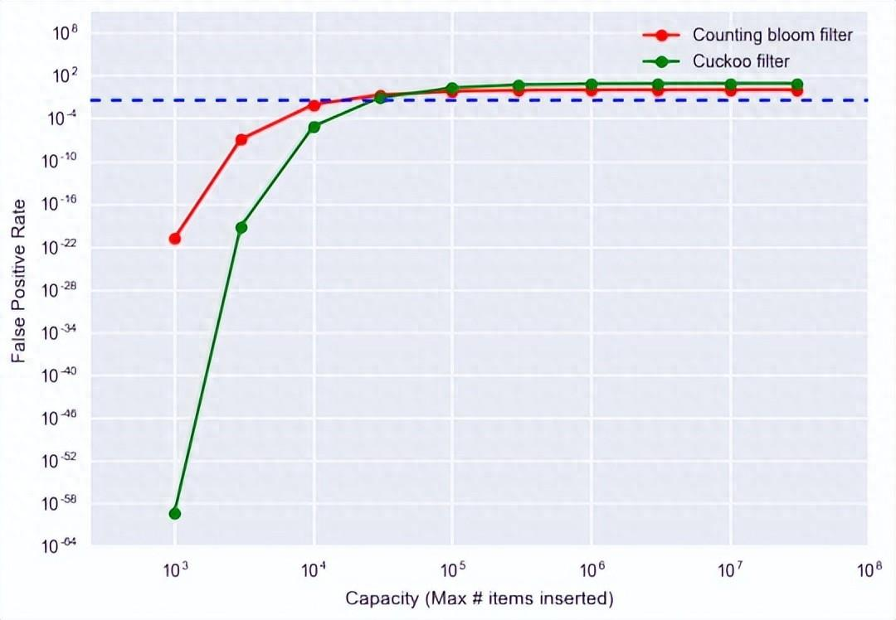
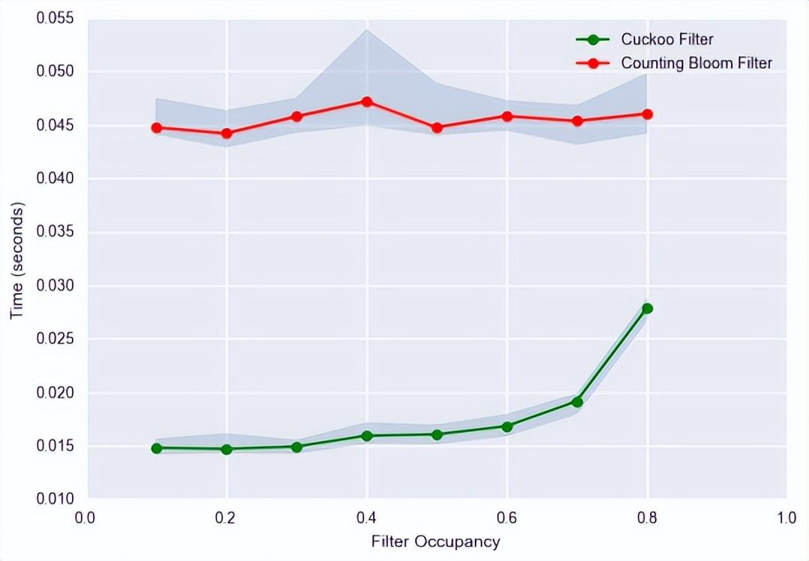

[toc]

## 概述

### 布隆过滤器(*Bloom Filter*)

用 bitmap 记录key多次(3次) hash 后的bit, 来判断是否存在该key.

**优点**

- 空间效率很高。
- 添加和查询时间复杂度均为O(k)，k为哈希次数.
- 成熟且广泛使用，适用于大规模数据处理。

**缺点**

- 无法删除已add的元素.

- hash碰撞产生误判.

### 增强版的布隆过滤器(Counting Bloom Filter)

将布隆过滤器的bitmap更换成数组,当数组某位置被映射一次时就+1,删除时-1, 
但仍然存在误删问题.

### 布谷鸟过滤器(Cuckoo Filter)

**?)开放地址法 (Open Addressing)**

最简单的布谷鸟哈希结构是一维数组结构，会有两个 hash 算法将新来的元素映射到数组的两个位置。如果两个位置中有一个位置为空，那么就可以将元素直接放进去。但是如果这两个位置都满了，它就不得不「鸠占鹊巢」，随机踢走一个，然后自己霸占了这个位置。

**问题**

**(rehash)**
如果数组太拥挤了，连续踢来踢去几百次还没有停下来，严重影响插入效率。这时候布谷鸟哈希会设置一个阈值，当连续占巢行为超出了某个阈值，就认为这个数组已经几乎满了。需要对它进行扩容，重新放置所有元素。

**优点**

- 支持删除操作。
- 在保持低假阳性率的同时，可以比布隆过滤器使用更少的空间。
- ?)相比于布隆过滤器，在某些情况下，具有更好的性能特征。

**缺点**

- 实现相对复杂。
- 当过滤器接近其容量极限时，插入性能可能会显著下降，因为需要重新定位现有元素。
- 并不像布隆过滤器那样广泛使用和测试。

## 使用场景

从他们的数据结构就能看出, 他们的读写效率有差. 
**使用场景**: 大数据判断是否存在; 解决缓存穿透

## 对比

布隆过滤器：适用于对查询速度要求较高、可以容忍一定的误判率的场景。
布谷鸟过滤器：适用于对误判率要求较高的场景，但需要更多的空间来存储数据。

- **删除支持：** 布谷鸟过滤器可以删除元素，而传统布隆过滤器则无法删除。
- **空间效率：** 对于同样的集合和误报率，布谷鸟过滤器通常能提供更高的空间效率。

- **性能变化：** 布隆过滤器对元素数量的增加相对稳定，而布谷鸟过滤器在接近设计容量时可能性能急剧下降。

- **实用性：** 布隆过滤器更简单、成熟，已经被广泛应用于各种系统中。布谷鸟过滤器则较新，实践应用相对较少。
- **误报率控制：** 布隆过滤器可以通过调整位数组的大小和哈希函数数量来控制误报率，而布谷鸟过滤器的误报率受指纹大小和桶大小影响。

## 参考

[Redis击穿、穿透、雪崩产生原因以及解决思路](https://objcoding.com/2021/11/28/redis/)

[Redis 之布隆过滤器，增强版，布谷鸟过滤器](https://www.cnblogs.com/Chary/p/15682276.html)

[布隆vs布谷鸟：哪种过滤器最适合你的大数据需求？](https://www.51cto.com/article/773960.html)

