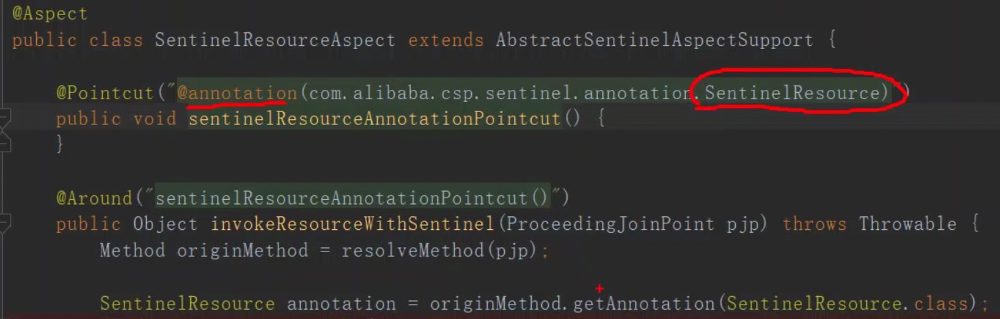

## 服务端到客户端

/setRules 
发送到sentinel服务端, 再推送到需要流控的客户端. 也会通过API查询客户端访问情况.

## 客户端到服务端

通过 sentinel-transport-simple-http包 注册到 sentinel服务端. 也会发心跳.

## SentinelResource 

也是AOP

SentinelAutoConfiguration.java 注入了 SentinelResourceAspect() 

**SentinelResourceAspect**

## SphU. entry（resourceName，resourceType, entryType, pjp. getArgs（））；

 

拿到interceptor 调用链(责任链) lookProcessChain （resourceWrapper）； 
不断 fireEntry（context, resourceWrapper, node, count, prioritized, args）；执行下一个interceptor
有异常的话, 就会在AOP中获得`@SentinelResource`注解的`blockHandler/fallback`的配置, 通过反射来执行对应的方法.