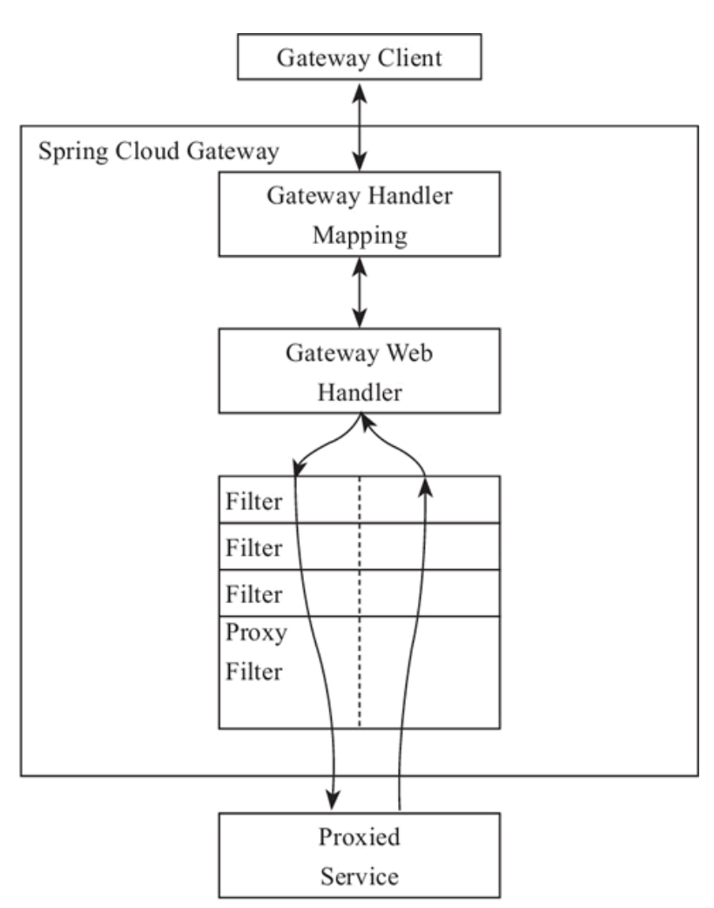
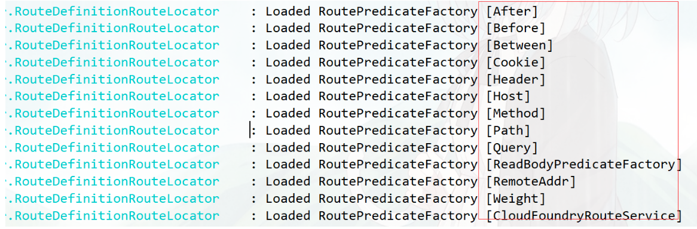
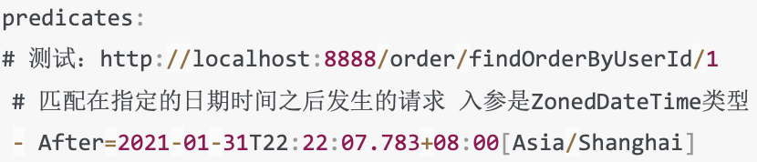
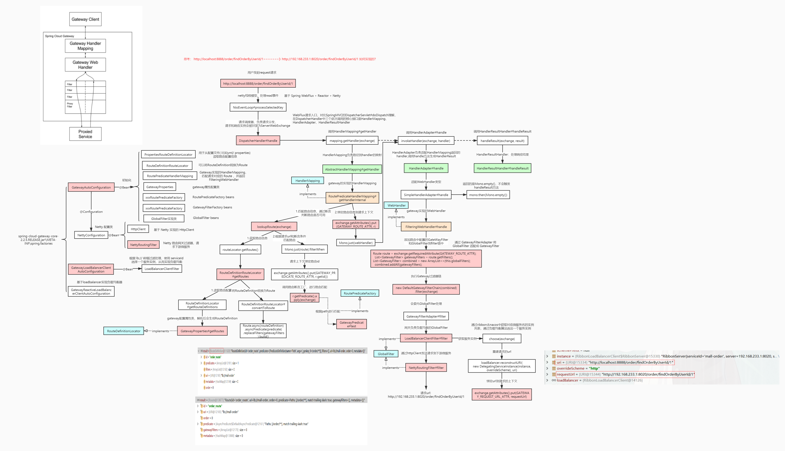

[toc]

## 概述

Spring Cloud Gateway 是由 **WebFlux + Netty + Reactor** 实现的响应式的API 网关。
它**不能**在传统的 **servlet 容器**中工作，也**不能构建成 war 包**。

## 与nginx 差异

Nginx **适合**做**反向代理、负载均衡、静态资源**服务等基础功能，
Nginx 能做一些 Gateway 功能（如负载均衡、转发请求），但无法提供像 API Gateway 那样的**高度定制和服务管理能力**。

而 API Gateway **更侧重于 API 管理、认证、限流、请求聚合、服务发现**等高级功能。

## 路由(route)

路由是网关中最基础的部分，**路由信息**包括一个ID、一个目的URI、一组断言工厂、一组Fiter组成。
如果断言为真，则说明请求的URL和配置的路由匹配。

## 断言(predicates)

Java8中的断言函数，SpringCloud Gateway中的断言函数类型是Spring5.0框架中的ServerWebExchange。断言函数允
许开发者去定义**匹配Http request**中的**任何信息**，比如请求头和参数等。

## 过滤器（Filter）

SpringCloud Gateway中的filter分为**Gateway Filler**和**Global Filter**. Filter可以对**请求和响应**进行**处理**。

## 路由断言工厂（**Route Predicate Factories**）配置

还有 **时间匹配**

还可以自定义断言工厂

## 全局过滤器(filter)

对所有请求拦截, 例如: 权限

Gateway 的 Filter 只有 pre 和 post 两种。

## 跨域配置（**CORS Configuration**）

## 整合sentinel限流

## 网关高可用

可以同时启动**多个 Gateway 实例**进行负载，在 Gateway 的上游**使用 Nginx** 或者 F5 进行**负载转发以达到高可用**。

## 源码

### 大致流程

NioEventLoop#processSelectedKey

请求和响应实例会被封装为ServerWebExchange

DispatcherHandler#handle

HandlerMapping负责路径到handler的映射, 1.匹配路由信息，通过断言判断路由是否可用; 2.绑定路由信息到请求上下文

HandlerAdapter负责适配HandlerMapping返回的handler，调用handle方法生成HandlerResult

添加路由中配置的GateWayFilter和GlobalFilter到filter链中, 执行Gateway过滤器链

网关负责负载均衡的GlobalFilter, 通过ribbon去nacos中获取对应微服务名的实例列表，通过负载均衡算法选出一个服务实例

通过httpClient发送请求到下游微服务

HandlerResultHandler： 处理响应结果