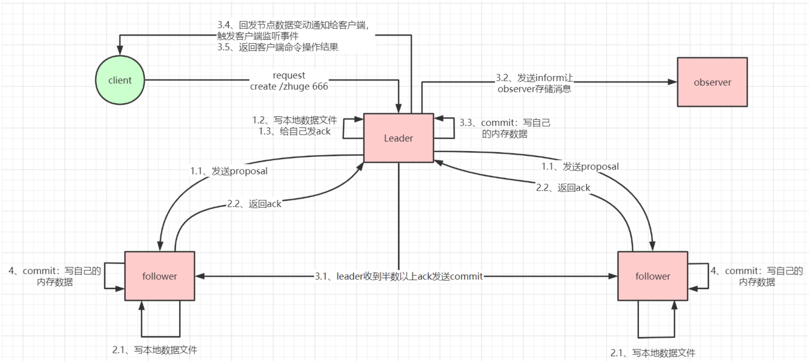

## 概述

## node角色

3种角色, 
Leader：负责处理**写**数据，也读数据
Follower：负责**读**数据，如果Leader 失效，Follower 可以**参与新的leader选举**.
Observer：负责**读**数据，减轻服务端写数据压力, **不选举**

## 简单总结

选举过程, 先投自己一票, 给不同的follower 发送自己的(myId, ZXID), 选出最大的ZXID, 如果ZXID相同则对比myId, 如果有过半node同某node, 则成为leader.
重选/写入同理.

**myId**: 本node的唯一标识
**ZXID**: 由`epoch` 和 `当前epochd`的index(执行过的事务的最大编号)组成.

**选举细节**: 选举过程中, 无法对外提供服务. 所以available受影响.
**重选细节**: 当选出新的leader后, 即进入新的epoch, 将会抛弃所有旧epoch 未完成的事务. 并将 ZXID 的 index置0. 

## 参考

[一文彻底搞懂ZAB算法，看这篇就够了！！！](https://cloud.tencent.com/developer/article/2347150)