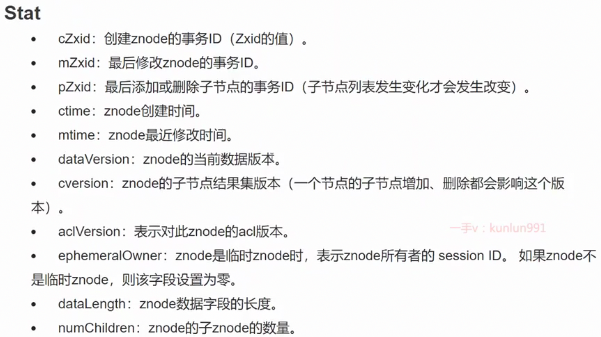
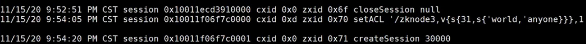

## 节点信息

有5种节点, **临时/永久 和 是否顺序节点 的组合**, 和 **container**(没有子node, 自动删除)

```
get -s xxx
```





## 监听机制

**注意：所有的通知都是一次性的****，及无论是对节点还是对目录进行的监听，一旦触发，对应的监听即被移除。递归子节点，监听是对所有子节点的，所以，每个子节点下面的事件同样只会被触发一次。
**需要重新注册监听事件.**

下例通过 getData 的 watcher this 来循环监听.


## 内存数据结构

### dataTree


### DataNode


## 事务日志

每一次客户端的**事务操作**，Zookeeper都会将他们记录到事务日志中，当然，Zookeeper也会将数据变更应用到内存数据库中。
我们可以在zookeeper的主配置文件**zoo.cfg** 中配置內存中的**数据持久化目录**，也就是事务日志的存储路径 **dataLogDir**. 如果没有配置datalogDir（非必填），事务日志将存储到**dataDir**（必填项）目录，

**和 redis 一样, 有2种, 一种是事务日志, 一种是快照**

事务日志 的磁盘空间 是预分配的. 65M. 顺序写.

### 事务日志示例:



### 数据快照snapshoot

通过**配置snapCount每间隔事务请求个数**生成快照, 
为了**避免**集群中所有机器在同一时间进行快照，生成时机为事务数达到［snapCount/2 +**随机数**（随机数范围为1~snapCount/2）］个数时开始快照）,


## 集群推荐奇数

因为过半原则, 偶数台在写请求时, 需要比奇数多1太, 降低了写效率. 
**例:** 
3 台, 可以死1台, 需要写2台;
4 台, 可以死1台, 需要写3台;


## 使用场景

配置中心


## zookeeper node扩容

3.5 以后可以动态扩容


