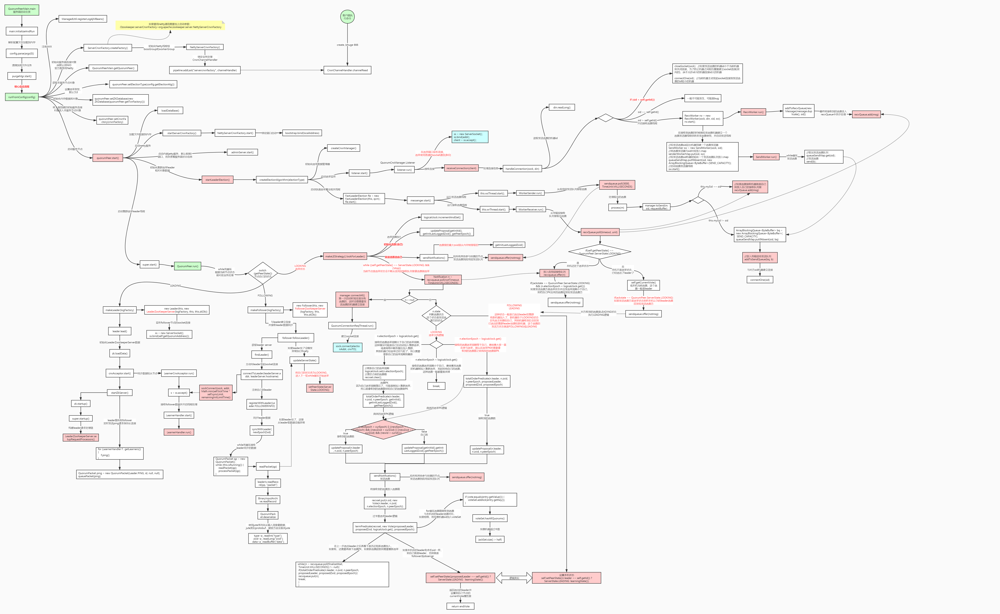

## 概述

zk有 **LOOKING，FOLLOWING，LEADING，OBSERVING 4种状态.**
**LOOKING** 就是**没有选出主时**的状态.

new Vote(ZXID, epoch)

electionAlgorithm有多种, ~~LeaderElection, AuthFastLeaderElection~~, FastLeaderElection(默认)

开启线程接受选票.

## 启动或leader宕机选举leader流程

ZXID 是事务ID, 肯定选大(最新)的, 

### 选举流程图

