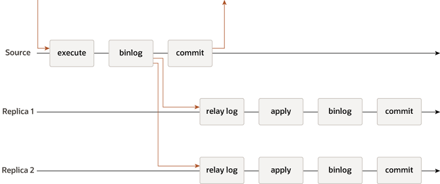

[TOC]

# 什么是CAP定理

CAP定理指的是在一个分布式系统中， Consistency（一致性）、 Availability（可用性）、Partition tolerance（分区容错性），三者不可兼得。在分布式系统中，分区容错性是必须需要实现的。所以只能在一致性和可用性之间进行权衡（AP或者CP）

## 单机RDBMS是CA系统

单机的Oracle或MySQL之类的传统RDBMS数据库没有分区容错，是CA系统，可以达到强一致性和可用性。

## MySQL主从复制中的应用 AP系统

异步复制 异步复制操作时序图：

异步复制在master写binlog成功之后立即提交，不等待slave的同步结果。

半同步复制在master写binlog成功之后不立即提交，而是等待其中一个slave同步成功，只要有一个slave同步成功，立即提交。

也是AP.

# 一致性协议Paxos

# k8s 长连接 负载均衡

[在 k8s 中使用 gRPC Go 服务发现](https://blog.cong.moe/post/2021-03-15-grpc-go-discovery-in-k8s/)

云原生：TCP长连接在K8S环境下的负载均衡分析 https://icorer.com/index.php/archives/507/

# nacos 的服务发现和 k8s 的服务发现之间的关系? #211

https://github.com/nacos-group/nacos-k8s/issues/211

# 参考

https://my.oschina.net/lhztt/blog/915533 [分布式系统理论（一）：CAP定理](https://my.oschina.net/lhztt/blog/915533)

[一致性协议Paxos](https://my.oschina.net/lhztt/blog/995114)