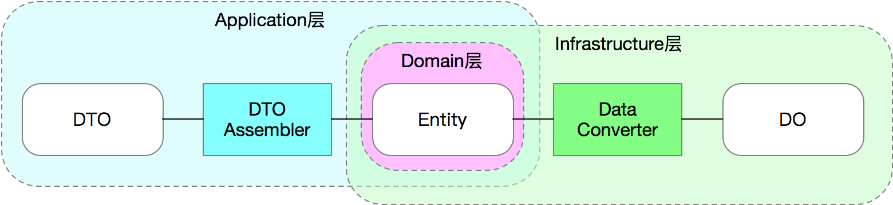
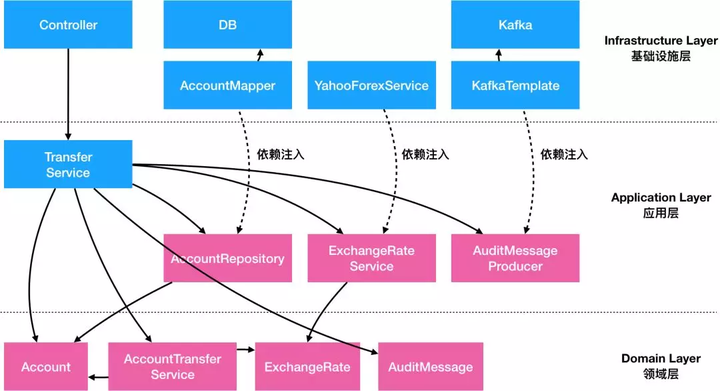
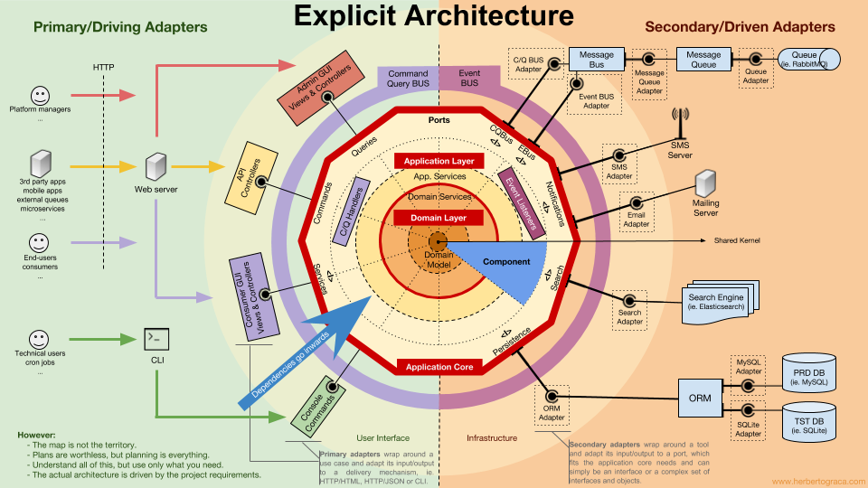

[toc]

## DO(DAO)

看作**固件**, 和底層**db強綁定**

只用來映射DB字段. 不能参与到业务逻辑中.

== Mapper

## DTO(Data Transfer Object)

**Application层**的入参和出参, 

DTO价值在于**适配不同的业务场景**的入参和出参，避免让**业务对象变成一个万能大对象**。

## Domain Primitive(Value Object?)

**不修改**自身 object 屬性, 帶有**單對象**行爲/工具的ob, 例如**封裝**DO

## Entity

**可修改**自身 object 屬性, 帶有**單對象**行爲/工具的ob

**和业务语言保持一致**, 和持久化无关(Entity的生命周期应该仅存在于内存中，**不需要可序列化和可持久化**). 

## 模型对象之间的关系

实际开发中DO、Entity和DTO不一定是1:1:1的关系, 例如:
Entity : 表 = 1 : n; 
Entity : 表 = n : 1; 
Entity : DTO = 1 : n;

### 轉化

Application层, Entity <-> DTO, **DTO Assembler**;

Infrastructure层, Entity <-> DO, **Data Converter**;

**轉化庫: MapStruct**

## Repository

在Infrastructure层, 這是調用轉化爲do, 再調dao入庫.

難點在於, 對一個複合entity操作時, 只需要更新有變化的對象, 這個時候需要額外的代碼實現.

## Domain Service

~~仅作为组件编排~~

涉及(同一)多對象的業務. 例如: 轉賬

**最底层不是数据库**，而是Entity、Domain Primitive和Domain Service;
负责组件编排的**Application Service**，但是这些服务仅**仅依赖**了一些**抽象出来的**ACL类和Repository类;
最后是ACL，Repository等的**具体实现**, **依赖**外部**具体技术实现和框架**，所以统称为**Infrastructure Layer（基础设施层）**。Web框架里的对象如**Controller**之类的通常**也属于**基础设施层。

## application service

在 Domain Service 之上, 依賴 Domain Service. 複雜的邏輯一般放在 Domain Service 層.

## infrastructure layer

Persistence模块包含数据库DAO的实现，包含Data Object、ORM Mapper、Entity到DO的转化类等

## 領域事件

當模型變化時, 可能導致**對大量關聯的其他對象產生影响**, 導致處理的任務都**寫在一個方法內, 變得複雜**.
其根本的原因是**反应代码**（比如升级）直接和上面的**事件触发条件**（比如收到经验）**直接耦合**，而且这种耦合性是隐性的。

通过显性事件，将事件触发和事件处理**解耦**.

## 參考

https://blog.csdn.net/crazymakercircle/article/details/134128426